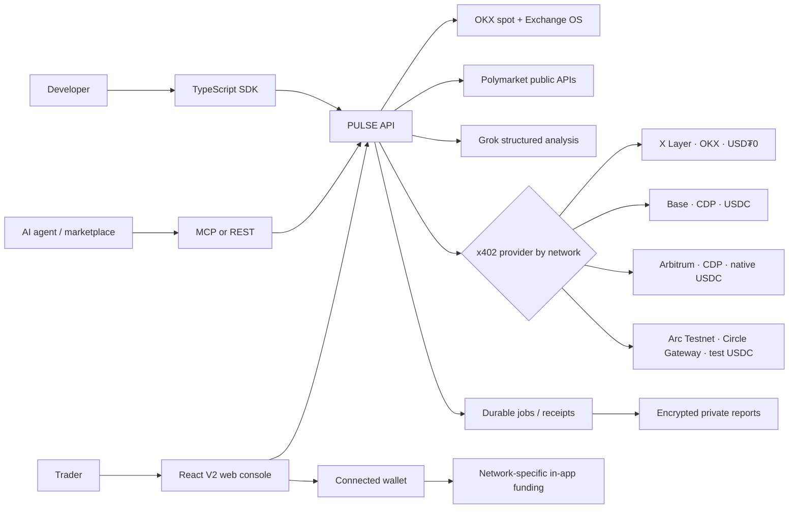
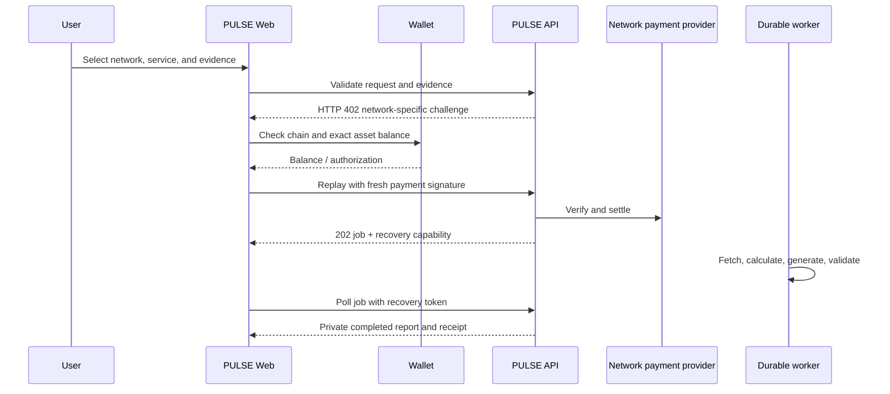

<p align="center">
  
</p>

<h1 align="center">PULSE</h1>

<p align="center"><strong>Multichain spot and prediction-market intelligence. Pay per report on your selected network.</strong></p>

PULSE combines live OKX spot evidence with explicitly selected Polymarket data for traders and autonomous agents. It provides free discovery and evidence endpoints, paid structured reports, recoverable delivery, and network-aware x402 settlement on X Layer, Base, Arbitrum One, and Arc Testnet.

PULSE is an independent intelligence product. Polymarket is a public read-only evidence source; PULSE does not place Polymarket orders or bypass Polymarket trading restrictions.

## The product

Markets move continuously, but most analysis products still require an account, subscription, or separate checkout. Agents need something stricter: structured intelligence they can discover, pay for, recover after a refresh, and consume without a human checkout.

**PULSE turns market intelligence into a multichain onchain service while preserving the original X Layer product.**

- Preview live OKX spot instruments, tickers, and candles without payment.
- Discover active crypto-focused Polymarket questions in an in-page picker and explicitly select the single market used by a report.
- Buy a base or premium spot report, or a separate base or premium crypto-prediction report.
- Run X Layer token-risk and composite pre-trade checks without changing their existing routes.
- Settle through USD₮0 on X Layer, native USDC on Base and Arbitrum, or test USDC on Arc Testnet.
- Recover an idempotent paid job and its private report without paying twice.
- Use the same product through the responsive web console, REST, MCP, or TypeScript SDK.

The browser keeps funding in context: connect once, inspect the selected chain’s native and payment-asset balances, and use the chain-specific in-app funding path. The last selected network is restored after reload. PULSE remains decision support, not financial advice. Contract evidence reports observable RPC facts; heuristic safety scores are not audits or guaranteed simulations.

## Why it stands out

| Typical market tool | PULSE V2 |
| --- | --- |
| Account and recurring subscription | Pay only for the requested report |
| Human-only dashboard | Responsive web + REST + MCP + typed SDK |
| Opaque AI prose | Strict structured output, evidence quality, limitations, and invalidation |
| One generic workflow | Separate Crypto Market and user-selected Prediction Market analysis |
| Payment failure after work begins | Input and required primary evidence are validated before the payment challenge |
| Lost result after refresh | Receipt-bound durable job and private report recovery |
| Separate wallet and funding journey | Network-aware balances and funding inside PULSE |
| Hidden network assumptions | Explicit chain, token, provider, amount, payee, and receipt metadata |

## Experience

### Crypto Market

Choose a live OKX instrument instead of typing an arbitrary pair. Select a timeframe and PULSE fetches public ticker/OHLCV data, renders the chart locally, and sends bounded structured context—not a screenshot—to Grok. Changing the pair, timeframe, or payment network clears the previous report so stale analysis is never shown for a new context.

### Prediction Market

Prediction discovery is free and lives inside the main application rather than on a separate page. The user opens the market picker, chooses one active crypto price/direction question, reviews its probabilities, order books, liquidity, volume, open interest, restriction status, and resolution rules, then purchases Base or Premium prediction analysis. PULSE validates condition/outcome identity, order-book availability, freshness, liquidity, spread, depth, history, and horizon. Restricted markets remain usable as public read-only evidence when active and orderbook-enabled, but the restriction is always disclosed and PULSE never places an order.

Prediction reports use the same readable presentation standard as Crypto Market reports: confidence and tier, headline and summary, outcome probability cards, bid/ask and evidence-quality labels, market metrics, invalidation conditions, risks, evidence provenance, and disclaimer. Large provider payloads are kept behind a collapsed technical-details control. The optional focus note lets the user request emphasis such as the bull/up case, counter-case, catalysts, liquidity quality, resolution risk, or invalidation; it does not create a market or place an order.

### Safety rail

- **X Layer token discovery · free:** OKX Onchain OS catalog with X Layer-only enrichment and manual-address fallback.
- **Contract evidence · free:** chain/block/code/balance/nonce reads, bytecode fingerprint, and common proxy detection.
- **Token risk:** deterministic component scores and explicit limitations.
- **Composite preflight:** PASS/WARN/FAIL report, grade, checklist, recommendations, and report identity.
- **Transaction simulation:** network-scoped evidence that never broadcasts a transaction.

Catalog presence, price, liquidity, and market probability are evidence—not endorsement, fact, or a safety guarantee.

### Wallet and funding

- One wallet drawer supports OKX Wallet, EIP-6963 injected wallets, WalletConnect, Base-compatible AppKit connectors, and Circle User-Controlled EOA wallets authenticated by email OTP. With the configured Circle Testnet application, Circle email sessions are Arc Testnet-only; PULSE hides X Layer, Base, and Arbitrum until the Circle wallet is disconnected.
- The selected PULSE network, connected provider, wallet chain, address, native balance, and exact payment-asset balance remain distinct.
- X Layer prepares OKB → USD₮0 through OKX Exchange OS.
- Base and Arbitrum prepare native ETH → native USDC inside PULSE; Arbitrum explicitly rejects USDC.e as the payment asset.
- Arc Testnet exposes faucet guidance, test-USDC balance, Circle Gateway balance, and Gateway deposit.
- Arc displays wallet USDC and Circle Gateway USDC in separate tabs so onchain funds are not confused with spendable Gateway funds.
- Before browser signing, PULSE switches to the selected chain and refreshes the exact payment-asset balance.

## Product surfaces

- **Spot Intelligence:** live OKX instruments, tickers, candles, standard reports, and premium reports.
- **Prediction Markets:** active crypto price/direction markets only, explicit single-market selection, order books, probability history, liquidity and evidence quality, followed by base or premium prediction analysis.
- **Safety:** network-scoped contract evidence and transaction simulation; legacy heuristic scores remain clearly identified.
- **Human web app:** one responsive Crypto Market / Prediction Market / Safety workspace; persistent network selection; X Layer, Base, Arbitrum and Arc-specific themes; Reown AppKit, Wagmi and Viem wallet connectivity; balances, funding, payment progress, job recovery, and readable reports.
- **Agent interfaces:** REST, MCP, TypeScript SDK, machine-readable metadata, OKX.AI compatibility, CDP Bazaar metadata, and Circle Marketplace listing material.

## Networks and payments

| Network | Public prefix | Payment asset | Provider | Funding inside PULSE |
| --- | --- | --- | --- | --- |
| X Layer (`eip155:196`) | `/xlayer` | USD₮0 | OKX x402 | Native OKB to USD₮0 through OKX Exchange OS |
| Base (`eip155:8453`) | `/base` | Native USDC | CDP x402 | Native ETH to native USDC swap |
| Arbitrum One (`eip155:42161`) | `/arbitrum` | Native USDC | CDP x402 | Native ETH to native USDC swap; USDC.e is not accepted |
| Arc Testnet (`eip155:5042002`) | `/arc` | Test USDC | Circle Gateway | Faucet guidance and in-app Gateway deposit |

The shared unprefixed routes retain X Layer compatibility. Network aliases isolate chain IDs, assets, receipts, discovery metadata, and idempotency records while reusing the same business handlers.

Arc is always labeled **Testnet**. Its USDC has no production-value implication.

## Services and prices

| Service | Price |
| --- | ---: |
| Free OKX and Polymarket discovery | Free |
| Spot analysis — standard | $0.10 |
| Spot analysis — premium | $0.20 |
| Prediction analysis — standard | $0.10 |
| Prediction analysis — premium | $0.20 |
| Token scan | $0.10 |
| Legacy composite preflight | $0.20 |

Prices are configured by environment variables and published through `/v1/metadata`. A paid request is rejected before the payment challenge when its schema is invalid or its required Polymarket market/order-book evidence is unavailable.

The earlier fused, divergence, and event-risk routes remain in the codebase only for API compatibility and are disabled by default. They are not presented as consumer products in the web app or public product metadata.

## Paid report lifecycle

1. Validate the request and required provider evidence before payment.
2. Return a network-specific x402 challenge.
3. Verify and settle the signed authorization.
4. Persist an idempotent job and normalized payment receipt.
5. Fetch fresh provider context and calculate deterministic features.
6. Generate and validate the structured report.
7. Store the report privately and expose recovery through the job API.

Real backend stages are returned by `GET /v1/jobs/:jobId`. A recovery token lets the payer retrieve the completed report after refresh without paying again. A settled job may regenerate its deliverable within policy without creating a second payment.

## Polymarket data policy

PULSE uses public Gamma, CLOB and Data API reads. No Polymarket API key is required for discovery, order books, prices, history, or public open interest.

- Web users explicitly select one primary crypto market. The API retains bounded additional-market fields only for backward compatibility and never adds markets silently.
- PULSE never silently substitutes another market.
- Condition IDs and outcome-token mappings are validated.
- Active restricted markets may be analyzed read-only; `restricted` remains visible as a trading-compliance signal.
- Closed, archived, inactive, malformed, or orderbook-disabled markets are rejected.
- Required primary-market order books are checked before payment and revalidated by the worker after settlement.
- Optional-source failures produce explicit partial-data fields rather than invented values.

## Wallet and funding UX

One restored wallet session supports all enabled networks. The UI distinguishes the selected PULSE network, connected provider, connected address, and wallet chain. Before signing, PULSE switches to the selected chain and verifies the exact payment-asset balance.

The selected network is stored locally and restored on reload or the next start. `DEFAULT_NETWORK` is used only when no valid saved selection exists. Each non-X-Layer network has its own visual theme; the original X Layer appearance remains unchanged.

- **X Layer:** OKB and USD₮0 balances; in-app OKB → USD₮0 swap.
- **Base:** ETH and native USDC balances; in-app ETH → USDC swap.
- **Arbitrum:** ETH and native USDC balances; in-app ETH → USDC swap with explicit USDC.e warning.
- **Arc Testnet:** separate Wallet USDC and Gateway USDC tabs, faucet entry, and Gateway deposit. `ARC_AI_MODE=live` is required for real Base/Premium reports; `fixture` is only a deterministic payment/job plumbing check and makes no market inference.

Supported connection paths include OKX Wallet, EIP-6963 injected wallets such as MetaMask and Rabby, WalletConnect mobile sessions, Base-compatible connectors exposed through AppKit, and Circle User-Controlled EOA wallets via email OTP. The connected address in the funding drawer is copyable. Circle wallet keys remain controlled by the user through Circle's MPC signing UI; `CIRCLE_API_KEY` is server-only.

## System overview



### Browser payment sequence



The server binds a payment to network, asset, amount, payee, resource URL, and request hash. A repeated authorization resolves to the same job rather than charging twice.

## Product architecture

```text
.
├── apps/
│   ├── web/                 React 19 + Vite V2 console
│   └── api/                 Express REST, MCP, metadata, jobs, reports
├── packages/
│   ├── analysis/            Spot and prediction structured analysis; compatibility modules
│   ├── market/              OKX and public Polymarket evidence clients
│   ├── payments/            OKX, CDP, Circle and mock test adapters
│   ├── buyer/               Controlled x402 buyer utilities
│   ├── domain/              Safety, preflight and deterministic features
│   ├── schemas/             Shared Zod contracts
│   ├── config/              Networks, flags, prices and ASP metadata
│   └── sdk/                 Typed PULSE client
├── api/                     Vercel serverless entrypoint
├── metadata/                Additive marketplace metadata
├── assets/                  Brand assets
├── scripts/                 Compliance, readiness and E2E diagnostics
├── ops/                     Alerts and operational configuration
└── docs/                    Local testing, deployment and listing guides
```

## Quick start

### Requirements

- Node.js 22.x
- npm 10+
- xAI key for live generated reports
- Provider credentials for real settlement and funding
- A funded test wallet only when intentionally running real-payment tests

```bash
git clone https://github.com/mssystem1/ai-pulse.git
cd ai-pulse
copy .env.local.example .env
npm install
npm run build
npm test
npm run dev
```

`npm run dev` starts both applications. Use `npm run dev:api` and `npm run dev:web` only when separate terminals are preferable.

## Local development

Requirements: Node.js 22.x and npm 10+.

```bash
copy .env.local.example .env
npm install
npm run build
npm test
npm run dev
```

`npm run dev` starts the web app at `http://localhost:5173` and the API at `http://localhost:4000`. Individual processes are available as `npm run dev:web` and `npm run dev:api`.

Useful local endpoints:

- Web: `http://localhost:5173`
- API health: `http://localhost:4000/healthz`
- Product metadata: `http://localhost:4000/v1/metadata`
- MCP: `http://localhost:4000/mcp`
- Polymarket discovery: `http://localhost:4000/v1/polymarket/markets`

### Real local payment testing

Use `X402_MOCK=0`. Real testing spends the configured wallet's assets and must use a fresh challenge and signature for every payment. `X402_MOCK=1` is reserved only for automated shape/unit tests and must never be enabled in production.

Do not expose server credentials or private keys through `VITE_*` variables. Test-wallet secrets belong only in ignored local environment files.

## Configuration

Start with [`.env.local.example`](.env.local.example) for local integration and [`.env.production.example`](.env.production.example) for rollout. The complete categorized guide is [docs/ENVIRONMENT.md](docs/ENVIRONMENT.md).

Key controls:

```dotenv
ENABLED_NETWORKS=xlayer,base,arbitrum,arc-testnet
VITE_ENABLED_NETWORKS=xlayer,base,arbitrum,arc-testnet

FEATURE_PREDICTION_ANALYSIS=1
FEATURE_FUSED_ANALYSIS=0
FEATURE_DIVERGENCE_ANALYSIS=0
FEATURE_EVENT_RISK_ANALYSIS=0
FEATURE_BASE_PAYMENTS=1
FEATURE_ARBITRUM_PAYMENTS=1
FEATURE_ARC_PAYMENTS=1
CIRCLE_GATEWAY_ENABLED=1

X402_MOCK=0
ARC_AI_MODE=live
GROK_MAX_INPUT_FUSED_STANDARD=13000
```

`ENABLED_NETWORKS` controls server routes and payment adapters. `VITE_ENABLED_NETWORKS` controls which networks the built web application exposes. Keep them aligned for local testing. Production can begin with only `xlayer` and expand through feature flags after each network's release gates pass.

`ARC_AI_MODE=live` uses real xAI analysis after Circle Gateway settlement and requires positive xAI input/output cost variables. `fixture` intentionally returns a labelled non-analytical test report. Fused, divergence, and event-risk flags remain disabled because they are not part of the current web product.

## API examples

```bash
curl "http://localhost:4000/v1/market/ticker?instId=BTC-USDT"
curl "http://localhost:4000/v1/polymarket/trending?limit=20"

curl -i -X POST "http://localhost:4000/base/v1/analysis/prediction/standard" \
  -H "content-type: application/json" \
  -d '{"primaryMarketId":"pm:0x...","additionalMarketIds":[],"lang":"en"}'
```

The unpaid request returns a 402 response only after input and primary-market evidence validation succeeds.

## Persistence and operations

- Upstash KV/Redis stores idempotency, jobs, leases, queue state, and receipt references.
- Vercel Blob stores encrypted private reports and integrity metadata.
- Correlation IDs connect payment, job, provider, Grok, and report events.
- `/metrics` publishes payment, provider, queue, completion, recovery, token, and estimated AI-cost metrics.
- Alert rules and production checks live under `ops/` and `scripts/`.

Deployment and rollback instructions are in [docs/V5_PRODUCTION_RUNBOOK.md](docs/V5_PRODUCTION_RUNBOOK.md) and [docs/DEPLOY.md](docs/DEPLOY.md). Marketplace drafts are documentation until an operator explicitly publishes them.

## Deployment

### Current topology and supported layouts

PULSE supports a one-origin Vercel layout or a split Vercel-web/Railway-API layout. In the split layout, `BASE_URL` is the final public API origin and `VITE_API_URL` is compiled into the web build. In the one-origin layout, browser API calls remain relative and Vercel rewrites them to the API entrypoint.

Production deployment is an operator action. Local readiness never authorizes a commit, push, redeploy, marketplace submission, or agent update. Use [docs/DEPLOY.md](docs/DEPLOY.md) and [docs/V5_PRODUCTION_RUNBOOK.md](docs/V5_PRODUCTION_RUNBOOK.md), deploy a canary network set first, verify live receipts and recovery, then expand feature flags.

### Marketplace discovery contract

- OKX.AI A2MCP endpoints must either return a free result or a standard paid challenge followed by a successful paid replay.
- X Layer challenges declare USD₮0 address, six decimals, symbol, EIP-712 name/version, amount, payee, and `eip155:196`.
- Base and Arbitrum publish CDP Bazaar discovery extensions only after their deployed paid routes are enabled and verified.
- Arc Testnet listing material must remain explicitly testnet and must not imply production-value USDC or Arc-native AI inference.
- The Base dashboard verification tag is emitted by `apps/web/index.html` as `base:app_id=6a71cfab2c28265d676172e4`.

Detailed operator steps are in [docs/MARKETPLACE_LISTING_GUIDE.md](docs/MARKETPLACE_LISTING_GUIDE.md).

## Test commands

```bash
npm test
npm run build
npm run readiness:okx
npm run readiness:upstash
npm run readiness:blob
npm run validate:alerts
```

`readiness:*` commands are release diagnostics, not requirements for ordinary `npm run dev` usage. Live settlement certification is separate from mocked automated tests and must be reported by exact network, service, transaction, receipt, and terminal job state.

## Security and limitations

- Browser keys remain in the wallet; server credentials remain server-side.
- Signed payments are bound to network, asset, amount, payee, resource URL, and request body.
- Idempotency prevents one authorization from starting duplicate analysis jobs.
- PULSE provides decision support, not financial advice.
- Polymarket probabilities are market prices, not objective truth.
- Restricted-market analysis does not authorize or facilitate trading.
- Prototype heuristic safety outputs are never presented as audits or guaranteed transaction outcomes.
- Arc production-quality analysis requires `ARC_AI_MODE=live`; fixture reports are labelled non-analytical plumbing checks and cannot be confused with live Grok output.

## Current release discipline

All network and feature additions are additive and feature-flagged. Existing X Layer routes remain compatible. No cloud deployment, marketplace publication, agent update, commit, or push should occur until the local test matrix is complete and the operator explicitly approves release actions.

## Status

| Area | Local implementation state |
| --- | --- |
| Original X Layer web, REST, MCP, safety, wallet and funding | Preserved and extended |
| Base / Arbitrum native-USDC payment and in-app funding | Implemented; production certification remains an operator gate |
| Arc Testnet Circle payment and funding | Implemented; explicitly testnet |
| Polymarket discovery and read-only analysis | Implemented |
| Crypto prediction base and premium services | Implemented |
| Receipt-bound durable jobs and private recovery | Implemented |
| Desktop/mobile V2 layouts | Locally reviewed |
| Automated tests and production build | Passing locally |
| Base dashboard verification tag | Implemented locally |
| Marketplace publication and agent #8355 mutation | Not executed; requires explicit operator approval |

---

<p align="center"><strong>PULSE</strong> · Signal when you need it. Proof when it matters.</p>
