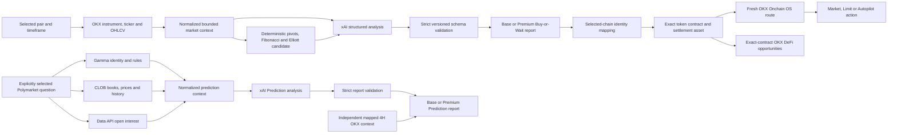
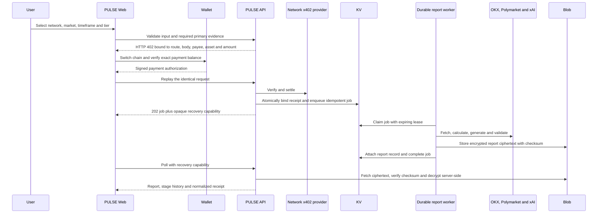
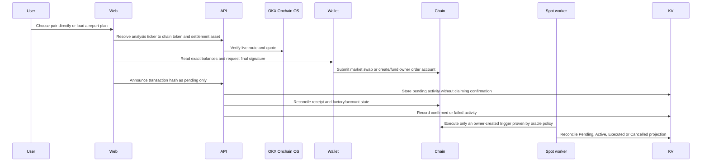
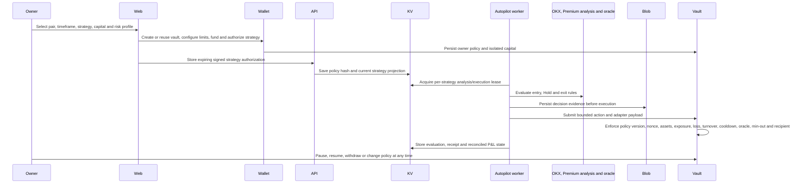
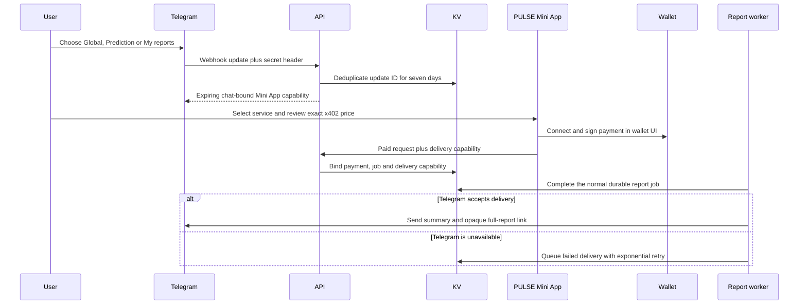
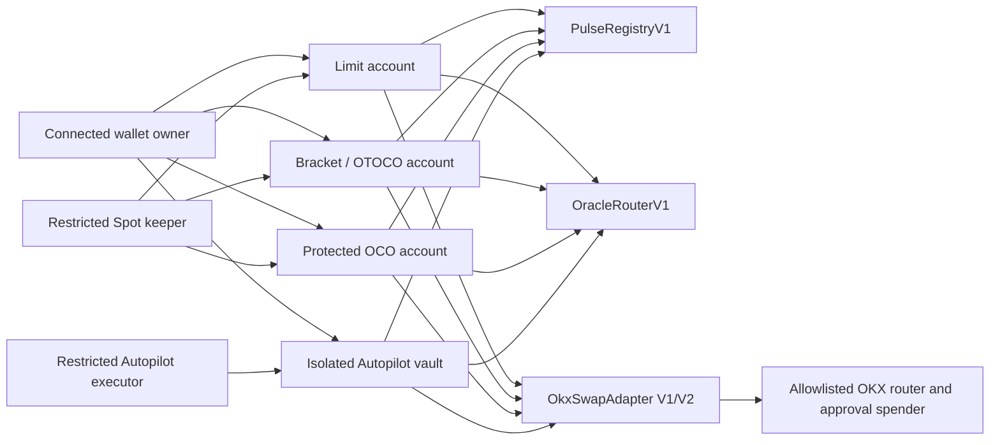

<p align="center">
  
</p>

<h1 align="center">PULSE</h1>

<p align="center"><strong>Global & Prediction intelligence. Wallet-signed Spot execution. Independent guarded Autopilot.</strong></p>

PULSE combines live OKX Global Market evidence—including crypto, xStocks, and RWA instruments—with explicitly selected Polymarket data. A valid Global report can prefill an Agentic-Wallet-signed Market or Limit Spot ticket, including optional TP/SL. Guarded Autopilot starts separately through its own pair, strategy, capital/risk, owner-vault and duration workflow; it never requires or reuses a paid report as its live signal. Reports are private, recoverable across devices through wallet proof, and paid per request through network-aware x402 settlement on X Layer, Base, Arbitrum One, and Arc Testnet.

PULSE is an independent intelligence product. Polymarket is a public read-only evidence source; PULSE does not place Polymarket orders or bypass Polymarket trading restrictions.

## Contents

- [Product and experience](#the-product)
- [Networks, services and payments](#networks-and-payments)
- [System architecture](#system-architecture)
- [End-to-end workflows](#end-to-end-workflows)
- [Trading prices, PnL and oracle evidence](#trading-prices-pnl-and-oracle-evidence)
- [Data architecture: KV and Blob only](#data-architecture-kv-and-blob-only)
- [On-chain execution architecture](#on-chain-execution-architecture)
- [Repository and module architecture](#repository-and-module-architecture)
- [Local development and configuration](#quick-start)
- [Persistence and deployment](#persistence-and-operations)
- [Trading troubleshooting](#trading-troubleshooting)
- [Security, release discipline and status](#security-and-limitations)

## The product

Markets move continuously, but most analysis products still require an account, subscription, or separate checkout. Agents need something stricter: structured intelligence they can discover, pay for, recover after a refresh, and consume without a human checkout.

**PULSE turns market intelligence into a multichain onchain service while preserving the original X Layer product.**

- Preview live OKX spot instruments, xStocks/RWA instruments, tickers, and candles without payment.
- Use the Opportunity Radar to shortlist markets worth analyzing without treating a score as a trade signal.
- Discover active crypto-focused Polymarket questions in an in-page picker and explicitly select the single market used by a report.
- Buy a visibly marked Base or Premium Global report, or a separate Base or Premium Prediction report. Agent discovery names the same tiers Quick and Pro so the next action is explicit.
- Read deterministic Fibonacci, pivot, and Elliott-wave structure; Pro reports add an annotated chart and executable Buy-or-Wait plan.
- Move a valid Global plan into connected-wallet Market or Limit Spot execution with route, balance, slippage, entry, TP, and SL carried forward.
- Run a policy-bounded Autopilot that can Buy, Hold, partially Sell, fully Sell, and later Buy again only inside owner-signed limits.
- Run network-scoped Risk Guard evidence and pre-trade checks on X Layer, Base, Arbitrum, and Arc Testnet.
- Settle through USD₮0 on X Layer, native USDC on Base and Arbitrum, or test USDC on Arc Testnet.
- Recover an idempotent paid job without paying twice and reopen wallet-owned report history on another device.
- Use the same product through the responsive web console, REST, MCP, or TypeScript SDK.

The browser keeps funding in context: connect once, inspect the selected chain’s native and payment-asset balances, and use the chain-specific in-app funding path. The last selected network is restored after reload. PULSE remains decision support, not financial advice. Contract evidence reports observable RPC facts; heuristic safety scores are not audits or guaranteed simulations.

## Why it stands out

| Typical market tool | PULSE |
| --- | --- |
| Account and recurring subscription | Pay only for the requested report |
| Human-only dashboard | Responsive web + REST + MCP + typed SDK |
| Opaque AI prose | Strict structured output, evidence quality, limitations, and invalidation |
| One generic workflow | Separate Global Market and user-selected Prediction Market analysis |
| Payment failure after work begins | Input and required primary evidence are validated before the payment challenge |
| Lost result after refresh | Receipt-bound durable job and private report recovery |
| Separate wallet and funding journey | Network-aware balances and funding inside PULSE |
| Hidden network assumptions | Explicit chain, token, provider, amount, payee, and receipt metadata |
| Analysis disconnected from execution | Global intelligence → Spot, plus an independent Configure → Fund & protect → Activate Autopilot journey |
| Ticker assumed to equal a chain token | Identity-safe representations such as BTC → cbBTC/WBTC and ETH → WETH, followed by a live-route check |

## Experience

### Global Market

Choose a live OKX instrument instead of typing an arbitrary pair. Select a timeframe and PULSE fetches public ticker/OHLCV data, renders the chart locally, and sends bounded structured context—not a screenshot—to Grok. Base and Premium reports have distinct marks. Premium adds an annotated, click-to-enlarge chart with Fibonacci levels, pivots, the current Elliott candidate, its invalidation, and wave-consistent next paths. The recommendation is deliberately **Buy or Wait**; PULSE never turns a bearish report into a new short. Changing pair, timeframe, network, or request tier supersedes the earlier request so a late response cannot replace the current context.

### Prediction Market

Prediction discovery is free and lives inside the main application rather than on a separate page. The user opens the market picker, chooses one active crypto price/direction question, reviews its probabilities, order books, liquidity, volume, open interest, restriction status, and resolution rules, then purchases Base or Premium prediction analysis. PULSE validates condition/outcome identity, order-book availability, freshness, liquidity, spread, depth, history, and horizon. Restricted markets remain usable as public read-only evidence when active and orderbook-enabled, but the restriction is always disclosed and PULSE never places an order.

Prediction reports use the same readable presentation standard as Global Market reports: confidence and tier, headline and summary, outcome probability cards, bid/ask and evidence-quality labels, market metrics, invalidation conditions, risks, evidence provenance, and disclaimer. Large provider payloads are kept behind a collapsed technical-details control. The optional focus note lets the user request emphasis such as the bull/up case, counter-case, catalysts, liquidity quality, resolution risk, or invalidation; it does not create a market or place an order.

### Connected-wallet Spot execution

Spot Trading works with or without a loaded report. The network-specific pair picker lists supported execution candidates directly; loading a Global report additionally prefills its pair, timeframe, entry, take-profit, and stop-loss. PULSE resolves the analysis ticker to an identity-safe chain token, checks the selected settlement asset and connected-wallet balance, and verifies a fresh OKX Onchain OS route before enabling either order button.

- Market orders expose Auto or Manual maximum slippage and can attach TP/SL after the confirmed fill.
- Limit orders carry the trigger, minimum received amount, and optional OTOCO protection in one ticket.
- Factory state is read from chain before account creation is offered; tab changes cannot erase an existing owner account.
- The shared dashboard separates Pending, Active, Executed, Cancelled, and Activity, displays trigger, actual entry/exit, OKX mark and P&L when provable, and supports selected or all-position closure.
- A trigger is only the owner-defined condition that permits execution. It is never presented as the fill. Contract balances and confirmed receipt transfers provide the actual entry/exit basis.
- Refresh reconciles the KV projection against the selected network. A previously missing or stale row can recover from its confirmed receipt or authoritative account state without recreating the order.
- If the pair is unavailable on the selected network, PULSE recommends a verified supported network; if none exists, it explains that the pair remains analysis-only and links to OKX Spot.

### Guarded Autopilot

Autopilot is independent from manual Spot Trading. The six-step setup covers the target vault, market, strategy, capital/risk, AI Entry Pass, review and activation; technical contract addresses and atomic values remain under optional proof. **Create new Autopilot** always creates a separate owner-controlled vault, while editing an explicitly selected vault changes only that vault. The creation form labels the connected wallet as the source and shows its spendable USDC or USDT0 balance. The target-token wallet balance is informational and is not required to start; a failed target-token read cannot replace a valid settlement balance with zero. Selecting **Prepare Autopilot** in Opportunity Radar prefills the draft, scrolls to setup and visibly confirms that no transaction has been sent.

After creation, one **Autopilot dashboard** combines account selection, status, portfolio balances, pass renewal, Pause/Resume, Add funds, Withdraw/Max, Close & withdraw all, strategy journals and reconciled on-chain activity. **Add funds** means a later owner top-up into that selected vault. It does not silently widen the signed maximum-trade, exposure, turnover, or loss limits; save the selected strategy when the policy should be resized around the larger capital base. **Withdraw** shows the selected vault’s withdrawable settlement balance, not the connected-wallet balance. The executor may act only through allowlisted ERC-20 assets/routes and owner-signed exposure, slippage, turnover, cooldown, daily-loss, confidence, and expiry limits; native assets use their official wrapped representation, such as WOKB on X Layer. The fast risk monitor handles TP/SL and completes bounded exits without waiting for another AI cycle. Closing leaves the empty contract auditable and reusable because deployed smart contracts cannot be deleted.

### Private report recovery

Paid reports use the configured public Vercel Blob transport, but only as authenticated AES-256-GCM ciphertext. The paying-wallet index, plaintext checksum, Blob reference, and logical private visibility remain in KV; the API refuses a production Blob configuration without a valid server-only encryption key. A wallet signature creates a short-lived report-access session that may decrypt and open the owner’s report or retry an already-settled failure; it cannot create a payment, trade, or authorize Autopilot. This makes report history available on desktop, iOS, Android, Mac, or another browser while retaining a same-device recovery fallback. A public Blob URL therefore never contains a readable report body.

### Risk Guard

- **X Layer token discovery · free:** OKX Onchain OS catalog with X Layer-only enrichment and manual-address fallback.
- **Contract evidence · free:** chain/block/code/balance/nonce reads, bytecode fingerprint, and common proxy detection.
- **Token risk:** deterministic component scores and explicit limitations.
- **Composite preflight:** PASS/WARN/FAIL report, grade, checklist, recommendations, and report identity.
- **Transaction simulation:** network-scoped evidence that never broadcasts a transaction.

Catalog presence, price, liquidity, and market probability are evidence—not endorsement, fact, or a safety guarantee.

### Wallet and funding

- One wallet drawer supports OKX Wallet, EIP-6963 injected wallets, WalletConnect, Base-compatible AppKit connectors, and Circle User-Controlled EOA wallets authenticated by email OTP. With the configured Circle Testnet application, Circle email sessions are Arc Testnet-only; PULSE hides X Layer, Base, and Arbitrum until the Circle wallet is disconnected.
- The selected PULSE network, connected provider, wallet chain, address, native balance, and exact payment-asset balance remain distinct.
- X Layer prepares OKB → USD₮0 through OKX Exchange OS.
- Base and Arbitrum prepare native ETH → native USDC inside PULSE; Arbitrum explicitly rejects USDC.e as the payment asset.
- Arc Testnet exposes faucet guidance, test-USDC balance, Circle Gateway balance, and Gateway deposit.
- Arc displays wallet USDC and Circle Gateway USDC in separate tabs so onchain funds are not confused with spendable Gateway funds.
- Before browser signing, PULSE switches to the selected chain and refreshes the exact payment-asset balance.

## Product surfaces

- **Global Market:** live OKX crypto, xStocks/RWA instruments, candles, Opportunity Radar, and Base/Premium reports with Elliott-aware execution plans.
- **Prediction Markets:** active crypto price/direction markets only, explicit single-market selection, order books, probability history, liquidity and evidence quality, followed by base or premium prediction analysis.
- **Risk Guard:** network-scoped contract evidence and transaction simulation on every supported network; legacy heuristic scores remain clearly identified.
- **Spot Trading:** connected-wallet Market, Limit, integrated TP/SL, route/balance checks, account discovery, and reconciled lifecycle dashboard.
- **Autopilot:** separate owner-controlled vault capital, strategy presets, enforceable policy limits, autonomous Buy/Hold/Sell lifecycle, and shared dashboard semantics.
- **Human web app:** one responsive Global Market / Prediction Market / Risk Guard / Spot Trading / Autopilot / Telegram / Docs workspace; persistent network selection; X Layer, Base, Arbitrum and Arc-specific themes; direct OKX Wallet preference plus EIP-6963/WalletConnect compatibility; balances, funding, payment progress, private report history, and readable reports.
- **Agent interfaces:** REST, MCP, TypeScript SDK, machine-readable metadata, OKX.AI compatibility, CDP Bazaar metadata, and Circle Marketplace listing material.

### Link previews and search metadata

The web entry point publishes canonical, Open Graph, X card, robots, sitemap, web-manifest, and Schema.org `WebApplication` metadata. Open Graph and X now reference the exact same versioned 1200×630 PULSE social card at `apps/web/public/og-image-v7.png`; changing the filename prevents one platform from retaining an older image while another uses the current card. Updating these local files does not refresh any remote crawler cache until the next deployment and crawler refresh.

## Networks and payments

| Network | Public prefix | Payment asset | Provider | Funding inside PULSE |
| --- | --- | --- | --- | --- |
| X Layer (`eip155:196`) | `/xlayer` | USD₮0 | OKX x402 | Native OKB to USD₮0 through OKX Exchange OS |
| Base (`eip155:8453`) | `/base` | Native USDC | CDP x402 | Native ETH to native USDC swap |
| Arbitrum One (`eip155:42161`) | `/arbitrum` | Native USDC | CDP x402 | Native ETH to native USDC swap; USDC.e is not accepted |
| Arc Testnet (`eip155:5042002`) | `/arc` | Test USDC | Circle Gateway | Faucet guidance and in-app Gateway deposit |

The shared unprefixed routes retain X Layer compatibility. Network aliases isolate chain IDs, assets, receipts, discovery metadata, and idempotency records while reusing the same business handlers.

Arc is always labeled **Testnet**. Its USDC has no production-value implication.

## Services and prices

The web UI uses the familiar **Base** and **Premium** tier labels. Public agent metadata uses the action-oriented **Quick** and **Pro** service names below; each pair maps to the same endpoints and prices.

### Public marketplace catalog

| Service | Price |
| --- | ---: |
| Free OKX and Polymarket discovery | Free |
| Global Quick → Spot Market or Limit | $0.20 |
| Global Pro → Spot Market or Limit | $0.30 |
| Prediction Quick | $0.20 |
| Prediction Pro | $0.30 |
| Onchain Pre-Trade Risk Guard | $0.15 |

### Public Autopilot start services

These three services guide the same six-step setup as the web product. The caller's Agentic Wallet creates/selects the owner vault, configures policy, deposits capital, registers the strategy and confirms start; the duration-specific x402 endpoint is the final AI-runtime activation step. They are published on X Layer, Base and Arbitrum, but excluded from Circle/Arc because Arc Testnet has no Autopilot execution.

| AI Entry Pass | Price |
| --- | ---: |
| Start Autopilot · 24h | $1.50 |
| Start Autopilot · 7d | $10.50 |
| Start Autopilot · 30d | $45.00 |

Prices are configured by environment variables and published through `/v1/metadata`. The overall execution-mainnet catalog has eight services; the Arc Testnet subset has five. Legacy compatibility prices remain configurable without becoming discoverable products. A paid request is rejected before the payment challenge when its schema or required preconditions are invalid.

Both Global tiers expose the same two execution choices after delivery: a prefilled wallet-signed Spot Market order or Spot Limit order. Base/Quick is the concise report; Premium/Pro adds the deeper chart, Elliott paths and broader execution context. Autopilot starts independently and does not buy or reuse either report: its own deterministic gates decide when a compact prepaid AI entry confirmation is eligible.

For Global Spot and Autopilot start workflows, Agentic Wallet remains the signer and owner. PULSE prepares and verifies the route or contract interaction but never receives a private key or silently broadcasts. X Layer uses the OKX Agentic Wallet on chain 196 with zero gas; Base and Arbitrum use the caller's EVM Agentic Wallet and require native ETH for gas.

The earlier fused, divergence, and event-risk routes remain in the codebase only for API compatibility and are disabled by default. They are not presented as consumer products in the web app or public product metadata.

## Paid report lifecycle

1. Validate the request and required provider evidence before payment.
2. Return a network-specific x402 challenge.
3. Verify and settle the signed authorization.
4. Persist an idempotent job and normalized payment receipt.
5. Fetch fresh provider context and calculate deterministic features.
6. Generate and validate the structured report.
7. Store the report privately and expose recovery through the job API.

Real backend stages are returned by `GET /v1/jobs/:jobId`. A recovery token lets the payer retrieve the completed report after refresh without paying again. A settled job may regenerate its deliverable within policy without creating a second payment.

## Polymarket data policy

PULSE uses public Gamma, CLOB and Data API reads. No Polymarket API key is required for discovery, order books, prices, history, or public open interest.

- Web users explicitly select one primary crypto market. The API retains bounded additional-market fields only for backward compatibility and never adds markets silently.
- PULSE never silently substitutes another market.
- Condition IDs and outcome-token mappings are validated.
- Active restricted markets may be analyzed read-only; `restricted` remains visible as a trading-compliance signal.
- Closed, archived, inactive, malformed, or orderbook-disabled markets are rejected.
- Required primary-market order books are checked before payment and revalidated by the worker after settlement.
- Optional-source failures produce explicit partial-data fields rather than invented values.

## Wallet and funding UX

One restored wallet session supports all enabled networks. The UI distinguishes the selected PULSE network, connected provider, connected address, and wallet chain. Before signing, PULSE switches to the selected chain and verifies the exact payment-asset balance.

The selected network is stored locally and restored on reload or the next start. `DEFAULT_NETWORK` is used only when no valid saved selection exists. Each non-X-Layer network has its own visual theme; the original X Layer appearance remains unchanged.

- **X Layer:** OKB and USD₮0 balances; in-app OKB → USD₮0 swap.
- **Base:** ETH and native USDC balances; in-app ETH → USDC swap.
- **Arbitrum:** ETH and native USDC balances; in-app ETH → USDC swap with explicit USDC.e warning.
- **Arc Testnet:** separate Wallet USDC and Gateway USDC tabs, faucet entry, and Gateway deposit. `ARC_AI_MODE=live` is required for real Base/Premium reports; `fixture` is only a deterministic payment/job plumbing check and makes no market inference.

Supported connection paths include OKX Wallet, EIP-6963 injected wallets such as MetaMask and Rabby, WalletConnect mobile sessions, Base-compatible connectors exposed through AppKit, and Circle User-Controlled EOA wallets via email OTP. The connected address in the funding drawer is copyable. Circle wallet keys remain controlled by the user through Circle's MPC signing UI; `CIRCLE_API_KEY` is server-only.

## System architecture

PULSE separates presentation, payment, analysis, operational state, immutable artifacts, wallet authority, and on-chain enforcement. The browser never receives provider secrets or an automation private key. The API never treats its database projection as stronger evidence than a confirmed chain receipt, contract read, token balance, or provider order state.

```mermaid
flowchart TB
  subgraph Clients[Client and agent surfaces]
    WEB[React web console]
    TG[Telegram Bot and Mini App]
    AGENT[REST, MCP and TypeScript SDK clients]
    WALLET[Connected user wallet]
  end

  subgraph Control[PULSE API and control plane]
    API[Express API<br/>schemas · auth · x402 · quotes · tx preparation]
    JOB[Durable report worker]
    CRON[Secret automation tick<br/>plus distributed KV lease]
    SPOTW[Deterministic Spot worker]
    AUTOW[Policy-bounded Autopilot worker]
    TGW[Telegram delivery worker]
  end

  subgraph Evidence[Evidence, analysis and payment providers]
    OKX[OKX public market, Onchain OS DEX and DeFi]
    POLY[Polymarket public Gamma, CLOB and Data APIs]
    XAI[xAI structured analysis]
    PAY[OKX, CDP or Circle x402 settlement]
    RPC[Chain RPC primary and fallback pools]
  end

  subgraph Data[KV and object persistence, no SQL]
    KV[Upstash KV<br/>jobs · receipts · indexes · sessions · leases · activity · strategies]
    BLOB[Vercel Blob<br/>encrypted report ciphertext · compatible evidence objects]
  end

  subgraph Chains[Supported execution chains]
    REG[Pulse Registry]
    ORACLE[Oracle Router]
    ADAPTER[Allowlisted OKX execution adapter]
    SPOT[Owner-controlled Spot accounts]
    VAULT[Owner-controlled Autopilot vaults]
  end

  WEB --> API
  TG --> API
  AGENT --> API
  WEB <--> WALLET
  API --> OKX
  API --> POLY
  API --> PAY
  API <--> KV
  API <--> BLOB
  JOB <--> KV
  JOB --> OKX
  JOB --> POLY
  JOB --> XAI
  JOB --> BLOB
  CRON --> SPOTW
  CRON --> AUTOW
  CRON --> TGW
  SPOTW <--> KV
  AUTOW <--> KV
  AUTOW --> BLOB
  TGW <--> KV
  SPOTW --> OKX
  AUTOW --> OKX
  API --> RPC
  SPOTW --> RPC
  AUTOW --> RPC
  WALLET --> SPOT
  WALLET --> VAULT
  SPOTW --> SPOT
  AUTOW --> VAULT
  SPOT --> REG
  SPOT --> ORACLE
  SPOT --> ADAPTER
  VAULT --> REG
  VAULT --> ORACLE
  VAULT --> ADAPTER
```



### Runtime boundaries

| Component | Owns | Does not own |
| --- | --- | --- |
| Web console | product state, responsive UI, wallet selection, signatures, local opaque recovery capability | provider secrets, server wallets, autonomous scheduling, final settlement truth |
| API | request schemas, network capability checks, x402 middleware, wallet-history challenges, route/quote validation, unsigned transaction preparation, dashboards | permission to sign a user’s trade or loosen an Autopilot policy |
| Durable report worker | leased paid jobs, provider context, deterministic features, xAI calls, schema validation, report persistence | trading authorization |
| Spot worker | deterministic owner-created limit/bracket/OCO trigger evaluation and confirmed-receipt reconciliation | AI strategy decisions, arbitrary assets, arbitrary recipients |
| Autopilot worker | strategy evaluation, evidence persistence, simulation, bounded executor calls, fast TP/SL monitoring | owner withdrawals, policy expansion, manual Spot orders |
| Telegram worker | webhook deduplication, retry queue, report-link delivery | wallet custody, analysis generation, payment signing |
| KV | current operational projections, indexes, queues, leases, idempotency, short-lived sessions and resilient outbox state | private keys, large report bodies, sole financial truth |
| Blob | encrypted immutable report ciphertext and compatible immutable evidence objects | plaintext public reports, mutable live order state, wallet balances, signing authority |
| Contracts | allocated-asset custody and enforcement of owner-approved execution limits | off-chain inference, market discovery, arbitrary router calls |

### Runtime modes

The same modules support three process layouts; changing the layout does not change financial authority.

| Mode | Behavior |
| --- | --- |
| Local `npm run dev` | Starts the API and web console. The API starts the durable report worker plus enabled Spot, Autopilot, and Telegram timers. The launcher reuses healthy local services, refuses a stale occupied port, and kills only child process trees it started. |
| Long-lived Node host | Runs the same API and in-process timers continuously. KV leases plus contract state/nonces prevent overlapping or repeated financial execution across instances. |
| Optional serverless API | Handles HTTP requests; `/v1/internal/automation/tick` is called with `CRON_SECRET`. A shared KV lease prevents overlapping Spot/Autopilot/Telegram cycles. The checked-in production default instead runs one long-lived Railway API/worker. |

A split web/API/worker deployment is supported operationally, but it is not required by the source tree. Autonomous execution never happens inside the browser and is never authorized by an ordinary report request.

### Market-data and analysis pipeline

Analysis coverage and on-chain executability are intentionally separate. Every valid OKX Global Market instrument may be analyzed, including crypto, xStocks, and RWA products. Spot or Autopilot is enabled only after a second pipeline resolves an identity-safe token representation and verifies a live route on the selected execution network.



Key rules:

- Provider payloads are normalized and bounded before model input; Grok receives structured evidence, not screenshots, wallet secrets, or arbitrary raw pages.
- Pivot, Fibonacci, alternating swing points, Elliott candidate/invalidation, and chart paths are calculated deterministically. The report explanation must remain consistent with those values.
- Pro Global reports expose an execution intent only when the result is a valid Buy setup. Bearish or insufficient evidence becomes Wait, never a new short recommendation.
- DeFi discovery first resolves the selected chain representation—for example `BTC → cbBTC` on Base or `BTC → WBTC` on Arbitrum—then accepts only products containing that exact contract.
- Prediction Market uses one explicitly selected condition/outcome mapping. It never silently substitutes a trending market. Pro may add an independently sourced 4H underlying-asset chart, clearly separated from the prediction probability evidence.
- The Opportunity Radar is a free technical shortlist. Its score selects what to investigate; it is not transaction authorization.
- Shared Zod schemas reject missing, extra, malformed, or mixed-type model output. Compatibility repair is limited to the known obsolete pre-Elliott shape so a paid report is not lost merely because a provider returned the previous schema.

### Report data model

| Layer | Representative data |
| --- | --- |
| Request identity | network, service/tier, pair or selected market ID, timeframe, language, optional focus, request hash |
| Source evidence | observed times, ticker/candles, order books/history/open interest, source availability, stale/partial flags |
| Deterministic structure | pivot, supports/resistances, Fibonacci levels, Elliott candidate, wave points, invalidation and candidate next paths |
| Model interpretation | tier mark, headline, summary, bias, confidence, catalyst/counter-case, limitations and disclaimer |
| Execution intent | Buy-or-Wait, entry trigger, take-profit, stop-loss, rationale and timeframe; never a wallet authorization |
| Selected-chain extension | identity-safe execution token, settlement asset, live-route result, alternative networks and exact-token DeFi products |
| Delivery proof | normalized settlement receipt, durable stage events, report checksum, Blob record and opaque recovery capability |

The chart is rendered locally from report candles and deterministic annotations. It is not an AI-generated picture and does not require a horizontal overflow area; the same SVG opens in an accessible zoom dialog.

## End-to-end workflows

### Paid report and recovery



The payment authorization is bound to network, asset, amount, payee, resource URL, and request hash. Replaying one authorization resolves to one idempotent job. A settled job whose deliverable failed can be retried within policy without a second payment. A five-minute wallet challenge creates a separate 15-minute report-history session for cross-device retrieval and receipt-bound recovery; that signature cannot create a payment or trade.

### Manual Spot and automatic protection



For a direct Market swap, PULSE validates the prepared sender, input/output token contracts, router, native value, approval target, amount, deadline, and slippage before the wallet sees it. For Limit or protected Spot, only the allocated amount enters the owner’s account contract. The keeper can execute an existing condition; it cannot create a market, enlarge an amount, change TP/SL, or redirect proceeds.

### Guarded Autopilot



Autopilot capital is the vault’s actual settlement-token balance. It is separate from the connected wallet’s Spot capital and from every other Autopilot vault. A Hold does not disable a strategy: later evaluations may Buy; a held position may Hold, partially Sell, fully Sell, and later Buy again if the unchanged owner policy permits it. The one-minute deterministic risk path does not wait for xAI before enforcing an already configured TP/SL.

For a new Autopilot, **Initial deposit** is the single amount transferred from the connected wallet during creation and used to calculate the first signed trade, exposure, turnover, and loss limits. The user does not also use Add funds. **Add funds** appears only for an already-created vault and is an optional later owner top-up; it changes the vault balance but does not silently widen an already signed policy. Save the selected strategy when those limits should be recalculated from the larger capital base.

### Cost-controlled Autopilot AI

Autopilot does not generate a full Premium report on every cycle. The runtime has three distinct layers:

1. A one-minute deterministic risk path protects an open position and completes latched exits without xAI.
2. A scheduler with a hard 15-minute minimum evaluates only a newly closed candle. A deterministic trend, breakout, or mean-reversion prefilter rejects non-candidates without xAI.
3. Only a surviving entry candidate may use one compact 4,000-input/320-output-token classifier. Signals are cached by pair and timeframe for four hours, while hard per-vault and global daily call/USD budgets fail closed to Hold.

Each owner-controlled vault uses a manually prepaid AI Entry Pass. One covered day costs **$1.50** and adds up to three compact entry confirmations; seven and 30-day options are exact multiples. A new vault is created and registered before the final x402 activation payment; an existing active pass is reused without another charge. Renewing extends the current expiry. Pausing freezes the paid timer and suppresses expiry warnings; resuming shifts the deadline by the paused duration. Two active-runtime hours before expiry the UI becomes urgent, and a purchase made through the Telegram Mini App also registers an expiring chat reminder. When the pass expires or its confirmations are exhausted, new entries Hold. Existing TP/SL, deterministic structure exits, pause, close and owner withdrawal continue normally and never require another payment.

Spot and Autopilot dashboards distinguish four prices. The owner-defined **trigger** only decides when execution may start. **Actual entry** and **actual exit** are reconstructed from confirmed contract amounts or transaction-receipt ERC-20 balance transfers. The displayed **mark** is the timestamped OKX public spot last price. Open P&L compares mark with actual entry; realized P&L compares actual exit with actual entry, and PULSE reports an unavailable basis instead of substituting the trigger. Before an automated transaction, the restricted worker publishes the fresh OKX observation to `OracleRouterV1` with a five-minute maximum age; the contract rejects missing/stale data and independently enforces the approved adapter and minimum output.

### Trading prices, PnL and oracle evidence

PULSE deliberately keeps order conditions, execution evidence, market observations, and accounting separate:

| Value | Meaning | Authoritative source |
| --- | --- | --- |
| Trigger | Owner-selected price condition for a Limit entry, TP, or SL | Spot account or Autopilot policy contract |
| Actual entry | Effective settlement paid divided by target asset received | Account contract amounts or confirmed transaction-receipt ERC-20 transfers |
| Actual exit | Effective settlement received divided by target asset sold | Confirmed `PositionClosed` evidence or transaction-receipt ERC-20 transfers |
| Mark | Latest observed public OKX spot price, with observation time | OKX public spot ticker used by the current dashboard/worker refresh |
| Open P&L | `(mark - actual entry) / actual entry` for the currently held asset | Derived only after an actual entry is available |
| Realized P&L | `(actual exit - actual entry) / actual entry` for a completed lifecycle | Derived only after both confirmed fills are available |
| Portfolio P&L | Cash-flow-adjusted value of one Autopilot: current assets plus owner withdrawals minus gross owner contributions | Reconciled vault balances, confirmed owner cash flows, and current mark |

This distinction explains why a Buy-below order with trigger `2430` can show positive P&L when the mark is `2428.7`: if the actual on-chain fill was `2424.25`, the position is above its real entry even though the mark remains below the trigger. PULSE displays the trigger and actual entry separately so the user never has to infer one from the other.

For connected-wallet Market execution, PULSE accepts only a successful receipt whose sender is the connected owner and whose destination is the configured OKX router, then derives the fill from the owner’s ERC-20 transfers. For Spot account and Autopilot execution, the receipt must target the exact owner-controlled account or vault. This prevents a browser-announced hash or unrelated successful transaction from becoming a fabricated fill.

The price path is near-real-time polling, not a continuously streaming Chainlink feed:

- Spot condition checks default to every 30 seconds through `AUTOMATION_INTERVAL_MS`.
- Autopilot’s deterministic open-position risk check defaults to every 60 seconds through `AUTOPILOT_RISK_INTERVAL_MS`.
- Autopilot's deterministic new-candle scheduler has a hard 15-minute floor through `AUTOPILOT_ANALYSIS_INTERVAL_MS`; lower deployed values are ignored. It does not itself imply an xAI call.
- Compact AI entry confirmation is limited by `AUTOPILOT_AI_MIN_INTERVAL_MS`, shared cache TTL, per-vault/global call caps and per-vault/global USD caps.
- Access is prepaid per owner-controlled vault: **$1.50 for 24 hours**, **$10.50 for 7 days**, or **$45 for 30 days**. Renewal appends time to an unexpired pass. Each covered day permits up to three compact confirmations, still subject to the stricter runtime budgets above.
- At two active-runtime hours remaining the web console marks the pass urgent. A Telegram Mini App purchase carries a chat-bound reminder capability and sends one warning plus one expiry notice. Pausing freezes both expiry and reminders. When active paid time ends, PULSE blocks new AI-assisted entries but keeps deterministic protection/exits and every owner control available.
- The provider-attempt timestamp is persisted **before** the request. Every attempt therefore observes at least the configured AI interval, including failed requests. Billing/auth/quota failures open a six-hour circuit breaker; generic failures use exponential backoff with a 15-minute floor. This prevents a rejected Grok request from being retried by every one-minute worker tick.
- The UI exposes lifetime evaluation/Buy/Sell/Hold/failure counters, today’s provider calls and cost, the last signal source, pass state and budget status. Identical consecutive failures are collapsed in the journal and raw provider text is hidden under Technical error details. When xAI returns `usage.cost_in_usd_ticks`, PULSE records that exact provider-billed amount; token-rate calculation is only the fallback for compatible responses without billed-cost ticks. KV retains the latest 100 detailed evaluations per vault while cumulative counters remain bounded; **Export CSV activity** combines that evidence window with reconciled on-chain activity.
- Immediately before an automatic Spot or Autopilot execution, the restricted worker writes the current normalized OKX observation into `OracleRouterV1` with `maxAge = 300` seconds.
- The contract rejects an absent, invalid, or stale oracle observation. It independently enforces the approved executor/keeper, adapter, token pair, amount, minimum output, policy version, nonce, and relevant risk limits.
- The execution route and slippage quote remain separate from the oracle condition. Passing a trigger never waives minimum-output or adapter checks.

When historical data cannot prove a fill basis, the dashboard displays **unavailable**. It does not use zero, a report recommendation, the trigger, or the current mark as a substitute entry.

### Telegram paid delivery



The Telegram bot is a navigation and delivery adapter, not a wallet, model host, or separate analysis service. Its 35-day HMAC capability identifies only the destination chat and cannot pay, trade, retrieve arbitrary wallet history, or authorize Autopilot. The duration covers a 30-day Autopilot pass plus its warning/expiry delivery window. Wallet connection and x402 signing remain in the Mini App. A full-report message uses a revocable opaque report share and therefore requires explicit `REPORT_SHARE_LINK_ENABLED=1`; the bot never receives a direct Blob URL. Duplicate updates are ignored, and failed messages are retried from KV under a per-delivery lock without rerunning or recharging the report.

## Data architecture: KV and Blob only

PULSE does not use PostgreSQL or another relational database. Production persistence has two internal stores plus external financial truth.

| Data class | Authority | Storage and rule |
| --- | --- | --- |
| Chain transactions, contract state, token balances | blockchain RPC and finalized receipts/logs | strongest execution truth; reconciliation repairs cached projections |
| OKX native route/order state and market observations | OKX provider responses | provider truth for its own route/order IDs; never accepted as permission to spend |
| Current jobs, receipts, activity, automation and dashboard projections | Upstash KV | operational read model; updated idempotently and allowed to degrade without inventing confirmation |
| Private reports and large decision evidence | Vercel Blob | immutable artifact body; KV stores its small manifest/index/checksum |
| Selected network and opaque recovery handles | browser storage | convenience only; no report body, private key, executor key, or authoritative order state |

### Implemented KV model

`PERSISTENCE_NAMESPACE` isolates paid-job, report, history-session, budget, and cron keys. The V6 trading keys retain the stable `pulse:v6:*` prefix so existing mainnet activity and vaults remain discoverable; separate environments must therefore use separate KV databases. Wallet addresses are normalized before keys are built, and payer indexes use a SHA-256-derived suffix. Important implemented key families are:

```text
<ns>:job:<jobId>                         paid job projection and stage history
<ns>:idem:<paymentIdempotencyKey>        payment/request deduplication
<ns>:jobs:ready                          report queue sorted by availability
<ns>:jobs:leased                         active leases sorted by expiry
<ns>:job-lease:<jobId>                   current report-worker lease owner
<ns>:payer-jobs:<payerDigest>            wallet report-history index

<ns>:report:<reportId>                   Blob path, owner, checksum and creation time
<ns>:report-body-fallback:<reportId>     bounded private paid-report fallback when Blob write fails
<ns>:report-share:<tokenDigest>          revocable expiring share mapping
<ns>:report-history-challenge:<digest>   one-use five-minute wallet challenge
<ns>:report-history-session:<digest>     15-minute report-access/recovery session

pulse:v6:activity-map:<network>:<wallet> per-transaction Spot/Autopilot activity hash
pulse:v6:activity:<network>:<wallet>     read-only legacy activity list used during migration
pulse:v6:automation:orders               current deterministic Spot automation projections
pulse:v6:autopilot:strategy-map          one hash field per signed Autopilot strategy
pulse:v6:autopilot:lease:<scope>:<id>    separate analysis and execution leases
pulse:v6:autopilot:evidence:<...>        private evidence fallback when a private Blob object is unsupported
pulse:v6:autopilot:potential-gainers:<tf> five-minute opportunity-radar cache

pulse:v6:telegram:delivery:<id>          retryable Telegram delivery task
pulse:v6:telegram:due                    due-delivery sorted set
pulse:v6:telegram:lock:<id>              delivery lock
pulse:v6:telegram:update:<updateId>       seven-day webhook deduplication marker
<ns>:automation:cron-lease               cross-instance scheduler lease
```

Report receipt binding and queue insertion are one Redis script. Job claims, acknowledgements, lease extensions, requeues, expired-lease recovery, and report attachment are also ownership/version checked. Trading activity uses one hash field per transaction so two workers cannot overwrite the whole ledger. Autopilot configuration and runtime telemetry are merged separately: a stale worker cannot roll back a newer owner-signed policy, and concurrent evaluation histories are unioned by evaluation ID.

Memory stores exist only for local/unit use. A production capability response labels persistence as `upstash_kv`; Spot/Autopilot execution that requires durable coordination fails closed when KV is unavailable. The resilience circuit bounds request time, opens after failure, retries a recovery probe, and lets read-only UI use last-known data without marking it confirmed.

### Implemented Blob model

- Paid report bodies are written under a unique `reports/<namespace>/<reportId>.json` path with overwrite disabled.
- The enforced production mode is `BLOB_ACCESS=public`. Before upload, every paid report body is encrypted with authenticated AES-256-GCM using the server-only `REPORT_ENCRYPTION_KEY`.
- The KV report record contains the paying wallet, Blob path, plaintext SHA-256 checksum, logical private visibility, and creation time.
- Blob reads are performed by the API, bypass caches, authenticate and decrypt the AES-GCM envelope server-side, verify the plaintext checksum, and only then parse JSON.
- Configuration rejects an unencrypted public report store. Do not set `BLOB_ACCESS=private`: the supplied PULSE Vercel Blob store and validated environment contract use public transport with encrypted payloads.
- A bounded private-KV report-body fallback protects already-paid delivery when Blob rejects a write or is temporarily unavailable. It uses the report retention TTL and the same SHA-256 verification; encrypted Blob remains the primary report artifact store.
- Autopilot stores the canonical decision payload before execution and binds its hash to the vault action. It attempts a private Blob evidence object only when the backing store supports one; with the supplied public store, the fail-closed private-KV evidence record is the expected path.
- Blob never stores the only current copy of a balance, active order, vault policy, position status, or P&L projection.

### Consistency and crash recovery

```text
wallet or worker broadcasts transaction
  -> UI records only a pending hash
  -> receipt reconciliation reads the selected chain through primary/fallback RPC
  -> confirmed sender + successful receipt advances activity
  -> contract/account reads determine Pending, Active, Executed or Cancelled
  -> immutable execution activity heals stale worker runtime
```

If a report worker crashes after settlement, its lease expires and a replacement claims the same job. If it crashes after Blob upload but before job completion, the receipt-bound retry policy regenerates or reconciles the deliverable without charging again. If an automation worker crashes after broadcast, the next cycle uses the transaction hash, receipt, existing activity ledger, and contract nonce/state rather than blindly broadcasting again. KV is the fast operational projection; chain/provider evidence wins disagreements.

### Operational state and dashboard projections

PULSE does not infer trading state from an unrelated account-creation receipt. It derives each lifecycle from its own contract/provider evidence:

| UI state | Meaning |
| --- | --- |
| Pending | a submitted transaction awaits a receipt, or a funded entry condition has not filled |
| Active | acquired assets remain under TP/SL, or an Autopilot vault currently holds a governed position |
| Executed | a Market/Limit buy or sell completed without active protection, or a protected lifecycle closed fully |
| Cancelled | the owner cancelled the order or the contract reports a terminal cancellation |
| Activity | append-only view of wallet/contract transactions; it is not another order status |

A partial exit remains Active while protected target balance remains. A completed exit becomes Executed only when contract state and balance agree. Trigger and mark come from contract/provider evidence; P&L is shown only when a confirmed fill basis exists. Legacy records without provable basis say that the basis is unavailable instead of displaying a fabricated zero.

The browser also maintains a latest-request epoch. Starting Premium supersedes a still-running Quick request; changing pair, timeframe, network, or selected Prediction question invalidates the previous context. A late response can be recovered in history, but it cannot overwrite the currently selected report.

### Sensitive-data boundary

- User wallet private keys and seed phrases never enter the API, KV, Blob, logs, or report payloads.
- `TEST_WALLET_PRIVATE_KEY` and the restricted automation executor key are server/worker environment values only and are never exposed through `VITE_*`.
- Provider keys, xAI credentials, Blob tokens, KV tokens, Telegram secrets, `CRON_SECRET`, and report encryption keys stay server-side.
- Wallet-history nonces and sessions are hashed in keys and expire; they can read reports and retry only an already-settled report job, never pay or trade.
- Browser-announced activity can only be `pending`; confirmation is derived from a receipt whose sender matches the wallet.
- Logs and metrics contain correlation IDs, stages, timings and outcome counts—not private report bodies or signing secrets.

## On-chain execution architecture

One separately configured contract suite exists on each supported execution mainnet. The UI reads factory state before suggesting account creation. Arc Testnet exposes analysis/payment and Risk Guard only; Spot and Autopilot remain hidden.



| Contract family | Responsibility and enforced boundary |
| --- | --- |
| `PulseRegistryV1` | approved adapters, separate Spot keeper and Autopilot executor roles, and guardian automation pause; owner withdrawal is not delegated to automation |
| `OracleRouterV1` | normalized price plus freshness/validity; automatic execution rejects missing, stale or invalid observations |
| `OkxSwapAdapterV1/V2` | exact token/amount/recipient/deadline payload, separate router and approval-spender policy, balance-delta output and minimum received |
| `SpotOrderAccountV2` + factory | connected-wallet Buy-below/Sell-above limit order; owner cancellation and exact funded amount |
| `SpotBracketAccountV1` + factory | OTOCO entry followed by contract-held TP/SL protection; one exit closes the sibling branch |
| `SpotOrderAccountV1` + factory | owner-controlled protected OCO position and immediate owner close/recovery |
| `AutopilotVaultV2` + factory | isolated settlement capital, allowlisted target asset, policy version/hash, nonce, trade/exposure/turnover/loss/slippage/cooldown/expiry limits, executor-only bounded action |

Contracts are not proxy-upgraded in place. New behavior uses a new implementation/factory version and explicit configuration. Provider calldata is untrusted: the adapter validates the approved router path, tokens, recipient, amount, deadline, approval target and output before success. Global pause and per-integration allowlists can stop automation, while the owner retains pause, cancellation, close and withdrawal controls.

Spot Trading and Autopilot are independent systems. A Spot report action never allocates capital to Autopilot; creating a Spot order never authorizes strategy decisions; an Autopilot vault never controls ordinary connected-wallet holdings.

## Repository and module architecture

```text
.
├── apps/
│   ├── web/                         React 19 + Vite 6 console
│   │   └── src/
│   │       ├── App.tsx              network, wallet, analysis and top-level routing
│   │       ├── V6Workspaces.tsx     Spot, Autopilot, Telegram, Docs and shared dashboards
│   │       ├── Pickers.tsx          themed market, execution-pair and timeframe pickers
│   │       ├── Report.tsx           readable reports and zoomable Elliott charts
│   │       ├── ReportHistory.tsx    wallet-owned cross-device recovery
│   │       └── wallet.ts            provider selection, x402 signing and chain checks
│   └── api/
│       └── src/
│           ├── app.ts               REST/MCP/x402 routes and durable report execution
│           ├── jobs.ts              KV jobs, leases, receipts and Blob report store
│           ├── v6Routes.ts          pair resolution, quotes, balances and activity APIs
│           ├── onchainDiscovery.ts  factory multicall, RPC fallback and account snapshots
│           ├── tradeAutomation.ts   deterministic Spot reconciliation/trigger worker
│           ├── autopilotPolicy.ts   explicit entry, Hold and exit rule engine
│           ├── autopilotAutomation.ts strategy/evidence/simulation/execution loop
│           ├── reportHistoryAuth.ts wallet challenge and scoped report recovery sessions
│           ├── resilientKv.ts       bounded retry and recovering KV circuit
│           ├── automationTick.ts    secret serverless scheduler entry and lease
│           └── telegram.ts          webhook, checkout handoff and durable delivery
├── packages/
│   ├── contracts/                   Solidity, artifacts, deployments, config and tests
│   ├── analysis/                    structured Global/Prediction analysis and Elliott logic
│   ├── market/                      OKX and public Polymarket evidence clients
│   ├── payments/                    OKX, CDP, Circle and mock x402 adapters
│   ├── buyer/                       controlled x402 buyer utilities
│   ├── domain/                      Risk Guard and deterministic preflight logic
│   ├── schemas/                     versioned Zod API/report contracts
│   ├── config/                      networks, feature gates, prices and metadata
│   └── sdk/                         typed PULSE client and job polling
├── api/                             Vercel serverless entrypoint
├── metadata/                        local machine-readable marketplace package
├── assets/                          source brand assets
├── scripts/                         dev orchestration, readiness and E2E diagnostics
├── ops/                             alerting and operational configuration
└── docs/                            architecture, testing, deployment and user guides
```

The architecture detail in this README reflects implemented modules. The deeper contract authority, strategy rules, deployment variables, acceptance evidence, and operator procedures live in the [PULSE technical specification](docs/V6_TECHNICAL_PROPOSAL.md), [Autopilot trading report](docs/AUTOPILOT_TRADING_REPORT.md), [environment reference](docs/ENVIRONMENT.md), and [product testing guide](docs/PRODUCT_TESTING_GUIDE.md).

## Quick start

### Requirements

- Node.js 22.x
- npm 10+
- xAI key for live generated reports
- Provider credentials for real settlement and funding
- A funded test wallet only when intentionally running real-payment tests

```bash
git clone https://github.com/mssystem1/Pulse.git
cd Pulse
copy .env.local.example .env
npm install
npm run build
npm test
npm run dev
```

`npm run dev` starts both applications. Use `npm run dev:api` and `npm run dev:web` only when separate terminals are preferable.

## Local development

Requirements: Node.js 22.x and npm 10+.

```bash
copy .env.local.example .env
npm install
npm run build
npm test
npm run dev
```

`npm run dev` starts the web app at `http://localhost:5173` and the API at `http://localhost:4000`. Individual processes are available as `npm run dev:web` and `npm run dev:api`.

Useful local endpoints:

- Web: `http://localhost:5173`
- API health: `http://localhost:4000/healthz`
- Product metadata: `http://localhost:4000/v1/metadata`
- MCP: `http://localhost:4000/mcp`
- Polymarket discovery: `http://localhost:4000/v1/polymarket/markets`

### Real local payment testing

Use `X402_MOCK=0`. Real testing spends the configured wallet's assets and must use a fresh challenge and signature for every payment. `X402_MOCK=1` is reserved only for automated shape/unit tests and must never be enabled in production.

Do not expose server credentials or private keys through `VITE_*` variables. Test-wallet secrets belong only in ignored local environment files.

## Configuration

Start with [`.env.local.example`](.env.local.example) for local integration and [`.env.production.example`](.env.production.example) for rollout. The complete categorized guide is [docs/ENVIRONMENT.md](docs/ENVIRONMENT.md).

Key controls:

```dotenv
ENABLED_NETWORKS=xlayer,base,arbitrum,arc-testnet
VITE_ENABLED_NETWORKS=xlayer,base,arbitrum,arc-testnet

FEATURE_PREDICTION_ANALYSIS=1
FEATURE_FUSED_ANALYSIS=0
FEATURE_DIVERGENCE_ANALYSIS=0
FEATURE_EVENT_RISK_ANALYSIS=0
FEATURE_BASE_PAYMENTS=1
FEATURE_ARBITRUM_PAYMENTS=1
FEATURE_ARC_PAYMENTS=1
CIRCLE_GATEWAY_ENABLED=1

X402_MOCK=0
ARC_AI_MODE=live
GROK_MAX_INPUT_FUSED_STANDARD=13000
```

`ENABLED_NETWORKS` controls server routes and payment adapters. `VITE_ENABLED_NETWORKS` controls which networks the built web application exposes. Keep them aligned for local testing. Production can begin with only `xlayer` and expand through feature flags after each network's release gates pass.

`ARC_AI_MODE=live` uses real xAI analysis after Circle Gateway settlement and requires positive xAI input/output cost variables. `fixture` intentionally returns a labelled non-analytical test report. Fused, divergence, and event-risk flags remain disabled because they are not part of the current web product.

## API examples

```bash
curl "http://localhost:4000/v1/market/ticker?instId=BTC-USDT"
curl "http://localhost:4000/v1/polymarket/trending?limit=20"

curl -i -X POST "http://localhost:4000/base/v1/analysis/prediction/standard" \
  -H "content-type: application/json" \
  -d '{"primaryMarketId":"pm:0x...","additionalMarketIds":[],"lang":"en"}'
```

The unpaid request returns a 402 response only after input and primary-market evidence validation succeeds.

## Persistence and operations

- Upstash KV/Redis is the durable operational read model for payment idempotency, report queues and leases, receipt references, wallet-history authorization, Spot activity, automation projections, Autopilot strategies, worker leases, and Telegram delivery retries.
- Vercel Blob’s public transport holds immutable AES-256-GCM report ciphertext, never readable report JSON. KV holds the owner/index/checksum manifest, the bounded paid-report fallback, and the expected Autopilot evidence fallback when the public store rejects private evidence objects. API reads bypass caches, authenticate and decrypt reports server-side, and verify the plaintext checksum.
- Confirmed chain receipts, contract state, wallet balances, and provider-owned order state remain stronger evidence than KV. Reconciliation heals stale projections and never upgrades browser-announced activity beyond Pending without receipt evidence.
- `PERSISTENCE_NAMESPACE` scopes report/job/history/budget/cron data. Stable `pulse:v6:*` trading keys preserve existing mainnet accounts and activity, so development, staging, and production must use separate KV databases.
- Correlation IDs connect payment, job, provider, xAI, report, automation, and delivery events. `/metrics` publishes payment, provider, queue, completion, recovery, token, and estimated AI-cost metrics without report bodies or secrets.
- Long-lived Node hosts run report and enabled automation timers in process. Serverless installations call the secret `/v1/internal/automation/tick` route; `CRON_SECRET` authenticates the request and a KV lease prevents overlapping cycles.
- Alert rules and production checks live under `ops/` and `scripts/`. The complete source-of-truth and crash-recovery model is documented above in [Data architecture: KV and Blob only](#data-architecture-kv-and-blob-only).

Deployment and rollback instructions are in [docs/V5_PRODUCTION_RUNBOOK.md](docs/V5_PRODUCTION_RUNBOOK.md) and [docs/DEPLOY.md](docs/DEPLOY.md). Marketplace drafts are documentation until an operator explicitly publishes them.

## Deployment

### Current topology and supported layouts

PULSE supports a split Vercel-web/Railway-API layout and an optional one-origin serverless layout. The checked-in production default is the split layout: `BASE_URL` is the final public Railway API origin and `VITE_API_URL` is compiled into the Vercel web build. The single long-lived Railway service runs report, Spot, Autopilot and Telegram cycles directly. An alternative serverless deployment must schedule the authenticated automation tick and must not run alongside Railway automation. Neither layout moves user wallet signing into the server. See [`docs/DEPLOY.md`](docs/DEPLOY.md).

Production deployment is an operator action. Local readiness never authorizes a commit, push, redeploy, marketplace submission, or agent update. Use [docs/DEPLOY.md](docs/DEPLOY.md) and [docs/V5_PRODUCTION_RUNBOOK.md](docs/V5_PRODUCTION_RUNBOOK.md), deploy a canary network set first, verify live receipts and recovery, then expand feature flags.

### Marketplace discovery contract

- OKX.AI A2MCP endpoints must either return a free result or a standard paid challenge followed by a successful paid replay.
- The existing X Layer identity is [PULSE agent #8355](https://www.okx.ai/agents/8355). PULSE updates this identity rather than creating duplicate Base or Arbitrum ERC-8004 agents.
- X Layer challenges declare USD₮0 address, six decimals, symbol, EIP-712 name/version, amount, payee, and `eip155:196`.
- Base and Arbitrum publish CDP Bazaar discovery extensions only after their deployed paid routes are enabled and verified.
- Arc Testnet listing material must remain explicitly testnet and must not imply production-value USDC or Arc-native AI inference.
- The Base dashboard verification tag is emitted by `apps/web/index.html` as `base:app_id=6a71cfab2c28265d676172e4`.

| Discovery surface | Network and settlement | Public catalog |
| --- | --- | --- |
| OKX.AI agent #8355 | X Layer · USDT0 | Eight services under `/xlayer`: five analysis/risk plus three Agentic-Wallet Autopilot starts |
| CDP Bazaar | Base and Arbitrum · native USDC | The same eight services under `/base` and `/arbitrum`, with Agentic Wallet execution and Bazaar schemas |
| Circle Agent Marketplace material | Arc Testnet · test USDC | The same five analysis/Risk Guard endpoints under `/arc`; no Spot or Autopilot execution |

The three Autopilot rows are complete guided start/extension services, not ordinary analysis reports. Their paid endpoints activate 24h, 7d or 30d of compact AI entry runtime only after an owner-controlled vault exists. Pause freezes unused time. Global Market/Limit execution remains part of the two Global workflows rather than extra SKUs.

Detailed operator steps are in [docs/MARKETPLACE_LISTING_GUIDE.md](docs/MARKETPLACE_LISTING_GUIDE.md).

## Test commands

```bash
npm test
npm run build
npm run readiness:okx
npm run readiness:upstash
npm run readiness:blob
npm run validate:alerts
```

`readiness:*` commands are release diagnostics, not requirements for ordinary `npm run dev` usage. Live settlement certification is separate from mocked automated tests and must be reported by exact network, service, transaction, receipt, and terminal job state.

## Trading troubleshooting

### Autopilot shows zero or unavailable connected-wallet balance

1. Confirm the header wallet address and selected network are the intended account and chain.
2. Confirm the balance is the network settlement asset: USDT0 on X Layer or native USDC on Base/Arbitrum. A target asset such as WETH, xBTC, or cbBTC is not creation capital.
3. Use the Autopilot refresh/retry action. Settlement and target balances are read independently; an unavailable target-token read must not erase a valid settlement balance.
4. Do not create or fund a vault while the settlement balance explicitly says unavailable. PULSE fails closed instead of treating an unknown value as zero or sufficient funds.

### Initial deposit and Add funds look different

- **Initial Autopilot deposit** appears while creating a new owner-controlled vault. It moves funds from the connected wallet and sizes the initial signed risk policy.
- **Add funds** appears after selecting an existing vault. It transfers additional settlement tokens into that vault but preserves the currently signed risk limits.
- To increase the limits after a top-up, review the new capital/risk values and choose **Save changes & restart selected**. The wallet must approve the changed policy.
- **Withdraw** uses the selected vault’s available settlement balance. The connected-wallet balance is shown separately because it is the destination, not the withdrawal maximum.

### An order is missing or changes state after refresh

The dashboard is a KV projection, while the selected network’s receipt and account contract are authoritative. Refresh asks PULSE to reconcile them. A Limit entry remains **Pending** until the entry condition executes; a filled protected position becomes **Active**; a completed unprotected trade or closed lifecycle becomes **Executed**; and a contract-confirmed owner cancellation becomes **Cancelled**. Account-creation and approval transactions remain in **Activity** and never count as positions.

If RPC/KV connectivity is temporarily unavailable, PULSE retains last-known information without upgrading it to confirmed. Recovery reads the existing account and transaction hashes; it must not propose account recreation merely because one read failed.

### P&L appears surprising or unavailable

Compare **Actual entry**, **Mark (OKX)**, and **Actual exit**, not the trigger. Open P&L can be positive below a Buy-below trigger when execution filled at a lower price. Executed orders show realized P&L only when both entry and exit are receipt/contract-backed. Old activity without a provable basis correctly remains unavailable.

### Oracle or automatic execution is stale

The dashboard mark is a timestamped OKX public spot observation. Automatic execution additionally requires a fresh on-chain `OracleRouterV1` observation no older than five minutes. Check the worker health, selected-network RPC, OKX provider availability, KV lease, configured keeper/executor, and transaction receipt. Never fix a stale-oracle rejection by increasing `maxAge` without reassessing the security model.

## Security and limitations

- Browser keys remain in the wallet; server credentials remain server-side.
- Signed payments are bound to network, asset, amount, payee, resource URL, and request body.
- Idempotency prevents one authorization from starting duplicate analysis jobs.
- PULSE provides decision support, not financial advice.
- Polymarket probabilities are market prices, not objective truth.
- Restricted-market analysis does not authorize or facilitate trading.
- Prototype heuristic safety outputs are never presented as audits or guaranteed transaction outcomes.
- Arc production-quality analysis requires `ARC_AI_MODE=live`; fixture reports are labelled non-analytical plumbing checks and cannot be confused with live Grok output.

## Current release discipline

All network and feature additions are additive and feature-flagged. Existing X Layer routes remain compatible. No cloud deployment, marketplace publication, agent update, commit, or push should occur until the local test matrix is complete and the operator explicitly approves release actions.

## Status

The exact Autopilot strategies, entry/exit rules, risk profiles, contract authority and point 12.d acceptance standard are documented in [`docs/AUTOPILOT_TRADING_REPORT.md`](docs/AUTOPILOT_TRADING_REPORT.md).

| Area | Local implementation state |
| --- | --- |
| Original X Layer web, REST, MCP, safety, wallet and funding | Preserved and extended |
| Base / Arbitrum native-USDC payment and in-app funding | Implemented; production certification remains an operator gate |
| Arc Testnet Circle payment and funding | Implemented; explicitly testnet |
| Polymarket discovery and read-only analysis | Implemented |
| Prediction Market Quick and Pro services | Implemented |
| Receipt-bound durable jobs and private recovery | Implemented |
| Desktop/mobile PULSE layouts and mobile service switcher | Locally reviewed |
| Automated tests | 194/194 passing locally through the root `npm test` command on 2026-08-29 |
| Production build | Passing locally |
| Base dashboard verification tag | Implemented locally |
| Marketplace publication and agent #8355 mutation | Not executed; requires explicit operator approval |

---

<p align="center"><strong>PULSE</strong> · Signal when you need it. Proof when it matters.</p>
