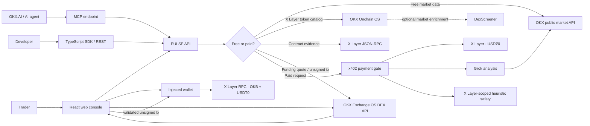
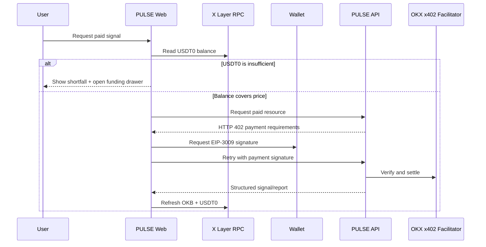

<p align="center">
  
</p>

<h1 align="center">PULSE</h1>

<p align="center"><strong>OKX spot intelligence. Pay per signal on X Layer.</strong></p>

<p align="center">
  Live market context for free. Grok-powered analysis and pre-trade safety when it matters.<br />
  One product for traders, autonomous agents, and the OKX.AI marketplace.
</p>

<p align="center">
  <code>A2MCP</code> · <code>x402</code> · <code>X Layer</code> · <code>USD₮0</code> · <code>OKX</code> · <code>Grok</code>
</p>

---

## The product

Markets move continuously, but most analysis products still make users create accounts, buy subscriptions, or leave the workflow that needs the answer. Agents have it worse: they need structured intelligence they can discover, pay for, and consume without a human checkout.

**PULSE turns market intelligence into an onchain service.**

- Preview live OKX spot tickers and candles without payment.
- Pick markets from a searchable list of live OKX spot instruments instead of typing exchange symbols.
- Discover X Layer tokens and memecoins from a searchable catalog, or enter any contract address manually.
- Buy a focused or premium Grok analysis for a single request.
- Run X Layer-scoped token-risk and composite pre-trade safety checks.
- Pay in **USD₮0 on X Layer** through **x402**—no subscription and no custodial account.
- Use the same product through a polished web console, REST, MCP, or the TypeScript SDK.

The browser keeps the entire funding loop in context: connect an OKX-compatible wallet once, see **OKB + USDT0**, request a live **OKX Exchange OS** route, and sign the prepared OKB → USDT0 transaction with that same wallet.

> PULSE is decision support, not financial advice. The free contract inspector reports factual X Layer RPC evidence. Paid safety scores are deterministic, explainable prototype heuristics—not audits or transaction simulations—and identify that limitation in the interface and every response.

## Why it stands out

| Typical market tool | PULSE |
| --- | --- |
| Account and recurring subscription | Pay only for the signal you request |
| Human-only dashboard | Web + REST + MCP + typed SDK |
| Opaque AI prose | Structured JSON, confidence, levels, invalidation, scenarios, and limitations |
| Separate wallet and exchange journey | Balances and OKB → USDT0 funding in one drawer |
| Payment failure after signing | Fresh USDT0 balance check before the wallet is asked to sign |
| Generic price feed | Live OKX spot ticker and OHLCV context |
| Error-prone symbol/address typing | Searchable live OKX pair picker + X Layer token catalog with manual-address fallback |
| Refresh destroys work in progress | Free market refresh updates only the chart and ticker; the current report stays visible |

## Experience

### Market intelligence

Open the market picker, search, and choose from live OKX spot instruments; the pair itself is never accepted as arbitrary text. Pick a timeframe and PULSE fetches public OKX ticker/OHLCV data, renders the chart locally, and sends a compact market series—not a screenshot—to Grok. Refreshing free market data changes only the ticker/chart and never clears an existing report.

- **Free preview:** ticker, 24-hour range/change, and up to 300 candles.
- **Base signal · $0.03:** trend, bias, levels, targets, invalidation, risk notes.
- **Premium signal · $0.06:** deeper multi-scenario analysis, execution plan, and agent checklist.
- English and Simplified Chinese output.

### Safety rail

- **X Layer token discovery · free:** searchable token and memecoin catalog for chain 196, sourced from OKX Onchain OS and enriched by DexScreener only when DexScreener identifies X Layer data. Selection fills the address; manual contract entry always remains available.
- **Contract evidence · free:** live X Layer chain/block/code/balance/nonce reads, bytecode fingerprint, and common EIP-1967/EIP-1167 proxy detection for any EVM address.
- **Token risk · $0.01:** deterministic contract heuristic with component scores and limitations.
- **Pre-trade check · $0.05:** PASS/WARN/FAIL composite report with grade, checklist, recommendations, and share id.
- Additional REST/SDK capabilities include wallet heuristics, a lightweight market pulse, and heuristic swap-route quality.

Safety is scoped to **X Layer · chain 196**. Catalog presence, price, and liquidity are discovery metadata—not endorsement or a safety verdict. The generic inspector queries the configured X Layer RPC and reports observable facts without manufacturing a universal risk score. Token taxes, honeypot behavior, source verification, and transaction outcomes still require token-aware simulation, explorer data, or a full audit; the current paid scores do not claim otherwise.

### Wallet and funding

- OKX Wallet is preferred; compatible injected EVM wallets are supported.
- Connection switches or adds X Layer (`eip155:196`).
- There is one connection entry point: the sticky header. Once connected, its explicit **Wallet & funding** control opens a responsive drawer with native OKB and USDT0 balances.
- The funding drawer uses the same connected injected provider; there is no iframe, embedded wallet session, or second connect step.
- Disconnect persists across reloads and requests wallet permission revocation when the extension supports it.
- PULSE requests live **OKX Exchange OS DEX API** quotes for a fixed, safe-to-understand **X Layer · OKB → USDT0** flow. Server credentials stay private; the browser validates and submits the unsigned transaction through the connected wallet.
- Before every browser x402 payment, PULSE reads USDT0 again. An underfunded request is stopped **before signing**, explains the shortfall, and opens the funding drawer.

## Services and pricing

| Surface | Service | Price | Source / behavior |
| --- | --- | ---: | --- |
| REST + MCP | Spot instrument search | Free | OKX public API |
| REST + web | X Layer token catalog | Free | OKX Onchain OS + DexScreener enrichment when available |
| REST + MCP | Live ticker | Free | OKX public API |
| REST | Candles | Free | OKX public API |
| REST + web | X Layer contract evidence | Free | Live X Layer JSON-RPC |
| REST + web | OKB → USDT0 funding quote/transaction | Free | OKX Exchange OS DEX API |
| REST + MCP | Base market analysis | $0.03 | OKX OHLCV → Grok |
| REST + MCP | Premium market analysis | $0.06 | OKX OHLCV → Grok |
| REST + MCP | Token risk | $0.01 | Deterministic heuristic |
| REST + MCP | Pre-trade safety | $0.05 | Composite deterministic heuristic |
| REST + SDK | Wallet risk | $0.01 | Deterministic heuristic |
| REST + SDK | Market pulse | $0.01 | Deterministic demo model |
| REST + SDK | Swap-route quality | $0.02 | Deterministic demo model |

Paid routes settle through the official OKX x402 seller stack when production credentials are configured. Local development intentionally defaults to a mock 402 gate.

## System overview



### Browser payment sequence



## Product architecture

```text
.
├── apps/
│   ├── web/                 React 19 + Vite product console
│   └── api/                 Express, REST, MCP, metadata, reports, token catalog
├── packages/
│   ├── analysis/            Grok prompts and structured analysis
│   ├── market/              Live OKX spot instruments/tickers/OHLCV
│   ├── payments/            Mock gate + official OKX x402 middleware
│   ├── buyer/               Server-side x402 buyer used by tests/tools
│   ├── domain/              Explainable safety and route methodology
│   ├── schemas/             Zod contracts shared across surfaces
│   ├── config/              Environment, pricing, ASP metadata
│   └── sdk/                 Typed PULSE client
├── api/                     Vercel serverless entrypoint
├── metadata/                OKX.AI ASP listing payloads
├── assets/                  PULSE logo assets
├── scripts/                 Compliance, smoke, wallet, and paid E2E checks
└── docs/                    Deployment, demo, listing, and audit guides
```

The internal workspace scope is `@pulse/*`. “Preflight” is reserved for the composite safety capability and its `/v1/preflight` route.

## Quick start

### Requirements

- Node.js 20 or newer
- npm 10 or newer
- Optional for paid AI output: xAI API key
- Optional for live settlement: OKX API credentials and a non-zero X Layer recipient

```bash
git clone <your-repository-url> pulse
cd pulse
copy .env.example .env
npm install
npm run build
npm test
```

Run the API and web app in separate terminals:

```bash
npm run dev:api
npm run dev:web
```

- Web: `http://localhost:5173`
- API: `http://localhost:4000`
- Health: `http://localhost:4000/healthz`
- ASP metadata: `http://localhost:4000/v1/metadata`
- MCP: `http://localhost:4000/mcp`

## Configuration

Copy [`.env.example`](.env.example) and review every production value.

| Variable | Required | Purpose |
| --- | --- | --- |
| `BASE_URL` | Production | Public HTTPS API origin |
| `PAY_TO_ADDRESS` | Live payments | Non-zero X Layer payment recipient |
| `XAI_API_KEY` | AI analysis | Enables base and premium Grok analysis |
| `GROK_MODEL` | Optional | Defaults to the configured production model |
| `X402_MOCK=1` | Local only | Uses a shaped mock payment challenge; moves no funds |
| `OKX_XLAYER_API_KEY` / `OKX_API_KEY` | Live payments + funding | Server-side OKX x402 / Exchange OS credential |
| `OKX_XLAYER_API_SECRET` / `OKX_SECRET_KEY` | Live payments + funding | Server-side OKX signing secret |
| `OKX_XLAYER_API_PASSPHRASE` / `OKX_PASSPHRASE` | Live payments + funding | Server-side OKX passphrase |
| `X_LAYER_RPC` | Recommended | Balance and contract-evidence RPC; defaults to `https://rpc.xlayer.tech` |
| `VITE_API_URL` | Split deployment | Public API origin used by the web app |

Never expose server credentials or test private keys through a `VITE_*` variable. Never ship with `X402_MOCK=1`, a zero `PAY_TO_ADDRESS`, or `ENABLE_SERVER_PAY=1` in a public environment.

## API examples

Free market teaser:

```bash
curl "http://localhost:4000/v1/market/instruments?q=ETH&limit=20"
curl "http://localhost:4000/v1/market/ticker?instId=BTC-USDT"
```

Free X Layer token discovery:

```bash
curl "http://localhost:4000/v1/xlayer/tokens?q=USDT0&limit=20"
```

This catalog route requires the server-side OKX credentials used by Exchange OS. DexScreener is an optional enrichment source; if it has no X Layer match, PULSE keeps the OKX chain-196 result rather than substituting a similarly named token from another chain.

Free live contract evidence:

```bash
curl -X POST http://localhost:4000/v1/contract/inspect \
  -H "content-type: application/json" \
  -d '{"address":"0x779ded0c9e1022225f8e0630b35a9b54be713736"}'
```

Unpaid request—the expected result is `402 Payment Required` plus the `PAYMENT-REQUIRED` header:

```bash
curl -i -X POST http://localhost:4000/v1/analysis/base \
  -H "content-type: application/json" \
  -d '{"instId":"BTC-USDT","timeframe":"1H","lang":"en"}'
```

Typed client:

```ts
import { PulseClient } from "@pulse/sdk";

const pulse = new PulseClient({
  baseUrl: "https://api.example.com",
  paymentSignature: async () => obtainX402Signature(),
});

const report = await pulse.preflight({
  intent: "swap",
  fromToken: "0x0000000000000000000000000000000000000000",
  toToken: "0x779ded0c9e1022225f8e0630b35a9b54be713736",
  amount: "1",
});
```

## Deployment

### One-origin Vercel deployment

The repository includes root and web Vercel configuration. The preferred judging/demo setup serves the Vite application and rewrites API traffic to the Node serverless entrypoint under one HTTPS origin.

1. Import the repository into Vercel.
2. Use the repository install command (`npm install`).
3. Set production variables from `.env.example`.
4. Set `BASE_URL` to the final HTTPS origin.
5. Keep `VITE_API_URL` empty for same-origin routing.
6. Deploy and run the readiness checks below.

### Split deployment

Run `apps/api` on Railway, Render, or a Node container and deploy `apps/web` to Vercel. Set `BASE_URL` to the API hostname and `VITE_API_URL` to the same origin during the web build. CORS already exposes the x402 payment headers.

### Release gates

```bash
npm run build
npm test
node scripts/asp-compliance.mjs https://your-domain.example
```

The compliance script does not spend by default. After independently checking the funded test wallet, route prices, and `payTo`, set `RUN_LIVE_PAY=1` only for the final low-value settlement proof.

Before submitting:

- `GET /healthz` reports `paymentMode: "okx"`, `hasOkxCredentials: true`, and `hasXaiKey: true`.
- An unpaid paid route returns HTTP 402 with X Layer, USDT0, the correct amount, and the intended `payTo` address.
- `/v1/metadata`, `/mcp`, `/brand/logo.svg`, and `/brand/logo.png` are public.
- The wallet drawer shows OKB and USDT0; a live OKX route is returned for OKB → USDT0 without a second wallet prompt.
- The pair picker lists live OKX instruments and does not allow an arbitrary pair value.
- The token picker returns chain 196 entries, labels its sources, selects an address, and leaves manual address entry available.
- Loading free market data does not remove an existing analysis or safety report.
- `/v1/contract/inspect` reports chain 196 and current RPC evidence for a known X Layer contract.
- A real low-value end-to-end payment is settled and documented.

Detailed platform instructions are in [docs/DEPLOY.md](docs/DEPLOY.md).

## Security and trust model

- Browser private keys never enter the PULSE server; the injected wallet signs the x402 authorization.
- The browser balance check is a UX guard. The server-side x402 facilitator remains the payment authority.
- Payment credentials and Grok keys remain server-side.
- API inputs are parsed through shared Zod schemas.
- Report responses include methodology version and limitations.
- `/v1/checkout` is a test/operator capability and must remain disabled in public production.
- Mock payments validate integration shape but do not prove live settlement.

Current dependency, architecture, and release audit notes are tracked in [docs/PRODUCT_AUDIT.md](docs/PRODUCT_AUDIT.md). The earlier embedded DEX package and its separate-wallet boundary were removed; PULSE now owns the compact swap UI and uses server-authenticated OKX Exchange OS calls for quotes and unsigned transaction preparation.

## Status

| Area | State |
| --- | --- |
| Web console and wallet funding UX | Implemented |
| Live OKX ticker and OHLCV | Implemented |
| Searchable live OKX pair picker | Implemented |
| X Layer token/memecoin discovery + manual address fallback | Implemented; OKX credentials required for catalog |
| Grok analysis pipeline | Implemented; requires `XAI_API_KEY` |
| REST and MCP | Implemented |
| Browser x402 signing | Implemented |
| Official OKX seller middleware | Implemented; requires credentials |
| Native Exchange OS OKB → USDT0 funding | Implemented; requires OKX credentials |
| Live generic X Layer contract evidence | Implemented |
| Live public deployment | Operator action required |
| OKX.AI listing | Submission action required |
| Heuristic safety data replacement | Production roadmap |

---

<p align="center"><strong>PULSE</strong> · Signal when you need it. Proof when it matters.</p>
