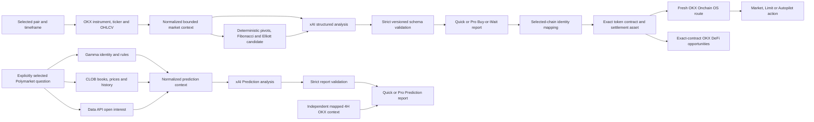
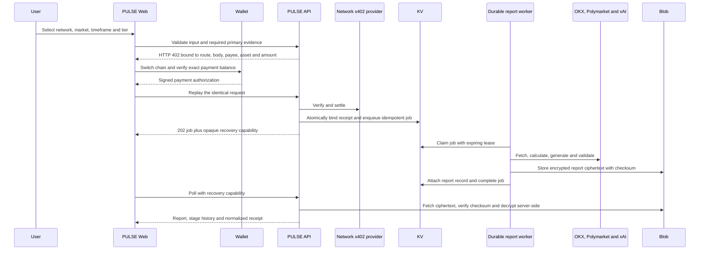
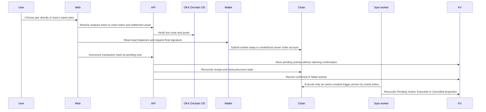
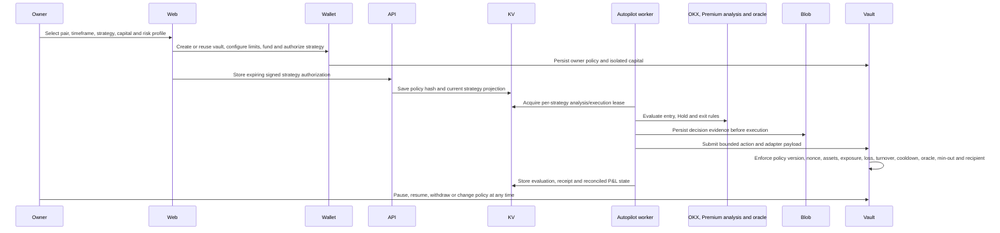
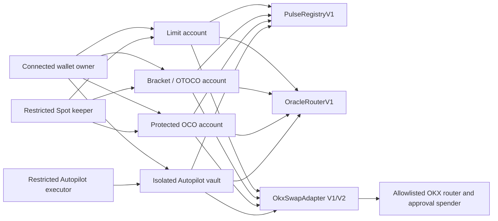

<p align="center">
  
</p>

<h1 align="center">PULSE</h1>

<p align="center"><strong>Market intelligence. Wallet-approved Spot orders. Autonomous Autopilot trading.</strong></p>

PULSE combines live OKX Global Market evidence—including crypto, xStocks, and RWA instruments—with explicitly selected Polymarket data. Arc uses the same OKX research logic, with reviewed BTC → cirBTC and ETH → WETH execution mappings; its wider token index belongs to Token Risk Guard. A valid Global report can prefill a wallet-signed Market or Limit Spot ticket, including optional TP/SL. Guarded Autopilot starts separately through its own pair, strategy, capital/risk, owner-vault and duration workflow; it never requires or reuses a paid report as its live signal. Reports are private, recoverable across devices through wallet proof, and paid per request through network-aware x402 settlement on X Layer, Base, Arbitrum One, Arc Mainnet and Robinhood Chain. Execution availability depends on each network's release gates.

PULSE is an independent intelligence product. Polymarket is a public read-only evidence source; PULSE does not place Polymarket orders or bypass Polymarket trading restrictions.

## Contents

- [Product and experience](#the-product)
- [Networks, services and payments](#networks-and-payments)
- [System architecture](#system-architecture)
- [End-to-end workflows](#end-to-end-workflows)
- [Trading prices, PnL and oracle evidence](#trading-prices-pnl-and-oracle-evidence)
- [Data architecture: Redis/KV and Blob](#data-architecture-rediskv-and-blob)
- [On-chain execution architecture](#on-chain-execution-architecture)
- [Repository and module architecture](#repository-and-module-architecture)
- [Local development and configuration](#quick-start)
- [Persistence and deployment](#persistence-and-operations)
- [Trading troubleshooting](#trading-troubleshooting)
- [Security, release discipline and status](#security-and-limitations)

## The product

### Public website and application

The public landing introduces Global Market, Prediction Market, Risk Guard, wallet-approved Spot and autonomous Autopilot. The canonical application home is `app.ai-pulse.tech/portfolio`; `/overview` remains compatible. Both public and app interfaces support five independent appearances: Pulse, Clarity, Midnight, Horizon and Dawn (ink black/electric lime). Dawn preserves the existing `robinhood` preference ID. Appearance never changes the selected network or overwrites an existing saved choice.

Local previews: `/landing` for the public site and `/portfolio` for the application. Root cutover is gated by `VITE_PUBLIC_LANDING_ENABLED`; the owner configures domains and deploys manually. See [public/app rollout and report recovery](docs/PUBLIC_APP_ROLLOUT.md).

See the [13–14 September deployment audit](docs/PULSE_POST_DEPLOY_AUDIT_2026-09-14.md) for verified live workflows, payment recovery, historical statistics, test coverage and remaining validation limits.

PULSE uses one Telegram bot, `@pulsemi_bot`: all five chat research services, persistent read-only EVM history, and a TON Connect Mini App on the same token, webhook and Telegram account. Start with the [full BotFather configuration](docs/PULSE_BOTFATHER_SETUP.md), [deployment package](docs/PULSE_TELEGRAM_DEPLOYMENT.md), [rollout playbook](docs/TELEGRAM_ROLLOUT_GUIDE.md) and [marketing strategy](docs/PULSE_MARKETING_STRATEGY.md). TON purchases also appear in chat history; the TON interface displays its own research subset. Local preparation does not establish real payment/client acceptance or platform eligibility of the combined links. The [operator kit](docs/launch/README.md) provides configuration templates, readiness checks, evidence/campaign records and the offline economics workbook.

Telegram report history identifies Global reports by pair and timeframe, followed by service, status and date. Prediction entries identify the market; Risk Guard identifies the token and network. First delivery and recovery use the same curated research sections: a compact formatted chat overview, a labelled TXT download, and a PNG chart for Pro reports with valid saved chart data. Provider payloads, raw candle arrays, internal field paths and payment metadata are excluded. The TON Mini App uses the same report presentation, supports TXT downloads and expands saved charts for reading on mobile.

Public activity combines chains independently of the selected RPC. The network comparison includes all five mainnets, including Arc Mainnet. Retired Arc testnet deliveries appear in a separate archive; they do not become Arc mainnet deliveries or trading volume. Platform lifetime research totals can retain this explicitly disclosed legacy activity. Counts are evidence-backed observed activity, include developer testing, and disclose incomplete historical coverage. Missing figures are not replaced with sample or zero lifetime counts.

The landing page compares research deliveries with a shared-scale stacked bar chart, split into Global, Prediction and Risk Guard. Patterns and labels distinguish services across all five appearances; the table retains exact counts. Missing coverage is shown explicitly, and testnet research is not presented as mainnet trading volume.

Markets move continuously, but most analysis products still require an account, subscription, or separate checkout. Agents need something stricter: structured intelligence they can discover, pay for, recover after a refresh, and consume without a human checkout.

**PULSE turns market intelligence into a multichain onchain service while preserving the original X Layer product.**

- Preview live OKX spot instruments, xStocks/RWA instruments, tickers, and candles without payment.
- Use the Opportunity Radar to shortlist markets worth analyzing without treating a score as a trade signal.
- Discover active crypto-focused Polymarket questions in an in-page picker and explicitly select the single market used by a report.
- Buy a Quick ($0.20) or Pro ($0.30) Global report, or a separate Quick/Pro Prediction report. Legacy API/storage names `base`/`standard` and `premium` stay compatible; they refer to the same two report depths.
- Read deterministic Fibonacci, pivot, and Elliott-wave structure; Pro reports add an annotated chart and executable Buy-or-Wait plan.
- Move a valid Global plan into connected-wallet Market or Limit Spot execution with route, balance, slippage, entry, TP, and SL carried forward.
- Run a policy-bounded Autopilot that can Buy, Hold, partially Sell, fully Sell, and later Buy again only inside owner-signed limits.
- Run network-scoped Risk Guard evidence and pre-trade checks, with source coverage disclosed for each chain, including Robinhood.
- Settle through USD₮0 on X Layer, native USDC on Base and Arbitrum, USDG on Robinhood, or USDC on Arc Mainnet.
- Recover an idempotent paid job without paying twice and reopen wallet-owned report history on another device.
- Use the same product through the responsive web console, REST, MCP, or TypeScript SDK.

The browser keeps funding in context: connect once, inspect the selected chain’s native and payment-asset balances, and use the chain-specific in-app funding path. The last selected network is restored after reload. PULSE remains decision support, not financial advice. Contract evidence reports observable RPC facts; heuristic safety scores are not audits or guaranteed simulations.

## Why it stands out

| Typical market tool | PULSE |
| --- | --- |
| Account and recurring subscription | Pay only for the requested report |
| Human-only dashboard | Responsive web + REST + MCP + typed SDK |
| Opaque AI prose | Strict structured output, evidence quality, limitations, and invalidation |
| One generic workflow | Separate Global Market and user-selected Prediction Market analysis |
| Payment failure after work begins | Input and required primary evidence are validated before the payment challenge |
| Lost result after refresh | Receipt-bound durable job and private report recovery |
| Separate wallet and funding journey | Network-aware balances and funding inside PULSE |
| Hidden network assumptions | Explicit chain, token, provider, amount, payee, and receipt metadata |
| Analysis disconnected from execution | Global intelligence → Spot, plus an independent Configure → Fund & protect → Activate Autopilot journey |
| Ticker assumed to equal a chain token | Identity-safe representations such as BTC → cbBTC/WBTC and ETH → WETH, followed by a live-route check |

## Experience

### Portfolio

The main application opens on **Portfolio** (the existing `/overview` URL remains compatible). Spot orders and matched-fill performance, autonomous Autopilot capital/runtime, and saved Global/Prediction research stay in separate sections. Values are scoped to the selected network. Missing cost basis is shown as unavailable, not zero; Spot and Autopilot percentages are never averaged together.

### Asset catalogs and automatic route checks

Global Market, Spot Trading and Autopilot pair pickers default to **Route available** on the selected network. Automatic checks scan mapped pairs, including offscreen rows, and show progress as verified results arrive. Combine this view with **All / Crypto / Tokenized stock / Tokenized ETF / RWA** and search. Category counts describe the catalog; visible results also reflect route availability and search.

Choose **All assets** to inspect unchecked or unavailable candidates; Global also includes unmapped research-only markets. Available routes sort first. Checks are cached separately by chain and execution mode, use bounded concurrency, and stop scheduling when the picker closes. Provider errors remain unknown and are retried.

**Route available · OKX** means an indicative OKX quote succeeded; Arc also checks its reviewed contract mapping, live OKX reference data, and the reverse route. The actual order amount is quoted again before signing. **No OKX route found** does not imply no liquidity at other providers. Coinbase CDP supports native ETH-to-USDC funding on Base and Arbitrum; general Coinbase routing is deferred. Stocks, ETFs and RWA need both a verified representation and a live route on the selected chain.

Expanded catalogs combine live provider discovery with reviewed chain-specific deployments. Global and execution pickers request up to 5,000 markets, with searchable results displayed in batches; catalog membership does not guarantee tradability. See [catalog coverage, sources and validation](docs/TRADING_CATALOG_COVERAGE.md).

Arc **Global Market follows the same live OKX research-instrument logic as Base and Arbitrum**. Spot and Autopilot require a reviewed Arc representation of that instrument, live OKX ticker/history, and fresh OKX Onchain OS entry/exit quotes. The current Arc mappings are:

| OKX research and signal market | Arc execution | Exact Arc token contract |
| --- | --- | --- |
| BTC-USDT | cirBTC/USDC | 0x171A4217b86A807A64eB94757Db6849fb4bDbAA0 |
| ETH-USDT | WETH/USDC | 0x128cC466B61f542da60c70e3aA11c10e19B84EDB |

Search **cirBTC** in the Global or execution picker to find the BTC mapping. Chart/reference prices use OKX; actual swaps use an independent Arc quote. A USDT exchange reference is not an executable USDC quote or a guarantee that the wrapped asset trades at the same price. The restricted keeper updates PULSE's on-chain OracleRouter from its reference observations; OKX does not supply a separate on-chain oracle contract. Contract slippage and minimum-output checks still apply.

The wider Arc token and memecoin index from [RadarDex via Arcodex](https://www.arcodex.fun/tokens) is used **only for Token Risk Guard discovery**. It includes reviewed USDC, WETH, cirBTC and EURC deployments, supports name/symbol/full-address search, and retains manual contract entry. Indexed tokens are not promoted into Global, Spot or Autopilot merely because a swap quote succeeds. Missing token-market evidence is disclosed in a Risk Guard report rather than fabricated. The provider returned at most 2,000 indexed entries in the read-only audit; this is not complete chain coverage.

Arc route availability checks chain 5042, published contract metadata, live OKX reference data, and both indicative swap directions against canonical USDC. The actual order amount is quoted again before signing. Autopilot additionally requires 50 recent consecutive completed OKX candles for its selected market/timeframe before funding. An unavailable data source or route blocks setup. Legacy address-specific native market selections are rejected before research checkout, AI entitlement consumption or transaction preparation.

The [OKX market policy audit](docs/ARC_MAINNET_OKX_MARKET_POLICY_AUDIT_2026-10-05.json) records live cirBTC/WETH data, two-way quotes, guarded preflight, browser workflows and isolated checkout/worker regressions. These checks do not activate production trading or qualify a new live cirBTC trade.

Agents and SDK clients use OKX IDs such as BTC-USDT with `PulseClient({ network: "arc", ... })` or /arc/mcp. Telegram Global accepts BTC-USDT followed by a timeframe; Risk Guard accepts arc followed by the full token contract address and pins chain 5042. Chat reports use Telegram Stars and do not fund wallet/Gateway USDC or authorize trading. The TON Mini App retains its separate TON research scope.

Market data loads automatically after pair or timeframe selection. The compact Global chart stays visible and expands on demand; timeframe selection works independently of chart expansion. Technical shortlist scores are separate from AI report confidence. Recent bullish reports above 60% use existing reports, without automatic paid AI screening. Low confidence does not itself block a manually reviewed Spot trade.

Spot navigation separates **Trade setup** and **Dashboard**. Autopilot provides **Create new Autopilot**, **Edit Autopilot**, **Dashboard** and **On-chain activity**. Editing loads the selected vault's current configuration; save-and-restart shows confirmation progress and reuses existing capital and a valid pass. The in-app Docs sidebar includes an **Assets & routes** guide.

### Global Market

Choose a live OKX instrument instead of typing an arbitrary pair. Select a timeframe and PULSE fetches public ticker/OHLCV data, renders the chart locally, and sends bounded structured context—not a screenshot—to Grok. Base and Premium reports have distinct marks. Premium adds an annotated, click-to-enlarge chart with Fibonacci levels, pivots, the current Elliott candidate, its invalidation, and wave-consistent next paths. The recommendation is deliberately **Buy or Wait**; PULSE never turns a bearish report into a new short. Changing pair, timeframe, network, or request tier supersedes the earlier request so a late response cannot replace the current context.

### Prediction Market

Prediction discovery is free and lives inside the main application rather than on a separate page. The user opens the market picker, chooses one active crypto price/direction question, reviews its probabilities, order books, liquidity, volume, open interest, restriction status, and resolution rules, then purchases Quick or Pro prediction analysis. PULSE validates condition/outcome identity, order-book availability, freshness, liquidity, spread, depth, history, and horizon. Restricted markets remain usable as public read-only evidence when active and orderbook-enabled, but the restriction is always disclosed and PULSE never places an order.

Prediction reports use the same readable presentation standard as Global Market reports: confidence and tier, headline and summary, outcome probability cards, bid/ask and evidence-quality labels, market metrics, invalidation conditions, risks, evidence provenance, and disclaimer. Large provider payloads are kept behind a collapsed technical-details control. The optional focus note lets the user request emphasis such as the bull/up case, counter-case, catalysts, liquidity quality, resolution risk, or invalidation; it does not create a market or place an order.

### Connected-wallet Spot execution

Spot Trading works with or without a loaded report. The network-specific pair picker lists supported execution candidates directly; loading a Global report additionally prefills its pair, timeframe, entry, take-profit, and stop-loss. PULSE resolves the analysis ticker to an identity-safe chain token, checks the selected settlement asset and connected-wallet balance, and verifies a fresh OKX Onchain OS route before enabling either order button.

- Market orders expose Auto or Manual maximum slippage and can attach TP/SL after the confirmed fill. Enter the amount, then choose **Get quote to review buy/sell** (or **Get live quote**). This first action only fetches an amount-specific quote. Inspect the expected output, then choose **Review buy/sell in wallet** for fresh transaction preparation and wallet approval. The background route check does not quote your ticket amount; an empty or zero-output response cannot enable review.
- Limit orders carry the trigger, minimum received amount, and optional OTOCO protection in one ticket.
- Factory state is read from chain before account creation is offered; tab changes cannot erase an existing owner account.
- The shared dashboard separates Pending, Active, Executed, Cancelled, and Activity, displays trigger, actual entry/exit, OKX mark and P&L when provable, and supports selected or all-position closure.
- A trigger is only the owner-defined condition that permits execution. It is never presented as the fill. Contract balances and confirmed receipt transfers provide the actual entry/exit basis.
- Refresh reconciles the KV projection against the selected network. A previously missing or stale row can recover from its confirmed receipt or authoritative account state without recreating the order.
- If the pair is unavailable on the selected network, PULSE recommends a verified supported network; if none exists, it explains that the pair remains analysis-only and links to OKX Spot.

### Guarded Autopilot

Autopilot is independent from manual Spot Trading. The six-step setup covers the target vault, market, strategy, capital/risk, AI Entry Pass, review and activation; amounts are shown in readable token units and verified contract addresses remain available under technical proof. **Create new Autopilot** always creates a separate owner-controlled vault, while editing an explicitly selected vault changes only that vault. The creation form labels the connected wallet as the source and shows its spendable USDC or USDT0 balance. The target-token wallet balance is informational and is not required to start; a failed target-token read cannot replace a valid settlement balance with zero. Selecting **Prepare Autopilot** in Opportunity Radar prefills the draft, scrolls to setup and visibly confirms that no transaction has been sent.

For an account whose setup was interrupted, **Review setup** starts a storage/account readiness check and jumps to that vault's review summary. It shows existing capital and draft limits, offers a clear way to edit them, and continues on the same account. Missing signed registration cannot be reconstructed from a deposit alone: the owner must review and authorize the settings. A valid pass and existing vault funds are reused; pass-payment success followed by a rejected Resume is not a reason to buy again.

After creation, one **Autopilot dashboard** combines account selection, status, portfolio balances, pass renewal, Pause/Resume, Add funds, Withdraw/Max, Close & withdraw all, strategy journals and reconciled on-chain activity. **Add funds** means a later owner top-up into that selected vault. It does not silently widen the signed maximum-trade, exposure, turnover, or loss limits; save the selected strategy when the policy should be resized around the larger capital base. **Withdraw** shows the selected vault’s withdrawable settlement balance, not the connected-wallet balance. The executor may act only through allowlisted ERC-20 assets/routes and owner-signed exposure, slippage, turnover, cooldown, daily-loss, confidence, and expiry limits; native assets use their official wrapped representation, such as WOKB on X Layer. The fast risk monitor handles TP/SL and completes bounded exits without waiting for another AI cycle. Closing leaves the empty contract auditable and reusable because deployed smart contracts cannot be deleted.

### Private report recovery

Paid reports use the configured public Vercel Blob transport, but only as authenticated AES-256-GCM ciphertext. The paying-wallet index, plaintext checksum, Blob reference, and logical private visibility remain in KV; the API refuses a production Blob configuration without a valid server-only encryption key. A wallet signature creates a short-lived report-access session that may decrypt and open the owner’s report or retry an already-settled failure; it cannot create a payment, trade, or authorize Autopilot. This makes report history available on desktop, iOS, Android, Mac, or another browser while retaining a same-device recovery fallback. A public Blob URL therefore never contains a readable report body.

### Risk Guard

- **Raw contract evidence · free:** an explicitly user-triggered selected-network RPC diagnostic. It is not the paid report and never runs automatically during report generation.
- **Token Risk Guard · $0.20:** Grok synthesizes a scored due-diligence report from bounded provider evidence. X Layer on-chain facts come from authenticated OKX Onchain OS APIs; Base and Arbitrum on-chain facts come from Blockscout APIs. GeckoTerminal supplies token/pool market data, declared website/X links and an attributed provider rating. Social handles do not establish posting frequency or promotion activity.
- **Project context:** PULSE fetches only a declared public HTTPS project website through a bounded SSRF-resistant reader. Missing, inaccessible or contradictory data remains an explicit unknown and reduces confidence.
- **Report:** source coverage, lower-risk score, grade, PASS/WARN/FAIL verdict, contract/market/holder/project/promotion breakdown, critical risks, positive signals, unknowns, likely loss scenario and recommendation.
- **Transaction simulation · free:** an optional, explicitly user-triggered selected-network diagnostic that never broadcasts a transaction.

The paid path does not issue automatic RPC `eth_call` traffic. `BLOCKSCOUT_API_KEY` is an optional server-only setting for Base/Arbitrum rate limits; add it to Railway when available, never to Vercel browser variables.

Catalog presence, price, liquidity, and market probability are evidence—not endorsement, fact, or a safety guarantee.

### Wallet and funding

- One wallet drawer supports OKX Wallet, EIP-6963 injected wallets, WalletConnect, Base-compatible AppKit connectors, and implemented Circle User-Controlled EOA email wallets. Production Circle email/SMTP and subscription setup is pending, so email wallets remain disabled. Once activated, Circle email sessions are Arc Mainnet-only; other execution networks remain hidden until that session is disconnected.
- The selected PULSE network, connected provider, wallet chain, address, native balance, and exact payment-asset balance remain distinct.
- X Layer prepares OKB → USD₮0 through OKX Exchange OS.
- Base and Arbitrum prepare native ETH → native USDC inside PULSE; Arbitrum explicitly rejects USDC.e as the payment asset.
- Arc Mainnet exposes wallet USDC, Circle Gateway balance, deposit and withdrawal; native gas uses the same USDC balance through its 18-decimal interface.
- With Arc selected and a wallet connected, the header shows separate **Wallet** and **Gateway** USDC balances on desktop and mobile. Wallet funds trading and gas; Gateway pays for research and Autopilot passes. Unavailable balances show a dash instead of zero. The funding drawer also keeps these balances separate.
- When Robinhood is enabled, its funding drawer prepares ETH → canonical USDG through OKX DEX. PULSE validates the deployed router's calldata, recipient, minimum received and expiry, checks gas reserves and simulates before the connected wallet signs. Funding never requires the facilitator key or an ERC-20 approval.
- Before browser signing, PULSE switches to the selected chain and refreshes the exact payment-asset balance.

## Product surfaces

- **Global Market:** live OKX crypto, xStocks/RWA instruments, candles, Opportunity Radar, and Quick/Pro reports with Elliott-aware execution plans.
- **Prediction Markets:** active crypto price/direction markets only, explicit single-market selection, order books, probability history, liquidity and evidence quality, followed by Quick or Pro prediction analysis.
- **Risk Guard:** free raw evidence and optional simulation are separate from the $0.20 Grok Token Risk report; the paid report uses OKX for X Layer on-chain evidence, Blockscout for Base/Arbitrum, and GeckoTerminal for market/profile evidence. Provider outages lower evidence confidence; they are not confirmed token defects.
- **Spot Trading:** connected-wallet Market, Limit, integrated TP/SL, route/balance checks, account discovery, and reconciled lifecycle dashboard.
- **Autopilot:** separate owner-controlled vault capital, strategy presets, enforceable policy limits, autonomous Buy/Hold/Sell lifecycle, and shared dashboard semantics.
- **Human web app:** one responsive Global Market / Prediction Market / Risk Guard / Spot Trading / Autopilot / Telegram / Docs workspace; persistent network selection; X Layer, Base, Arbitrum and Arc-specific themes; direct OKX Wallet preference plus EIP-6963/WalletConnect compatibility; balances, funding, payment progress, private report history, and readable reports.
- **Agent interfaces:** REST, MCP, TypeScript SDK, machine-readable metadata, OKX.AI compatibility, CDP Bazaar metadata, and Circle Marketplace listing material.

### Link previews and search metadata

The web entry point publishes canonical, Open Graph, X card, robots, sitemap, web-manifest, and Schema.org `WebApplication` metadata. Open Graph and X reference the same versioned 1200×630 PULSE social card at `apps/web/public/og-image-v8.png`. X can cache the page's card as well as the image, so changing only the image filename does not refresh an existing preview.

The web build also generates a static share page from the compiled homepage at **https://www.ai-pulse.tech/share/v8**. Its `og:url` and `twitter:url` identify the versioned share page, while its search canonical remains the homepage. Browser visitors open the normal homepage with their query and fragment preserved.

Both Vercel configurations temporarily redirect Twitterbot's homepage requests on `ai-pulse.tech` and `www.ai-pulse.tech` to `/share/v8`. This lets a new crawl of the main link reach the versioned card; browser visitors and other crawlers receive the normal homepage. The homepage response varies by User-Agent. X controls when its existing cached cards are fetched again, so deploying this route cannot guarantee an immediate change to an already cached preview. The versioned share link remains available when a fresh URL is needed.

When replacing the card, increment the image filename, update the homepage's image metadata and change the Twitterbot redirect destination in both `vercel.json` files to the new share version. The build derives the share page automatically and fails if either redirect targets a different version. Deploy manually before checking the main link again in a fresh X draft.

## Networks and payments

Network support is feature-specific. Selecting a chain does not enable every order type or start a strategy. Wallet Spot, contract Limit/protection and Autopilot each check live capabilities, deployed contracts, routes and runtime readiness. Robinhood uses canonical USDG for service payments and trading capital, with ETH reserved for gas; see its release limitations below.

For a deployment, keep `ENABLED_NETWORKS` (API) and `VITE_ENABLED_NETWORKS` (web) aligned. The five-network list is `xlayer,base,arbitrum,arc,robinhood`. Rebuild the frontend after changing browser variables: the PULSE selector and wallet connection modal must advertise the same chains. Never put facilitator, admin or buyer private keys in `VITE_*` variables.

| Network | Public prefix | Payment asset | Provider | Funding inside PULSE |
| --- | --- | --- | --- | --- |
| X Layer (`eip155:196`) | `/xlayer` | USD₮0 | OKX x402 | Native OKB to USD₮0 through OKX Exchange OS |
| Base (`eip155:8453`) | `/base` | Native USDC | CDP x402 | Native ETH to native USDC swap |
| Arbitrum One (`eip155:42161`) | `/arbitrum` | Native USDC | CDP x402 | Native ETH to native USDC swap; USDC.e is not accepted |
| Arc Mainnet (`eip155:5042`) | `/arc` | USDC | Circle Gateway | Mainnet USDC funding; Gateway deposit and withdrawal |
| Robinhood mainnet (`eip155:4663`, opt-in) | `/robinhood` | USDG | PULSE self-hosted x402 SDK facilitator | ETH to USDG; confirmed mainnet funding swap |

Robinhood qualification covers paid research, funding, wallet Spot, contract Limit roundtrips, Autopilot setup and paid Entry Pass activation. A genuine AI-approved AMAT Autopilot buy and complete autonomous take-profit exit are confirmed on mainnet. The exit required a better liquidity source and a bounded temporary 10% test tolerance; the same market did not qualify at the original 1%. Production limits are not enlarged automatically. Global automation is unpaused; the qualification account is individually paused, its original limits restored, and its position fully closed. This is not certification of every pair or production scheduling. See the [October 3 workflow verification](docs/ROBINHOOD_AUTOPILOT_VERIFICATION_2026-10-03.md), [integration plan](docs/ROBINHOOD_MAINNET_PLAN.md) and [payment operator guide](docs/ROBINHOOD_SELF_HOSTED_FACILITATOR.md). The normal facilitator runtime requires a dedicated gas signer separate from admin and buyer wallets.

The shared unprefixed routes retain X Layer compatibility. Network aliases isolate chain IDs, assets, receipts, discovery metadata, and idempotency records while reusing the same business handlers.

Arc is **Mainnet**, chain ID **5042** (`0x13b2`), with real USDC. Its retired chain-5042002 configuration is retained only for historical records and explicit testnet rejection. The PULSE network selector and AppKit wallet modal include Arc Mainnet; switching verifies the connected wallet chain before payment or execution. Appearance selection is independent of this choice.

### Arc wallet, Gateway and execution workflow

Select Arc Mainnet, connect your wallet and fund it with Arc USDC. Wallet USDC supplies trading capital and transaction gas. Native USDC (18 decimals) and ERC-20 USDC (6 decimals) expose the same wallet balance; never add the two balances. Gateway deposits form a separate service-payment balance.

| Action | Funding source and destination | User review |
| --- | --- | --- |
| Global Market / Prediction / Risk Guard | Gateway USDC pays the published service price; a report does not move trading capital | Service request and payment authorization |
| Spot Market | Wallet USDC → owner-signed swap → tokens in the same wallet | Exact contract, fresh route, amount, slippage and transaction |
| Spot Limit / TP-SL / bracket | Wallet capital → owner's order account → execution within signed conditions; cancellation returns unused escrow according to the order state | Account, entry/protection conditions, funding and authorization |
| Autopilot | Wallet capital → owner's vault; trades stay in the vault under the signed risk policy. An Entry Pass separately pays the AI runtime from Gateway | Select market → verify routes/history → configure policy → fund vault → authorize strategy → purchase pass → start |
| Gateway deposit | Wallet USDC → Circle Gateway Wallet | Exact USDC approval, then deposit transaction; retain wallet gas |
| Gateway withdrawal | Gateway USDC → the same connected wallet on Arc Mainnet | Review amount and maximum fee, sign the bounded burn intent, then approve the mint transaction |

In **Wallet & funding**, choose **Withdraw to wallet**, enter the USDC amount and select **Review withdrawal fee**. The unsigned production Gateway estimate binds both domains to **26**, the Arc USDC contract, official Gateway contracts and the depositor's wallet. The panel displays what the wallet receives, the maximum Gateway fee and the maximum Gateway debit. The amount **plus fee** must fit the current Gateway available balance; mint gas is paid separately from wallet USDC. Review expires after two minutes or at its block expiry. Normal withdrawal uses [Circle's instant same-chain transfer](https://developers.circle.com/gateway/howtos/transfer-unified-usdc-balance); it does not require the seven-day contract delay.

If the API, wallet or receipt step is interrupted, **Resume withdrawal** retries the same saved intent or mint transaction. The recovery record is scoped to Arc chain 5042 and the wallet, and kept until the minter's replay-protection state or a successful receipt confirms completion. Do not clear browser storage during an unfinished withdrawal. Expired or invalid recovery remains visible for investigation instead of creating another debit automatically.

The expandable **Contract withdrawal fallback** reads pending amounts and the actual claim block. If Circle's instant service is unavailable, explicitly initiate a contract withdrawal, wait its configured block delay (normally about seven days), then select **Claim to wallet**. PULSE blocks adding another delayed withdrawal while one is pending because it would reset the waiting period. This is a separate two-transaction procedure described in [Circle's contract reference](https://developers.circle.com/gateway/references/contract-interfaces-and-events).

The [October 7 execution/Gateway audit](docs/ARC_MAINNET_GATEWAY_AUDIT_2026-10-07.md) records the resume transaction, exact USDC locations and Max/mobile validation.

The [October 8 mobile and Market audit](docs/ARC_MAINNET_UI_FIXES_2026-10-08.md) records the OKX `NaN` signing compatibility fix, explicit amount-quote/wallet-review steps, both header balances and production-build browser checks. Physical OKX mobile signing still needs retesting after the manual release.

**Recipient and seller proceeds:** every network uses `PAY_TO_ADDRESS` on the API and matching `VITE_PAY_TO_ADDRESS` in the browser. Arc uses Circle Gateway batching: payment proceeds are credited to that same address’s **Gateway balance**, rather than its ordinary on-chain wallet balance. Connect the payment-recipient wallet and use **Wallet & funding → Withdraw to wallet** to withdraw seller proceeds. Withdrawal needs a small separate wallet USDC balance for mint gas. The deprecated Circle seller-address variables no longer select a recipient. [Circle’s seller flow](https://www.circle.com/fr/blog/turn-your-api-into-a-storefront-for-agents) explains batch credits and withdrawal.

**Max:** Deposit Max reads the live Arc wallet balance and reserves gas for approval plus deposit before filling a six-decimal amount. Withdrawal Max obtains an unsigned live fee estimate and subtracts its maximum fee from available Gateway USDC; you still review and sign. Both flows recheck balances before execution. Mobile wallet errors display the provider’s actual message, and an empty wallet shows the mint-gas requirement before withdrawal.

Withdrawing from Gateway does not stop a strategy or withdraw capital from a Spot account or Autopilot vault. Those owner-account controls remain separate. Arc global automation was unpaused on October 7, 2026 at the owner’s request; the hosted API confirms Market, Limit, bracket/protection and Autopilot are enabled. Individual orders and vaults retain their owner permissions, pause state, live-market and risk gates. Circle email wallets remain disabled while production setup is pending.

## Services and prices

The web UI uses the familiar **Base** and **Premium** tier labels. Public agent metadata uses the action-oriented **Quick** and **Pro** service names below; each pair maps to the same endpoints and prices.

### Public marketplace catalog

| Service | Price |
| --- | ---: |
| Free OKX and Polymarket discovery | Free |
| Global Quick → Spot Market or Limit | $0.20 |
| Global Pro → Spot Market or Limit | $0.30 |
| Prediction Quick | $0.20 |
| Prediction Pro | $0.30 |
| Token Risk Guard | $0.20 |

### Public Autopilot start services

These three services guide the same six-step setup as the web product. The caller's Agentic Wallet creates/selects the owner vault, configures policy, deposits capital, registers the strategy and confirms start; the duration-specific x402 endpoint is the final AI-runtime activation step. They are published on X Layer, Base and Arbitrum. Arc contracts are deployed and verified, with bounded live acceptance evidence recorded. Arc passes are published when `FEATURE_ARC_TRADING=1` and the live registry/runtime gates pass; global automation is now unpaused and remaining production acceptance is recorded separately.

| AI Entry Pass | Price |
| --- | ---: |
| Start Autopilot · 24h | $1.50 |
| Start Autopilot · 7d | $10.50 |
| Start Autopilot · 30d | $45.00 |

Prices are configured by environment variables and published through `/v1/metadata`. The overall execution-mainnet catalog has eight services; the Arc mainnet research subset has five until its three Autopilot services are activated. Legacy compatibility prices remain configurable without becoming discoverable products. A paid request is rejected before the payment challenge when its schema or required preconditions are invalid.

Both Global tiers expose the same two execution choices after delivery: a prefilled wallet-signed Spot Market order or Spot Limit order. Base/Quick is the concise report; Premium/Pro adds the deeper chart, Elliott paths and broader execution context. Autopilot starts independently and does not buy or reuse either report: its own deterministic gates decide when a compact prepaid AI entry confirmation is eligible.

For Global Spot and Autopilot start workflows, Agentic Wallet remains the signer and owner. PULSE prepares and verifies the route or contract interaction but never receives a private key or silently broadcasts. X Layer uses the OKX Agentic Wallet on chain 196 with zero gas; Base and Arbitrum use the caller's EVM Agentic Wallet and require native ETH for gas.

The earlier fused, divergence, and event-risk routes remain in the codebase only for API compatibility and are disabled by default. They are not presented as consumer products in the web app or public product metadata.

## Paid report lifecycle

1. Validate the request and required provider evidence before payment.
2. Return a network-specific x402 challenge.
3. Verify and settle the signed authorization.
4. Persist an idempotent job and normalized payment receipt.
5. Fetch fresh provider context and calculate deterministic features.
6. Generate and validate the structured report.
7. Store the report privately and expose recovery through the job API.

Real backend stages are returned by `GET /v1/jobs/:jobId`. A recovery token lets the payer retrieve the completed report after refresh without paying again. A settled job may regenerate its deliverable within policy without creating a second payment.

## Polymarket data policy

PULSE uses public Gamma, CLOB and Data API reads. No Polymarket API key is required for discovery, order books, prices, history, or public open interest.

- Web users explicitly select one primary crypto market. The API retains bounded additional-market fields only for backward compatibility and never adds markets silently.
- PULSE never silently substitutes another market.
- Condition IDs and outcome-token mappings are validated.
- Active restricted markets may be analyzed read-only; `restricted` remains visible as a trading-compliance signal.
- Closed, archived, inactive, malformed, or orderbook-disabled markets are rejected.
- Required primary-market order books are checked before payment and revalidated by the worker after settlement.
- Optional-source failures produce explicit partial-data fields rather than invented values.

## Wallet and funding UX

One restored wallet session supports all enabled networks. The UI distinguishes the selected PULSE network, connected provider, connected address, and wallet chain. Before signing, PULSE switches to the selected chain and verifies the exact payment-asset balance.

The selected network is stored locally and restored on reload or the next start. `DEFAULT_NETWORK` is used only when no valid saved selection exists. Each non-X-Layer network has its own visual theme; the original X Layer appearance remains unchanged.

- **X Layer:** OKB and USD₮0 balances; in-app OKB → USD₮0 swap.
- **Base:** ETH and native USDC balances; in-app ETH → USDC swap.
- **Arbitrum:** ETH and native USDC balances; in-app ETH → USDC swap with explicit USDC.e warning.
- **Arc Mainnet:** separate wallet and Gateway USDC balances, mainnet funding guidance, Gateway deposit and reviewed withdrawal with recovery. `ARC_AI_MODE=live` is required for real Quick/Pro reports; `fixture` is only a deterministic payment/job plumbing check and makes no market inference.

Supported connection paths include OKX Wallet, EIP-6963 injected wallets such as MetaMask and Rabby, WalletConnect mobile sessions and Base-compatible connectors exposed through AppKit. Circle email-wallet code is wired but currently disabled pending production setup. The connected address in the funding drawer is copyable. Circle signing uses the user's MPC approval UI; the production `CIRCLE_API_KEY_MAINNET` is server-only. `VITE_CIRCLE_APP_ID` is the public ID of the matching production Circle application, not a contract address or an API key; setting it alone does not complete subscription, email/SMTP or application setup.

## System architecture

PULSE separates presentation, payment, analysis, operational state, immutable artifacts, wallet authority, and on-chain enforcement. The browser never receives provider secrets or an automation private key. The API never treats its database projection as stronger evidence than a confirmed chain receipt, contract read, token balance, or provider order state.


```mermaid
flowchart TB
  subgraph Clients[Client and agent surfaces]
    WEB[React web console]
    TG[Telegram Bot and Mini App]
    AGENT[REST, MCP and TypeScript SDK clients]
    WALLET[Connected user wallet]
  end

  subgraph Control[PULSE API and control plane]
    API[Express API<br/>schemas · auth · x402 · quotes · tx preparation]
    JOB[Durable report worker]
    CRON[Secret automation tick<br/>plus distributed KV lease]
    SPOTW[Deterministic Spot worker]
    AUTOW[Policy-bounded Autopilot worker]
    TGW[Telegram delivery worker]
  end

  subgraph Evidence[Evidence, analysis and payment providers]
    OKX[OKX public market, Onchain OS DEX and DeFi]
    POLY[Polymarket public Gamma, CLOB and Data APIs]
    XAI[xAI structured analysis]
    PAY[OKX, CDP or Circle x402 settlement]
    RPC[Chain RPC primary and fallback pools]
  end

  subgraph Data[KV and object persistence, no SQL]
    KV[Railway Redis<br/>jobs · receipts · indexes · sessions · leases · activity · strategies]
    BLOB[Vercel Blob<br/>encrypted report ciphertext · compatible evidence objects]
  end

  subgraph Chains[Supported execution chains]
    REG[Pulse Registry]
    ORACLE[Oracle Router]
    ADAPTER[Allowlisted OKX execution adapter]
    SPOT[Owner-controlled Spot accounts]
    VAULT[Owner-controlled Autopilot vaults]
  end

  WEB --> API
  TG --> API
  AGENT --> API
  WEB <--> WALLET
  API --> OKX
  API --> POLY
  API --> PAY
  API <--> KV
  API <--> BLOB
  JOB <--> KV
  JOB --> OKX
  JOB --> POLY
  JOB --> XAI
  JOB --> BLOB
  CRON --> SPOTW
  CRON --> AUTOW
  CRON --> TGW
  SPOTW <--> KV
  AUTOW <--> KV
  AUTOW --> BLOB
  TGW <--> KV
  SPOTW --> OKX
  AUTOW --> OKX
  API --> RPC
  SPOTW --> RPC
  AUTOW --> RPC
  WALLET --> SPOT
  WALLET --> VAULT
  SPOTW --> SPOT
  AUTOW --> VAULT
  SPOT --> REG
  SPOT --> ORACLE
  SPOT --> ADAPTER
  VAULT --> REG
  VAULT --> ORACLE
  VAULT --> ADAPTER
```

### Runtime boundaries

| Component | Owns | Does not own |
| --- | --- | --- |
| Web console | product state, responsive UI, wallet selection, signatures, local opaque recovery capability | provider secrets, server wallets, autonomous scheduling, final settlement truth |
| API | request schemas, network capability checks, x402 middleware, wallet-history challenges, route/quote validation, unsigned transaction preparation, dashboards | permission to sign a user’s trade or loosen an Autopilot policy |
| Durable report worker | leased paid jobs, provider context, deterministic features, xAI calls, schema validation, report persistence | trading authorization |
| Spot worker | deterministic owner-created limit/bracket/OCO trigger evaluation and confirmed-receipt reconciliation | AI strategy decisions, arbitrary assets, arbitrary recipients |
| Autopilot worker | strategy evaluation, evidence persistence, simulation, bounded executor calls, fast TP/SL monitoring | owner withdrawals, policy expansion, manual Spot orders |
| Telegram worker | webhook deduplication, retry queue, report-link delivery | wallet custody, analysis generation, payment signing |
| KV | current operational projections, indexes, queues, leases, idempotency, short-lived sessions and resilient outbox state | private keys, large report bodies, sole financial truth |
| Blob | encrypted immutable report ciphertext and compatible immutable evidence objects | plaintext public reports, mutable live order state, wallet balances, signing authority |
| Contracts | allocated-asset custody and enforcement of owner-approved execution limits | off-chain inference, market discovery, arbitrary router calls |

### Runtime modes

The same modules support three process layouts; changing the layout does not change financial authority.

| Mode | Behavior |
| --- | --- |
| Local `npm run dev` | Starts the API and web console. The API starts the durable report worker plus enabled Spot, Autopilot, and Telegram timers. The launcher reuses healthy local services, refuses a stale occupied port, and kills only child process trees it started. |
| Long-lived Node host | Runs the same API and in-process timers continuously. KV leases plus contract state/nonces prevent overlapping or repeated financial execution across instances. |
| Optional serverless API | Handles HTTP requests; `/v1/internal/automation/tick` is called with `CRON_SECRET`. A shared KV lease prevents overlapping Spot/Autopilot/Telegram cycles. The checked-in production default instead runs one long-lived Railway API/worker. |

A split web/API/worker deployment is supported operationally, but it is not required by the source tree. Autonomous execution never happens inside the browser and is never authorized by an ordinary report request.

### Market-data and analysis pipeline

Analysis coverage and on-chain executability are intentionally separate. Every valid OKX Global Market instrument may be analyzed, including crypto, xStocks, and RWA products. Spot or Autopilot is enabled only after a second pipeline resolves an identity-safe token representation and verifies a live route on the selected execution network.

The explicit Base mappings include Coinbase-wrapped `cbBTC`, `cbDOGE`, `cbXRP`, `cbLTC`, `cbADA`, `cbZEC`, and `cbHYPE`. The current [Base tokenized-stock set](https://brand.base.org/stocks) maps OKX `XNVDA`, `XMETA`, `XAAPL`, and `XGOOGL` analysis instruments to `NVDAc`, `METAc`, `AAPLc`, and `GOOGLc` on Base.

On X Layer and Arbitrum, PULSE resolves the live OKX category-3 `X<ticker>` analysis symbol to the exact `<ticker>x` execution token only when the OKX chain catalog identifies that contract as an xStock. This follows the [OKX Unified Tokenized Stock](https://www.okx.com/en-gb/help/okx-to-list-unified-tokenized-stocks-xibm-xhood-and-more-for-spot-trading) and [xStocks multichain](https://docs.xstocks.fi/docs) naming model without treating ordinary crypto symbols ending in `X` as equities. The inventory is dynamic: a token representation may be present while a requested amount has no executable liquidity.

The 2026-09-01 catalog audit found matching representations for 90 of 93 live OKX stock/ETF analysis instruments on X Layer and 76 of 93 on Arbitrum. `XPOPMART`, `XTESTA`, and `XXIAOMI` had no matching xStock on either chain; Arbitrum additionally lacked `XAMAT`, `XAPLD`, `XDELL`, `XGEV`, `XKLAC`, `XLITE`, `XLRCX`, `XSMCI`, `XSMH`, `XSNDK`, `XTER`, `XUSAR`, `XVRT`, and `XXLE`. These counts describe representation, not guaranteed execution. Every Spot or Autopilot action still requires an amount-sized live OKX Onchain OS quote on the selected chain. PAXG and XAUT remain analysis-only until an identity-safe token plus settlement route is verified.


```mermaid
flowchart LR
  PICK[Selected pair and timeframe] --> OKXDATA[OKX instrument, ticker and OHLCV]
  OKXDATA --> NORMALIZE[Normalized bounded market context]
  NORMALIZE --> TECH[Deterministic pivots, Fibonacci and Elliott candidate]
  NORMALIZE --> MODEL[xAI structured analysis]
  TECH --> MODEL
  MODEL --> VALIDATE[Strict versioned schema validation]
  VALIDATE --> PLAN[Quick or Pro Buy-or-Wait report]
  PLAN --> MAP[Selected-chain identity mapping]
  MAP --> TOKEN[Exact token contract and settlement asset]
  TOKEN --> ROUTE[Fresh OKX Onchain OS route]
  TOKEN --> DEFI[Exact-contract OKX DeFi opportunities]
  ROUTE --> ACTION[Market, Limit or Autopilot action]

  PM[Explicitly selected Polymarket question] --> GAMMA[Gamma identity and rules]
  PM --> CLOB[CLOB books, prices and history]
  PM --> DATA[Data API open interest]
  GAMMA --> PCONTEXT[Normalized prediction context]
  CLOB --> PCONTEXT
  DATA --> PCONTEXT
  PCONTEXT --> PMODEL[xAI Prediction analysis]
  PMODEL --> PVALIDATE[Strict report validation]
  PVALIDATE --> PREPORT[Quick or Pro Prediction report]
  OKX4H[Independent mapped 4H OKX context] --> PREPORT
```

Key rules:

- Provider payloads are normalized and bounded before model input; Grok receives structured evidence, not screenshots, wallet secrets, or arbitrary raw pages.
- Pivot, Fibonacci, alternating swing points, Elliott candidate/invalidation, and chart paths are calculated deterministically. The report explanation must remain consistent with those values.
- Pro Global reports expose an execution intent only when the result is a valid Buy setup. Bearish or insufficient evidence becomes Wait, never a new short recommendation.
- DeFi discovery first resolves the selected chain representation—for example `BTC → cbBTC` on Base or `BTC → WBTC` on Arbitrum—then accepts only products containing that exact contract.
- Prediction Market uses one explicitly selected condition/outcome mapping. It never silently substitutes a trending market. Pro may add an independently sourced 4H underlying-asset chart, clearly separated from the prediction probability evidence.
- The Opportunity Radar is a free technical shortlist. Its score selects what to investigate; it is not transaction authorization.
- Shared Zod schemas reject missing, extra, malformed, or mixed-type model output. Compatibility repair is limited to the known obsolete pre-Elliott shape so a paid report is not lost merely because a provider returned the previous schema.

### Report data model

| Layer | Representative data |
| --- | --- |
| Request identity | network, service/tier, pair or selected market ID, timeframe, language, optional focus, request hash |
| Source evidence | observed times, ticker/candles, order books/history/open interest, source availability, stale/partial flags |
| Deterministic structure | pivot, supports/resistances, Fibonacci levels, Elliott candidate, wave points, invalidation and candidate next paths |
| Model interpretation | tier mark, headline, summary, bias, confidence, catalyst/counter-case, limitations and disclaimer |
| Execution intent | Buy-or-Wait, entry trigger, take-profit, stop-loss, rationale and timeframe; never a wallet authorization |
| Selected-chain extension | identity-safe execution token, settlement asset, live-route result, alternative networks and exact-token DeFi products |
| Delivery proof | normalized settlement receipt, durable stage events, report checksum, Blob record and opaque recovery capability |

The chart is rendered locally from report candles and deterministic annotations. It is not an AI-generated picture and does not require a horizontal overflow area; the same SVG opens in an accessible zoom dialog.

## End-to-end workflows

### Paid report and recovery


```mermaid
sequenceDiagram
  participant User
  participant Web as PULSE Web
  participant Wallet
  participant API as PULSE API
  participant Pay as Network x402 provider
  participant KV
  participant Worker as Durable report worker
  participant Sources as OKX, Polymarket and xAI
  participant Blob

  User->>Web: Select network, market, timeframe and tier
  Web->>API: Validate input and required primary evidence
  API-->>Web: HTTP 402 bound to route, body, payee, asset and amount
  Web->>Wallet: Switch chain and verify exact payment balance
  Wallet-->>Web: Signed payment authorization
  Web->>API: Replay the identical request
  API->>Pay: Verify and settle
  API->>KV: Atomically bind receipt and enqueue idempotent job
  API-->>Web: 202 job plus opaque recovery capability
  Worker->>KV: Claim job with expiring lease
  Worker->>Sources: Fetch, calculate, generate and validate
  Worker->>Blob: Store encrypted report ciphertext with checksum
  Worker->>KV: Attach report record and complete job
  Web->>API: Poll with recovery capability
  API->>Blob: Fetch ciphertext, verify checksum and decrypt server-side
  API-->>Web: Report, stage history and normalized receipt
```

The payment authorization is bound to network, asset, amount, payee, resource URL, and request hash. Replaying one authorization resolves to one idempotent job. A settled job whose deliverable failed can be retried within policy without a second payment. A five-minute wallet challenge creates a separate 15-minute report-history session for cross-device retrieval and receipt-bound recovery; that signature cannot create a payment or trade.

### Manual Spot and automatic protection


```mermaid
sequenceDiagram
  participant User
  participant Web
  participant API
  participant OKX as OKX Onchain OS
  participant Wallet
  participant Chain
  participant Worker as Spot worker
  participant KV

  User->>Web: Choose pair directly or load a report plan
  Web->>API: Resolve analysis ticker to chain token and settlement asset
  API->>OKX: Verify live route and quote
  Web->>Wallet: Read exact balances and request final signature
  Wallet->>Chain: Submit market swap or create/fund owner order account
  Web->>API: Announce transaction hash as pending only
  API->>KV: Store pending activity without claiming confirmation
  API->>Chain: Reconcile receipt and factory/account state
  API->>KV: Record confirmed or failed activity
  Worker->>Chain: Execute only an owner-created trigger proven by oracle policy
  Worker->>KV: Reconcile Pending, Active, Executed or Cancelled projection
```

For a direct Market swap, PULSE validates the prepared sender, input/output token contracts, router, native value, approval target, amount, deadline, and slippage before the wallet sees it. For Limit or protected Spot, only the allocated amount enters the owner’s account contract. The keeper can execute an existing condition; it cannot create a market, enlarge an amount, change TP/SL, or redirect proceeds.

### Guarded Autopilot


```mermaid
sequenceDiagram
  participant Owner
  participant Web
  participant Wallet
  participant API
  participant KV
  participant Worker as Autopilot worker
  participant Evidence as OKX, Premium analysis and oracle
  participant Blob
  participant Vault

  Owner->>Web: Select pair, timeframe, strategy, capital and risk profile
  Web->>Wallet: Create or reuse vault, configure limits, fund and authorize strategy
  Wallet->>Vault: Persist owner policy and isolated capital
  Web->>API: Store expiring signed strategy authorization
  API->>KV: Save policy hash and current strategy projection
  Worker->>KV: Acquire per-strategy analysis/execution lease
  Worker->>Evidence: Evaluate entry, Hold and exit rules
  Worker->>Blob: Persist decision evidence before execution
  Worker->>Vault: Submit bounded action and adapter payload
  Vault->>Vault: Enforce policy version, nonce, assets, exposure, loss, turnover, cooldown, oracle, min-out and recipient
  Worker->>KV: Store evaluation, receipt and reconciled P&L state
  Owner->>Vault: Pause, resume, withdraw or change policy at any time
```

Autopilot capital is the vault’s actual settlement-token balance. It is separate from the connected wallet’s Spot capital and from every other Autopilot vault. A Hold does not disable a strategy: later evaluations may Buy; a held position may Hold, partially Sell, fully Sell, and later Buy again if the unchanged owner policy permits it. The one-minute deterministic risk path does not wait for xAI before enforcing an already configured TP/SL.

For a new Autopilot, **Initial deposit** is the single amount transferred from the connected wallet during creation and used to calculate the first signed trade, exposure, turnover, and loss limits. The user does not also use Add funds. **Add funds** appears only for an already-created vault and is an optional later owner top-up; it changes the vault balance but does not silently widen an already signed policy. Save the selected strategy when those limits should be recalculated from the larger capital base.

### Cost-controlled Autopilot AI

Autopilot does not generate a full Premium report on every cycle. The runtime has three distinct layers:

1. A one-minute deterministic risk path protects an open position and completes latched exits without xAI.
2. A scheduler with a hard 15-minute minimum evaluates only a newly closed candle (OKX `confirm=1`). An in-progress candle cannot consume that candle's entry evaluation. A deterministic trend, breakout, or mean-reversion prefilter rejects non-candidates without xAI. The dashboard distinguishes **AI not evaluated** from an actual AI confidence score.
3. Only a surviving entry candidate may use one compact 4,000-input/320-output-token classifier. Signals are cached by pair and timeframe for four hours, while hard per-vault and global daily call/USD budgets fail closed to Hold. Downstream quote, oracle or contract failures retain the AI decision and are not recorded as new provider failures. Buy sizing stays within wallet balance, signed per-trade limits and oracle-valued exposure headroom; reducing size never increases the owner's signed risk limits.

Each owner-controlled vault uses a manually prepaid AI Entry Pass. One covered day costs **$1.50** and adds up to three compact entry confirmations; seven and 30-day options are exact multiples. A new vault is created and registered before the final x402 activation payment; an existing active pass is reused without another charge. Renewing extends the current expiry. Pausing freezes the paid timer and suppresses expiry warnings; resuming shifts the deadline by the paused duration. Two active-runtime hours before expiry the UI becomes urgent, and a purchase made through the Telegram Mini App also registers an expiring chat reminder. When the pass expires or its confirmations are exhausted, new entries Hold. Existing TP/SL, deterministic structure exits, pause, close and owner withdrawal continue normally and never require another payment.

Dashboard renewal is **pay, then resume**: after successful payment, PULSE checks that exact vault and automatically requests its owner-signed Resume transaction if paused. Already-running vaults need no extra Resume. Rejecting Resume does not repeat payment or discard purchased time: select the paid vault and use **Resume**. Switching wallet/network/vault during checkout stops the follow-up action. A confirmed Resume remains successful even if activity indexing temporarily fails. No pass auto-renews, and pass payments are separate from trading capital.

The in-app **Docs → Workflow maps** offers five visual guides: Research & Spot, independent Autopilot runtime (including a pause/resume timer diagram), Telegram, Performance, and Payment & recovery. These illustrate behavior—not forecast returns or historical performance.

The durable strategy `status` records registration, not a claim that the vault is currently trading. The API and dashboard derive an authoritative effective runtime state from the on-chain pause flag, current invested balance, and AI Entry Pass: **Running**, **Paused**, **Exit protection only**, **Entry pass expired**, **Entry confirmations used**, or **Runtime unavailable**. CSV audit exports begin with a current runtime snapshot and pass counters before the historical decision and on-chain activity rows.

Spot and Autopilot dashboards distinguish four prices. The owner-defined **trigger** only decides when execution may start. **Actual entry** and **actual exit** are reconstructed from confirmed contract amounts or transaction-receipt ERC-20 balance transfers. The displayed **mark** is the timestamped OKX public spot last price. Open P&L compares mark with actual entry; realized P&L compares actual exit with actual entry, and PULSE reports an unavailable basis instead of substituting the trigger. Before an automated transaction, the restricted worker publishes the fresh OKX observation to `OracleRouterV1` with a five-minute maximum age; the contract rejects missing/stale data and independently enforces the approved adapter and minimum output.

### Navigation, trade preparation and risk evidence

Appearance is independent from Network & Payment. **Neon Pulse**, **Daybreak**, **Deep Current** and **Silver Orbit** change presentation only; switching a theme never changes the selected chain or wallet. On phones, identity, appearance and language share the first header row; network and wallet occupy the second. The compact page switcher is separate from each service's workflow.

On Spot Trading, **Trade this pair** loads the selected pair into the Market/Limit ticket, clears stale quotes and previous price levels, focuses the ticket and confirms the selection. It does not submit an order. **Research in Global** opens Global intelligence for that pair; purchasing a Quick/Pro report is a separate action. Autopilot remains an independent setup and runtime.

Spot shortlist cards automatically display the existing OKX scan's price and recent close-price sparkline; they do not fetch a separate history for every card. A visible shortlist refreshes once per minute. The selected pair's **Market snapshot** sits above the ticket with price, 24-hour change, high, low, quote-currency volume and source time. Clicking a chart opens an accessible enlarged candlestick view with timeframe and zoom controls. These are reference market observations, not paid AI analysis or executable DEX prices. Global and Spot share a bounded, 30-second in-flight cache; the selected panel refreshes every 30 seconds only while visible. Failed refreshes are identified as stale, and switching pairs cannot display a previous pair's response.

Six Autopilot setup steps do not mean six wallet prompts. Before activation the UI explains separate contract transactions and signed authorizations. Existing vault configuration and valid passes affect the actual count. Dashboard rows and journals identify each vault as **Autopilot N**, so strategies using the same pair remain distinguishable. Confirmed fills and historical activity are separate from the latest evaluation; old fill reconciliation cannot replace a newer runtime decision.

Risk Guard uses GeckoTerminal token, pool and profile data as its primary market/profile source, independently of website availability. Requests share a short cache; transient HTTP 5xx responses receive at most one retry and rate-limit failures are cached. On-chain authority remains OKX on X Layer and Blockscout on Base/Arbitrum. GeckoTerminal's provider score is displayed separately from PULSE's assessment; metadata verification is not a contract audit. Unknown market cap is not replaced by FDV, pool age is not contract age, and base-token price changes are not attributed to the quote token. A discovered website that returns an error remains a declared, unverified source. A bullish chart does not justify manufacturing a high safety score.

Global pair search, shortlist cards and reports show selected-network Spot mapping status. Research-only pairs remain analyzable; mapped pairs still require a fresh route quote and wallet approval. Opening Spot from a report keeps the shortlist available; selecting another pair clears the previous report's trade levels. Robinhood buy setups with valid report levels preserve order type and timeframe and rebase entry/TP/SL percentage distances from the report's reference price onto the token's fresh USDG mark. The ticket labels these as adjusted levels for review, not original research prices; missing reference prices or stale token marks block conversion rather than silently copying prices between representations. Manual trades opened with risk acceptance also carry valid report trigger/TP/SL levels; the ticket does not impose the report's Wait recommendation as an execution gate. Invalid or missing long protection must still be configured manually. Live marks use the timestamped [OKX price endpoint](https://web3.okx.com/onchainos/dev-docs/market/market-price), not the last traded candle. Autopilot still requires adequate completed history for its selected timeframe; a mapped token is not necessarily strategy-ready. Robinhood setup checks history when the market/timeframe is selected and offers a read-only check of other timeframes before funding or payment. Verified fallback deployments include Base AERO ([Aerodrome](https://github.com/aerodrome-finance/contracts)), Arbitrum LINK ([Chainlink](https://docs.chain.link/resources/link-token-contracts)) and ARB ([Arbitrum Foundation](https://support.arbitrum.io/hc/en-gb/articles/19480176370459-I-ve-sent-ARB-from-a-CEX-to-my-wallet-but-I-can-t-see-it)). Catalog discovery covers up to 5,000 tokens per chain without silently truncating at 1,000; a ticker alone does not authorize a trade.

All eight public MCP services and the REST analysis routes validate required arguments before an x402 challenge. Malformed instruments, unsupported candle intervals, missing token contracts and malformed vault/owner addresses return input errors without payment headers. Autopilot pass challenges additionally require a registered vault owned by the specified wallet on the selected network. See [local verification and resubmission notes](docs/UI_RUNTIME_VERIFICATION.md); local changes do not update agent 8355 or deploy the API.

### Trading prices, PnL and oracle evidence

Robinhood issuer stock-token marks are an exception to the generic OKX live-price path: PULSE uses the issuer's timestamped USD bid/ask midpoint multiplied once by the token's on-chain `uiMultiplier()`, then converts to USDG. It verifies the exact contract, chain, registry multiplier and `oraclePaused()` state, and rejects stale quotes or trading halts. This valuation is not an executable swap quote; every order still needs a fresh route and must pass the vault's slippage and oracle checks. See [Robinhood stock-token pricing](https://docs.robinhood.com/chain/stock-token-apis/).

**Wallet-level Spot performance** matches all available confirmed Market and Limit Buy/Sell quantities using average cost. Realized profit is sale proceeds minus the cost assigned to the sold quantity; the return percentage divides by that matched cost. Open return needs the remaining cost and a current market mark for every held pair. Receipt refunds are netted; duplicate transaction/side records are counted once. Missing fills, unmatched externally acquired inventory, or mixed quote currencies make aggregate performance unavailable. Gas is excluded. Per-order entry/exit percentages below describe that order only, not a wallet return.

**Autopilot performance** uses `vault value + withdrawals − initial value − later deposits`, divided by initial value plus later deposits for percentage return. Entry Pass purchases and wallet gas are outside the vault capital calculation. The automation worker independently recovers vault cash flows in bounded chain-log pages and verifies each against a successful receipt. Deposits from another sender are capital, not profit; verified vault execution transfers are trades, not capital. Checkpoints live separately from the decision journal in Railway Redis and survive restarts. Paused strategies are included. Missing, stale or unpriced cash-flow coverage withholds PnL rather than displaying a false loss; a partial set of strategies cannot produce a portfolio-wide return.

PnL uses balances and transfers at the same checked block, with a 64-block reorganization buffer and current reference marks for held assets. The dashboard shows the checkpoint timestamp separately from newer spendable balances. The buffer is not a finality guarantee: changed block hashes trigger recovery. New registrations anchor their initial balance to an exact block; legacy strategies retain their original starting value and use the registration timestamp for discovery, with that limitation disclosed. Non-settlement deposits/withdrawals require historical valuation and currently withhold PnL. Recovery runs with `AUTOMATION_WORKER_ENABLED=1`, independently of the trading loop, rotating through two accounts per minute and scanning up to four 2,000-block pages per account per cycle. Initial catch-up can take hours for older accounts; it does not require buying another pass or signing a transaction.

Robinhood Autopilot prefers completed token DEX history. When sparse, it can use the reference market bound to that exact token contract by the active issuer registry (or canonical WETH mapping). Setup discloses and signs `policy.signalMarket`; the worker pins that source, isolates its AI cache, and records provenance. Existing policies without this field remain token-history-only until the owner reviews and signs an update. Signal levels are converted proportionally using synchronized live reference and actual token/USDG marks; execution still requires real token quotes and contract guards. No candles are invented, no same-symbol token is trusted without its contract binding, and missing/stale data still prevents automated entry.

Spot and selected-Autopilot charts label confirmed **B**uy and **S**ell fills for that pair/account within the visible candle window. The expanded chart lists supplied confirmed fills; select one to open its candle window. **Older**, **Newer** and **Latest** browse bounded pages without a fixed application history cutoff, subject to [OKX historical candle availability](https://app.okx.com/docs-v5/en/#order-book-trading-market-data-get-candlesticks-history). Historical pages do not poll live prices. Provider failures offer Retry; an empty page allows returning to newer data. Missing fills are never fabricated, and markers outside a window are not placed at a false timestamp.

Global, Spot and Autopilot market charts use **TradingView Lightweight Charts 5.2.1**, bundled locally and lazy-loaded. This is the free Apache-2.0 renderer—not a paid TradingView terminal or data subscription. No TradingView API key or billing environment variable is required; PULSE keeps its existing OKX data feed. Charts retain TradingView attribution. Green/red candles do not change meaning with the theme; the initial visible range adapts to screen width. Expand a chart for crosshair OHLC/volume readouts, drag/pinch/wheel navigation, keyboard arrows and +/−, and Reset view. Chart timestamps are UTC. B/S arrows sit above/below the corresponding candle (multiple same-side fills are grouped); actual execution prices remain in the fill list and cannot stretch the market-price scale. A marker is not an order trigger or a trade authorization.

PULSE deliberately keeps order conditions, execution evidence, market observations, and accounting separate:

| Value | Meaning | Authoritative source |
| --- | --- | --- |
| Trigger | Owner-selected price condition for a Limit entry, TP, or SL | Spot account or Autopilot policy contract |
| Actual entry | Effective settlement paid divided by target asset received | Account contract amounts or confirmed transaction-receipt ERC-20 transfers |
| Actual exit | Effective settlement received divided by target asset sold | Confirmed `PositionClosed` evidence or transaction-receipt ERC-20 transfers |
| Mark | Latest observed public OKX spot price, with observation time | OKX public spot ticker used by the current dashboard/worker refresh |
| Open P&L | `(mark - actual entry) / actual entry` for the currently held asset | Derived only after an actual entry is available |
| Realized P&L | `(actual exit - actual entry) / actual entry` for a completed lifecycle | Derived only after both confirmed fills are available |
| Portfolio P&L | Cash-flow-adjusted value of one Autopilot: current assets plus owner withdrawals minus gross owner contributions | Reconciled vault balances, confirmed owner cash flows, and current mark |

This distinction explains why a Buy-below order with trigger `2430` can show positive P&L when the mark is `2428.7`: if the actual on-chain fill was `2424.25`, the position is above its real entry even though the mark remains below the trigger. PULSE displays the trigger and actual entry separately so the user never has to infer one from the other.

For connected-wallet Market execution, PULSE accepts only a successful receipt whose sender is the connected owner and whose destination is the configured OKX router, then derives the fill from the owner’s ERC-20 transfers. For Spot account and Autopilot execution, the receipt must target the exact owner-controlled account or vault. This prevents a browser-announced hash or unrelated successful transaction from becoming a fabricated fill.

The price path is near-real-time polling, not a continuously streaming Chainlink feed:

- Spot condition checks default to every 30 seconds through `AUTOMATION_INTERVAL_MS`.
- Autopilot’s deterministic open-position risk check defaults to every 60 seconds through `AUTOPILOT_RISK_INTERVAL_MS`.
- Autopilot's deterministic new-candle scheduler has a hard 15-minute floor through `AUTOPILOT_ANALYSIS_INTERVAL_MS`; lower deployed values are ignored. It does not itself imply an xAI call.
- Compact AI entry confirmation is limited by `AUTOPILOT_AI_MIN_INTERVAL_MS`, shared cache TTL, per-vault/global call caps and per-vault/global USD caps.
- Access is prepaid per owner-controlled vault: **$1.50 for 24 hours**, **$10.50 for 7 days**, or **$45 for 30 days**. Renewal appends time to an unexpired pass. Each covered day permits up to three compact confirmations, still subject to the stricter runtime budgets above.
- At two active-runtime hours remaining the web console marks the pass urgent. A purchase carrying a Telegram chat-bound reminder capability and sends one warning plus one expiry notice. Pausing freezes both expiry and reminders. When active paid time ends, PULSE blocks new AI-assisted entries but keeps deterministic protection/exits and every owner control available.
- The provider-attempt timestamp is persisted **before** the request. Every attempt therefore observes at least the configured AI interval, including failed requests. Billing/auth/quota failures open a six-hour circuit breaker; generic failures use exponential backoff with a 15-minute floor. This prevents a rejected Grok request from being retried by every one-minute worker tick.
- The UI exposes lifetime evaluation/Buy/Sell/Hold/failure counters, today’s provider calls and cost, the last signal source, pass state and budget status. Confirmed activity is authoritative for Buy/Sell totals, so an older strategy cannot lose its fills when its detailed decision window changes. Both the API and dashboard independently reconcile the selected vault's confirmed activity; confirmed Buy/Sell counts appear in the main monitor, the collapsed journal label and a dedicated transaction-linked Confirmed trading ledger. The ledger identifies counters repaired from activity. New evaluations are stored in an append-only per-vault journal. The latest 100 are only a recent cache, not a history limit: failed journal writes keep a retryable pending list, and archive reads scan every page independently of current market-data availability. The journal has outcome/search filters, expandable rule/metric evidence, recorded policy and AI context, and pagination without truncating exports. Repeated-candle skips and protection checks have separate monitoring counters, starting when the new telemetry is enabled. The UI and **Export CSV activity** include every available journal and account-matched on-chain activity row; CSV adds rule results, market metrics, decision context, fill prices and explicit history coverage. Incomplete storage reads are labelled, not presented as a complete archive. Strategies created before the complete journal may have an explicitly labelled gap in old Hold/failure detail, but their surviving counters and confirmed fills remain visible. Raw provider text stays behind Technical error details. When xAI returns `usage.cost_in_usd_ticks`, PULSE records that exact provider-billed amount; token-rate calculation is only the fallback for compatible responses without billed-cost ticks.
- Immediately before an automatic Spot or Autopilot execution, the restricted worker writes the current normalized OKX observation into `OracleRouterV1` with `maxAge = 300` seconds.
- The contract rejects an absent, invalid, or stale oracle observation. It independently enforces the approved executor/keeper, adapter, token pair, amount, minimum output, policy version, nonce, and relevant risk limits.
- The execution route and slippage quote remain separate from the oracle condition. Passing a trigger never waives minimum-output or adapter checks.

When historical data cannot prove a fill basis, the dashboard displays **unavailable**. It does not use zero, a report recommendation, the trigger, or the current mark as a substitute entry.

### PULSE in Telegram

**One bot: [@pulsemi_bot](https://t.me/pulsemi_bot).** It combines native chat research, persistent EVM history linking and a TON Connect Mini App. The website introduction is [/telegram](https://www.ai-pulse.tech/telegram). Inside the PULSE app, **Telegram** is a practical user guide: starting the bot, exact service commands and input formats, Stars checkout, persistent history-wallet linking, TON Connect, report recovery and payment help. The Mini App route is [/ton-miniapp](https://www.ai-pulse.tech/ton-miniapp); it has **Explore**, **Reports** and **TON wallet** tabs. The legacy /miniapp entry opens the TON interface too.

| Chat service | Stars per report |
| --- | ---: |
| Global Quick → Spot | 10 |
| Risk Guard | 15 |
| Prediction Quick | 10 |
| Global Pro → Spot | 15 |
| Prediction Pro | 15 |

Press **Start**, choose a service in chat and send its requested pair/timeframe, network/token contract or prediction market. Confirm the native Telegram Stars invoice. PULSE delivers a summary and complete text report document to the same private chat. **My reports** recovers purchases from chat and the TON Mini App on another Telegram device without a new payment. The bot also prominently links to **www.ai-pulse.tech** through its menu and **/website** command.

**History wallet** binds one EVM address to the Telegram account. The user proves ownership once in an external browser and confirms the exact address in chat. The account association is stored server-side and survives browser wallet disconnection, Mini App closure, device changes and application restarts. It changes only after explicit replacement or unlinking by that Telegram account. It provides read-only access to retained paid website/mobile-wallet-browser reports; subsequent history reads require neither a transaction nor a chain switch. It does not grant trading or wallet payment authority.

**Open PULSE Mini App** launches the TON workspace from this same bot. It currently offers TON-USDT **Global Quick (10 Stars)** and **Global Pro (15 Stars)**, an optional TON Connect wallet connection and a TON research library. Risk Guard and Prediction purchases remain in chat. TON purchases belong to the same Telegram account and also arrive as complete reports in chat. A TON Connect session does not replace or erase the EVM history association; permanent server-verified TON wallet ownership is not implemented.

Both entry points share **one token and one webhook** at /v1/telegram/webhook. The native chat uses Telegram updates verified with the webhook secret; the TON API at /v1/telegram/ton verifies Mini App initData using this same bot token. The TON report API exposes its own research subset, while the chat library includes all owned Telegram orders plus eligible linked-wallet history.

```mermaid
sequenceDiagram
  participant User
  participant PULSE as One PULSE bot / TON Mini App
  participant Stars as Telegram Stars
  participant API
  participant Store as Durable storage
  participant Worker as Report worker
  User->>PULSE: Choose service and provide input
  PULSE->>API: Create owned order
  API-->>PULSE: Exact Stars invoice
  User->>Stars: Confirm purchase
  Stars->>API: Pre-checkout and successful_payment via one webhook
  API->>Store: Persist receipt and enqueue one report job
  Worker->>Store: Save completed private report
  Worker-->>PULSE: Send summary and complete document to chat
  User->>PULSE: My reports on another device
  PULSE->>API: Recover orders for verified Telegram account
  API-->>PULSE: Existing report; no new payment
```

Payment and fulfillment are idempotent: repeated webhook updates do not charge again or enqueue a second report. Failed delivery retries from durable KV without regenerating the report. EVM/chat reports can use a revocable browser share when sharing is enabled; TON report notifications link to this bot's Mini App. The signed delivery capability identifies the destination chat only and cannot pay, trade or authorize history access. Published prices are approved; checkout availability follows deployed feature flags and provider readiness.

For exact configuration, including BotFather display name, descriptions, all commands, Main Mini App, menu button and the paused rollout sequence, use the [full BotFather guide](docs/PULSE_BOTFATHER_SETUP.md) and [deployment runbook](docs/PULSE_TELEGRAM_DEPLOYMENT.md). The [rollout playbook](docs/TELEGRAM_ROLLOUT_GUIDE.md), [marketing strategy](docs/PULSE_MARKETING_STRATEGY.md) and [operator kit](docs/launch/README.md) cover launch acceptance, support, economics and campaigns. Local implementation and passing tests do not mean deployment, real Stars acceptance or Telegram platform review have completed.

## Data architecture: Redis/KV and Blob

For the Railway deployment, use **Railway Redis + the existing Vercel Blob**.
Native Redis support uses `QUEUE_PROVIDER=redis` and a server-only `REDIS_URL`.
This is not an automatic data migration: follow the [Railway Redis migration
guide](docs/RAILWAY_REDIS_MIGRATION.md) before switching a live deployment.
The explicit `upstash_kv` backend remains available for legacy deployments;
native Redis never silently falls back to it during an outage.

PULSE does not use PostgreSQL or another relational database. Production persistence has two internal stores plus external financial truth.

| Data class | Authority | Storage and rule |
| --- | --- | --- |
| Chain transactions, contract state, token balances | blockchain RPC and finalized receipts/logs | strongest execution truth; reconciliation repairs cached projections |
| OKX native route/order state and market observations | OKX provider responses | provider truth for its own route/order IDs; never accepted as permission to spend |
| Current jobs, receipts, activity, automation and dashboard projections | Railway Redis (legacy: Upstash KV) | operational read model; updated idempotently and allowed to degrade without inventing confirmation |
| Private reports and large decision evidence | Vercel Blob | immutable artifact body; KV stores its small manifest/index/checksum |
| Selected network and opaque recovery handles | browser storage | convenience only; no report body, private key, executor key, or authoritative order state |

### Implemented KV model

`PERSISTENCE_NAMESPACE` isolates paid-job, report, history-session, budget, and cron keys. The V6 trading keys retain the stable `pulse:v6:*` prefix so existing mainnet activity and vaults remain discoverable; separate environments must therefore use separate KV databases. Wallet addresses are normalized before keys are built, and payer indexes use a SHA-256-derived suffix. Important implemented key families are:

```text
<ns>:job:<jobId>                         paid job projection and stage history
<ns>:idem:<paymentIdempotencyKey>        payment/request deduplication
<ns>:jobs:ready                          report queue sorted by availability
<ns>:jobs:leased                         active leases sorted by expiry
<ns>:job-lease:<jobId>                   current report-worker lease owner
<ns>:payer-jobs:<payerDigest>            wallet report-history index

<ns>:report:<reportId>                   Blob path, owner, checksum and creation time
<ns>:report-body-fallback:<reportId>     bounded private paid-report fallback when Blob write fails
<ns>:report-share:<tokenDigest>          revocable expiring share mapping
<ns>:report-history-challenge:<digest>   one-use five-minute wallet challenge
<ns>:report-history-session:<digest>     15-minute report-access/recovery session

pulse:v6:activity-map:<network>:<wallet> per-transaction Spot/Autopilot activity hash
pulse:v6:activity:<network>:<wallet>     read-only legacy activity list used during migration
pulse:v6:automation:orders               current deterministic Spot automation projections
pulse:v6:autopilot:strategy-map          one hash field per signed Autopilot strategy
pulse:v6:autopilot:lease:<scope>:<id>    separate analysis and execution leases
pulse:v6:autopilot:evidence:<...>        private evidence fallback when a private Blob object is unsupported
pulse:v6:autopilot:potential-gainers:<tf> five-minute opportunity-radar cache

pulse:v6:telegram:delivery:<id>          retryable Telegram delivery task
pulse:v6:telegram:due                    due-delivery sorted set
pulse:v6:telegram:lock:<id>              delivery lock
pulse:v6:telegram:update:<updateId>       seven-day webhook deduplication marker
<ns>:automation:cron-lease               cross-instance scheduler lease
```

Report receipt binding and queue insertion are one Redis script. Job claims, acknowledgements, lease extensions, requeues, expired-lease recovery, and report attachment are also ownership/version checked. Trading activity uses one hash field per transaction so two workers cannot overwrite the whole ledger. Autopilot configuration and runtime telemetry are merged separately: a stale worker cannot roll back a newer owner-signed policy, and concurrent evaluation histories are unioned by evaluation ID.

Memory stores exist only for local/unit use. A production capability response labels persistence as `redis` or legacy `upstash_kv`; Spot/Autopilot execution that requires durable coordination fails closed when Redis is unavailable. The resilience circuit bounds request time, opens after failure, and permits a recovery probe. Reads may retry; ambiguous writes are not automatically replayed. Read-only UI can use explicitly stale telemetry, but missing paid-pass state is unavailable—not proof of expiry.

### Implemented Blob model

- Paid report bodies are written under a unique `reports/<namespace>/<reportId>.json` path with overwrite disabled.
- The enforced production mode is `BLOB_ACCESS=public`. Before upload, every paid report body is encrypted with authenticated AES-256-GCM using the server-only `REPORT_ENCRYPTION_KEY`.
- The KV report record contains the paying wallet, Blob path, plaintext SHA-256 checksum, logical private visibility, and creation time.
- Blob reads are performed by the API, bypass caches, authenticate and decrypt the AES-GCM envelope server-side, verify the plaintext checksum, and only then parse JSON.
- Configuration rejects an unencrypted public report store. Do not set `BLOB_ACCESS=private`: the supplied PULSE Vercel Blob store and validated environment contract use public transport with encrypted payloads.
- A bounded private-KV report-body fallback protects already-paid delivery when Blob rejects a write or is temporarily unavailable. It uses the report retention TTL and the same SHA-256 verification; encrypted Blob remains the primary report artifact store.
- Autopilot stores the canonical decision payload before execution and binds its hash to the vault action. It attempts a private Blob evidence object only when the backing store supports one; with the supplied public store, the fail-closed private-KV evidence record is the expected path.
- Blob never stores the only current copy of a balance, active order, vault policy, position status, or P&L projection.

### Consistency and crash recovery

```text
wallet or worker broadcasts transaction
  -> UI records only a pending hash
  -> receipt reconciliation reads the selected chain through primary/fallback RPC
  -> confirmed sender + successful receipt advances activity
  -> contract/account reads determine Pending, Active, Executed or Cancelled
  -> immutable execution activity heals stale worker runtime
```

If a report worker crashes after settlement, its lease expires and a replacement claims the same job. If it crashes after Blob upload but before job completion, the receipt-bound retry policy regenerates or reconciles the deliverable without charging again. If an automation worker crashes after broadcast, the next cycle uses the transaction hash, receipt, existing activity ledger, and contract nonce/state rather than blindly broadcasting again. KV is the fast operational projection; chain/provider evidence wins disagreements.

Arc Autopilot persists an encrypted signed transaction in private KV **before broadcast**, independently of its activity row. Recovery checks its locally computed hash and can resend only those same bytes while the original quote is valid and the vault is unpaused with the same policy version and action nonce. Pending recovery runs before the normal analysis/risk cooldowns and consumes no new AI confirmation. A confirmed receipt must match the known hash, factory-owned vault and execution event; the activity outcome is durably written before the recovery record is removed. Reverted receipts become failed activity. An expired or policy-invalid unresolved transaction stays on Hold for operator reconciliation, including replacement/cancellation evidence where necessary; a missing receipt is not permission to create a fresh trade.

Configure ARC_AUTOMATION_EXECUTOR_PRIVATE_KEY for an Arc-only restricted keeper/executor without replacing the shared signer for other networks. Arc falls back to AUTOMATION_EXECUTOR_PRIVATE_KEY, then the local TEST_WALLET_PRIVATE_KEY only when the Arc-specific setting is empty. An invalid explicit Arc key fails closed. Keep every private key server-only; cloud export omits a signer matching the qualification wallet.

The Arc recovery payload is authenticated and encrypted with a key derived from the selected Arc executor private key and exact owner/vault. It is never returned in UI strategy telemetry. **Resolve all pending Arc transactions before rotating or removing that executor key**, and retain private KV recovery records through API restarts. Missing storage, tampered ciphertext or an incompatible key stops execution; recovery never falls back to an unprotected fresh transaction.

### Operational state and dashboard projections

PULSE does not infer trading state from an unrelated account-creation receipt. It derives each lifecycle from its own contract/provider evidence:

| UI state | Meaning |
| --- | --- |
| Pending | a submitted transaction awaits a receipt, or a funded entry condition has not filled |
| Active | acquired assets remain under TP/SL, or an Autopilot vault currently holds a governed position |
| Executed | a Market/Limit buy or sell completed without active protection, or a protected lifecycle closed fully |
| Cancelled | the owner cancelled the order or the contract reports a terminal cancellation |
| Activity | append-only view of wallet/contract transactions; it is not another order status |

A partial exit remains Active while protected target balance remains. A completed exit becomes Executed only when contract state and balance agree. Trigger and mark come from contract/provider evidence; P&L is shown only when a confirmed fill basis exists. Legacy records without provable basis say that the basis is unavailable instead of displaying a fabricated zero.

The browser also maintains a latest-request epoch. Starting Premium supersedes a still-running Quick request; changing pair, timeframe, network, or selected Prediction question invalidates the previous context. A late response can be recovered in history, but it cannot overwrite the currently selected report.

### Sensitive-data boundary

- User wallet private keys and seed phrases never enter the API, KV, Blob, logs, or report payloads.
- `TEST_WALLET_PRIVATE_KEY` and the restricted automation executor key are server/worker environment values only and are never exposed through `VITE_*`.
- Provider keys, xAI credentials, Blob tokens, KV tokens, Telegram secrets, `CRON_SECRET`, and report encryption keys stay server-side.
- Wallet-history nonces and sessions are hashed in keys and expire; they can read reports and retry only an already-settled report job, never pay or trade.
- Browser-announced activity can only be `pending`; confirmation is derived from a receipt whose sender matches the wallet.
- Logs and metrics contain correlation IDs, stages, timings and outcome counts—not private report bodies or signing secrets.

## On-chain execution architecture

One separately configured contract suite exists on each supported execution mainnet. The UI reads factory state before suggesting account creation. Arc's seven core contracts are deployed on chain 5042 and have exact source verification on Sourcify; the four qualification accounts are also verified. The [deployment manifest](packages/contracts/deployments/5042.json) and [migration/acceptance record](docs/ARC_MAINNET_MIGRATION.md) contain addresses, receipts, verification links and remaining release gates. The seven PULSE addresses plus the separately checked third-party OKX router and approval spender are populated in the local environment and all environment examples. Registry automation was unpaused on October 7, 2026; `FEATURE_ARC_TRADING=1` enables the API’s live readiness checks. Funded wallet round trips are confirmed for both WETH and [cirBTC](docs/ARC_MAINNET_CIRBTC_ACCEPTANCE_2026-10-07.json), with only qualification-acquired tokens sold. A subsequent [live cirBTC limit check](docs/ARC_MAINNET_CIRBTC_KEEPER_ACCEPTANCE_2026-10-07.json) confirmed SDK/local API registration, the real scoped keeper, oracle update, contract fill and owner payout; its order storage was isolated from production Redis and the registry remained unpaused. Production wallet UI and remaining live acceptance are recorded separately from operational activation.

Failed or malformed factory reads never mean “no existing account.” Display reads may retain a labelled stale snapshot during an outage; `fresh=1` confirmation fails explicitly and cannot accept stale state after a creation transaction. Discovery checks the RPC chain ID and keeps Arc and other-chain owner caches separate.


```mermaid
flowchart LR
  OWNER[Connected wallet owner] --> LIMIT[Limit account]
  OWNER --> BRACKET[Bracket / OTOCO account]
  OWNER --> PROTECT[Protected OCO account]
  OWNER --> VAULT[Isolated Autopilot vault]
  KEEPER[Restricted Spot keeper] --> LIMIT
  KEEPER --> BRACKET
  KEEPER --> PROTECT
  EXECUTOR[Restricted Autopilot executor] --> VAULT
  LIMIT --> REG[PulseRegistryV1]
  BRACKET --> REG
  PROTECT --> REG
  VAULT --> REG
  LIMIT --> ORACLE[OracleRouterV1]
  BRACKET --> ORACLE
  PROTECT --> ORACLE
  VAULT --> ORACLE
  LIMIT --> ADAPTER[OkxSwapAdapter V1/V2]
  BRACKET --> ADAPTER
  PROTECT --> ADAPTER
  VAULT --> ADAPTER
  ADAPTER --> ROUTER[Allowlisted OKX router and approval spender]
```

| Contract family | Responsibility and enforced boundary |
| --- | --- |
| `PulseRegistryV1` | approved adapters, separate Spot keeper and Autopilot executor roles, and guardian automation pause; owner withdrawal is not delegated to automation |
| `OracleRouterV1` | normalized price plus freshness/validity; automatic execution rejects missing, stale or invalid observations |
| `OkxSwapAdapterV1/V2` | exact token/amount/recipient/deadline payload, separate router and approval-spender policy, balance-delta output and minimum received |
| `SpotOrderAccountV2` + factory | connected-wallet Buy-below/Sell-above limit order; owner cancellation and exact funded amount |
| `SpotBracketAccountV1` + factory | OTOCO entry followed by contract-held TP/SL protection; one exit closes the sibling branch |
| `SpotOrderAccountV1` + factory | owner-controlled protected OCO position and immediate owner close/recovery |
| `AutopilotVaultV2` + factory | isolated settlement capital, allowlisted target asset, policy version/hash, nonce, trade/exposure/turnover/loss/slippage/cooldown/expiry limits, executor-only bounded action |

Contracts are not proxy-upgraded in place. New behavior uses a new implementation/factory version and explicit configuration. Provider calldata is untrusted: the adapter validates the approved router path, tokens, recipient, amount, deadline, approval target and output before success. Global pause and per-integration allowlists can stop automation, while the owner retains pause, cancellation, close and withdrawal controls.

Spot Trading and Autopilot are independent systems. A Spot report action never allocates capital to Autopilot; creating a Spot order never authorizes strategy decisions; an Autopilot vault never controls ordinary connected-wallet holdings.

## Repository and module architecture

```text
.
├── apps/
│   ├── web/                         React 19 + Vite 6 console
│   │   └── src/
│   │       ├── App.tsx              network, wallet, analysis and top-level routing
│   │       ├── V6Workspaces.tsx     Spot, Autopilot, Telegram, Docs and shared dashboards
│   │       ├── Pickers.tsx          themed market, execution-pair and timeframe pickers
│   │       ├── Report.tsx           readable reports and zoomable Elliott charts
│   │       ├── ReportHistory.tsx    wallet-owned cross-device recovery
│   │       └── wallet.ts            provider selection, x402 signing and chain checks
│   └── api/
│       └── src/
│           ├── app.ts               REST/MCP/x402 routes and durable report execution
│           ├── jobs.ts              KV jobs, leases, receipts and Blob report store
│           ├── v6Routes.ts          pair resolution, quotes, balances and activity APIs
│           ├── onchainDiscovery.ts  factory multicall, RPC fallback and account snapshots
│           ├── tradeAutomation.ts   deterministic Spot reconciliation/trigger worker
│           ├── autopilotPolicy.ts   explicit entry, Hold and exit rule engine
│           ├── autopilotAutomation.ts strategy/evidence/simulation/execution loop
│           ├── tokenRiskEvidence.ts bounded OKX/Blockscout/GeckoTerminal/project evidence
│           ├── reportHistoryAuth.ts wallet challenge and scoped report recovery sessions
│           ├── resilientKv.ts       bounded retry and recovering KV circuit
│           ├── automationTick.ts    secret serverless scheduler entry and lease
│           └── telegram.ts          webhook, checkout handoff and durable delivery
├── packages/
│   ├── contracts/                   Solidity, artifacts, deployments, config and tests
│   ├── analysis/                    structured Global/Prediction/Token Risk Grok analysis and Elliott logic
│   ├── market/                      OKX and public Polymarket evidence clients
│   ├── payments/                    OKX, CDP, Circle and mock x402 adapters
│   ├── buyer/                       controlled x402 buyer utilities
│   ├── domain/                      legacy compatibility heuristics and shared scoring helpers
│   ├── schemas/                     versioned Zod API/report contracts
│   ├── config/                      networks, feature gates, prices and metadata
│   └── sdk/                         typed PULSE client and job polling
├── api/                             Vercel serverless entrypoint
├── metadata/                        local machine-readable marketplace package
├── assets/                          source brand assets
├── scripts/                         dev orchestration, readiness and E2E diagnostics
├── ops/                             alerting and operational configuration
└── docs/                            architecture, testing, deployment and user guides
```

The architecture detail in this README reflects implemented modules. The deeper contract authority, strategy rules, deployment variables, acceptance evidence, and operator procedures live in the [PULSE technical specification](docs/V6_TECHNICAL_PROPOSAL.md), [Autopilot trading report](docs/AUTOPILOT_TRADING_REPORT.md), [environment reference](docs/ENVIRONMENT.md), and [product testing guide](docs/PRODUCT_TESTING_GUIDE.md).

## Quick start

### Requirements

- Node.js 22.x
- npm 10+
- xAI key for live generated reports
- Provider credentials for real settlement and funding
- A funded test wallet only when intentionally running real-payment tests

```bash
git clone https://github.com/mssystem1/Pulse.git
cd Pulse
copy .env.local.example .env
npm install
npm run build
npm test
npm run dev
```

`npm run dev` starts both applications. Use `npm run dev:api` and `npm run dev:web` only when separate terminals are preferable.

## Local development

Requirements: Node.js 22.x and npm 10+.

```bash
copy .env.local.example .env
npm install
npm run build
npm test
npm run dev
```

`npm run dev` starts the web app at `http://localhost:5173` and the API at `http://localhost:4000`. Individual processes are available as `npm run dev:web` and `npm run dev:api`.

Useful local endpoints:

- Web: `http://localhost:5173`
- API health: `http://localhost:4000/healthz`
- Product metadata: `http://localhost:4000/v1/metadata`
- MCP: `http://localhost:4000/mcp`
- Polymarket discovery: `http://localhost:4000/v1/polymarket/markets`

### Real local payment testing

Use `X402_MOCK=0`. Real testing spends the configured wallet's assets and must use a fresh challenge and signature for every payment. `X402_MOCK=1` is reserved only for automated shape/unit tests and must never be enabled in production.

Do not expose server credentials or private keys through `VITE_*` variables. Test-wallet secrets belong only in ignored local environment files.

## Configuration

Start with [`.env.local.example`](.env.local.example) for local integration and [`.env.production.example`](.env.production.example) for rollout. The complete categorized guide is [docs/ENVIRONMENT.md](docs/ENVIRONMENT.md).

Key controls:

```dotenv
ENABLED_NETWORKS=xlayer,base,arbitrum,arc,robinhood
VITE_ENABLED_NETWORKS=xlayer,base,arbitrum,arc,robinhood

FEATURE_PREDICTION_ANALYSIS=1
FEATURE_FUSED_ANALYSIS=0
FEATURE_DIVERGENCE_ANALYSIS=0
FEATURE_EVENT_RISK_ANALYSIS=0
FEATURE_BASE_PAYMENTS=1
FEATURE_ARBITRUM_PAYMENTS=1
FEATURE_ARC_PAYMENTS=1
CIRCLE_GATEWAY_ENABLED=1
FEATURE_ARC_TRADING=1
FEATURE_CIRCLE_MAINNET_WALLETS=0
ARC_RPC_URL=https://rpc.mainnet.arc.io
ARC_RPC_FALLBACK_URL=https://rpc.quicknode.mainnet.arc.io

X402_MOCK=0
ARC_AI_MODE=live
GROK_MAX_INPUT_FUSED_STANDARD=13000
```

`ENABLED_NETWORKS` controls server routes and payment adapters. `VITE_ENABLED_NETWORKS` controls which networks the built web application exposes. Keep them aligned for local testing. Production can begin with only `xlayer` and expand through feature flags after each network's release gates pass.

`ARC_AI_MODE=live` uses real xAI analysis after Circle Gateway settlement and requires positive xAI input/output cost variables. Real Arc mainnet payments require live analysis; `fixture` is restricted to labelled mock/test plumbing. Fused, divergence, and event-risk flags remain disabled because they are not part of the current web product.

## API examples

```bash
curl "http://localhost:4000/v1/market/ticker?instId=BTC-USDT"
curl "http://localhost:4000/v1/polymarket/trending?limit=20"

curl -i -X POST "http://localhost:4000/base/v1/analysis/prediction/standard" \
  -H "content-type: application/json" \
  -d '{"primaryMarketId":"pm:0x...","additionalMarketIds":[],"lang":"en"}'
```

The unpaid request returns a 402 response only after input and primary-market evidence validation succeeds.

## Persistence and operations

- Railway Redis (or explicitly selected legacy Upstash KV) is the durable operational read model for payment idempotency, report queues and leases, receipt references, wallet-history authorization, Spot activity, automation projections, Autopilot strategies, worker leases, and Telegram delivery retries.
- Vercel Blob’s public transport holds immutable AES-256-GCM report ciphertext, never readable report JSON. KV holds the owner/index/checksum manifest, the bounded paid-report fallback, and the expected Autopilot evidence fallback when the public store rejects private evidence objects. API reads bypass caches, authenticate and decrypt reports server-side, and verify the plaintext checksum.
- Confirmed chain receipts, contract state, wallet balances, and provider-owned order state remain stronger evidence than KV. Reconciliation heals stale projections and never upgrades browser-announced activity beyond Pending without receipt evidence.
- `PERSISTENCE_NAMESPACE` scopes report/job/history/budget/cron data. Stable `pulse:v6:*` trading keys preserve existing mainnet accounts and activity, so development, staging, and production must use separate KV databases.
- Correlation IDs connect payment, job, provider, xAI, report, automation, and delivery events. `/metrics` publishes payment, provider, queue, completion, recovery, token, and estimated AI-cost metrics without report bodies or secrets.
- Long-lived Node hosts run report and enabled automation timers in process. Serverless installations call the secret `/v1/internal/automation/tick` route; `CRON_SECRET` authenticates the request and a KV lease prevents overlapping cycles.
- Alert rules and production checks live under `ops/` and `scripts/`. The complete source-of-truth and crash-recovery model is documented above in [Data architecture: Redis/KV and Blob](#data-architecture-rediskv-and-blob).

Deployment and rollback instructions are in [docs/V5_PRODUCTION_RUNBOOK.md](docs/V5_PRODUCTION_RUNBOOK.md) and [docs/DEPLOY.md](docs/DEPLOY.md). Marketplace drafts are documentation until an operator explicitly publishes them.

## Deployment

### Current topology and supported layouts

PULSE supports a split Vercel-web/Railway-API layout and an optional one-origin serverless layout. The checked-in production default is the split layout: `BASE_URL` is the final public Railway API origin and `VITE_API_URL` is compiled into the Vercel web build. The single long-lived Railway service runs report, Spot, Autopilot and Telegram cycles directly. An alternative serverless deployment must schedule the authenticated automation tick and must not run alongside Railway automation. Neither layout moves user wallet signing into the server. See [`docs/DEPLOY.md`](docs/DEPLOY.md).

Production deployment is an operator action. Local readiness never authorizes a commit, push, redeploy, marketplace submission, or agent update. Use [docs/DEPLOY.md](docs/DEPLOY.md) and [docs/V5_PRODUCTION_RUNBOOK.md](docs/V5_PRODUCTION_RUNBOOK.md), deploy a canary network set first, verify live receipts and recovery, then expand feature flags.

### Marketplace discovery contract

- OKX.AI A2MCP endpoints must either return a free result or a standard paid challenge followed by a successful paid replay.
- The existing X Layer identity is [PULSE agent #8355](https://www.okx.ai/agents/8355). PULSE updates this identity rather than creating duplicate Base or Arbitrum ERC-8004 agents.
- X Layer challenges declare USD₮0 address, six decimals, symbol, EIP-712 name/version, amount, payee, and `eip155:196`.
- Base and Arbitrum publish CDP Bazaar discovery extensions only after their deployed paid routes are enabled and verified.
- Arc listings use mainnet chain 5042 and production Circle Gateway. Execution claims require deployed and qualified PULSE contracts; AI inference remains off-chain.
- The Base dashboard verification tag is emitted by `apps/web/index.html` as `base:app_id=6a71cfab2c28265d676172e4`.

| Discovery surface | Network and settlement | Public catalog |
| --- | --- | --- |
| OKX.AI agent #8355 | X Layer · USDT0 | Eight services under `/xlayer`: five analysis/risk plus three Agentic-Wallet Autopilot starts |
| CDP Bazaar | Base and Arbitrum · native USDC | The same eight services under `/base` and `/arbitrum`, with Agentic Wallet execution and Bazaar schemas |
| Circle Agent Marketplace material | Arc Mainnet · USDC | Five research/Risk Guard endpoints under `/arc`; three Autopilot passes follow qualified execution activation |

The three Autopilot rows are complete guided start/extension services, not ordinary analysis reports. Their paid endpoints activate 24h, 7d or 30d of compact AI entry runtime only after an owner-controlled vault exists. Pause freezes unused time. Global Market/Limit execution remains part of the two Global workflows rather than extra SKUs.

Detailed operator steps are in [docs/MARKETPLACE_LISTING_GUIDE.md](docs/MARKETPLACE_LISTING_GUIDE.md).

## Test commands

```bash
npm test
npm run build
npm run readiness:okx
npm run readiness:upstash
npm run readiness:blob
npm run validate:alerts
npm run test:arc-workers
npm run readiness:arc
```

`readiness:*` commands are release diagnostics, not requirements for ordinary `npm run dev` usage. Live settlement certification is separate from mocked automated tests and must be reported by exact network, service, transaction, receipt, and terminal job state.

`test:arc-workers` exercises the actual keeper and Autopilot control flow with isolated providers, storage and chain clients, including eight-decimal cirBTC limit/protection fills and bounded position exits. It makes no live transactions. The [current Arc completion audit](docs/ARC_MAINNET_COMPLETION_AUDIT_2026-10-07.md) distinguishes source verification, operational availability and remaining production acceptance. `npm run verify:arc -- --existing-only` checks already published exact source matches without submitting sources and preserves recorded activation state; it does not pause automation. `readiness:arc` skips private Circle authentication while email wallets are explicitly disabled.

## Trading troubleshooting

### Autopilot shows zero or unavailable connected-wallet balance

1. Confirm the header wallet address and selected network are the intended account and chain.
2. Confirm the balance is the network settlement asset: USDT0 on X Layer, native USDC on Base/Arbitrum, or USDG on Robinhood. Keep the network's native token separately for gas. A target asset such as WETH, xBTC, or cbBTC is not creation capital.
3. Use the Autopilot refresh/retry action. Settlement and target balances are read independently; an unavailable target-token read must not erase a valid settlement balance.
4. Do not create or fund a vault while the settlement balance explicitly says unavailable. PULSE fails closed instead of treating an unknown value as zero or sufficient funds.

### Initial deposit and Add funds look different

- **Initial Autopilot deposit** appears while creating a new owner-controlled vault. It moves funds from the connected wallet and sizes the initial signed risk policy.
- **Add funds** appears after selecting an existing vault. It transfers additional settlement tokens into that vault but preserves the currently signed risk limits.
- To increase the limits after a top-up, review the new capital/risk values and choose **Save changes & restart selected**. The wallet must approve the changed policy.
- **Withdraw** uses the selected vault’s available settlement balance. The connected-wallet balance is shown separately because it is the destination, not the withdrawal maximum.

### An order is missing or changes state after refresh

The dashboard is a KV projection, while the selected network’s receipt and account contract are authoritative. Refresh asks PULSE to reconcile them. A Limit entry remains **Pending** until the entry condition executes; a filled protected position becomes **Active**; a completed unprotected trade or closed lifecycle becomes **Executed**; and a contract-confirmed owner cancellation becomes **Cancelled**. Account-creation and approval transactions remain in **Activity** and never count as positions.

If RPC/KV connectivity is temporarily unavailable, PULSE retains last-known information without upgrading it to confirmed. Recovery reads the existing account and transaction hashes; it must not propose account recreation merely because one read failed.

### P&L appears surprising or unavailable

Compare **Actual entry**, **Mark (OKX)**, and **Actual exit**, not the trigger. Open P&L can be positive below a Buy-below trigger when execution filled at a lower price. Executed orders show realized P&L only when both entry and exit are receipt/contract-backed. Old activity without a provable basis correctly remains unavailable.

### Oracle or automatic execution is stale

The dashboard mark is a timestamped OKX public spot observation. Automatic execution additionally requires a fresh on-chain `OracleRouterV1` observation no older than five minutes. Check the worker health, selected-network RPC, OKX provider availability, KV lease, configured keeper/executor, and transaction receipt. Never fix a stale-oracle rejection by increasing `maxAge` without reassessing the security model.

## Security and limitations

- Browser keys remain in the wallet; server credentials remain server-side.
- Signed payments are bound to network, asset, amount, payee, resource URL, and request body.
- Idempotency prevents one authorization from starting duplicate analysis jobs.
- PULSE provides decision support, not financial advice.
- Polymarket probabilities are market prices, not objective truth.
- Restricted-market analysis does not authorize or facilitate trading.
- Prototype heuristic safety outputs are never presented as audits or guaranteed transaction outcomes.
- Arc production-quality analysis requires `ARC_AI_MODE=live`; fixture reports are labelled non-analytical plumbing checks and cannot be confused with live Grok output.

## Current release discipline

### Non-spending verification

`npm run audit:autopilot -- --pair=ETH-USDT --timeframe=4H --summary` evaluates the deterministic setup gates using **closed OKX candles only**. It does not load wallet keys or call Grok. A technical candidate is not an authorized Buy: the active pass, AI budget, compact confirmation, signed policy and execution route must still pass.

`node scripts/asp-compliance.mjs http://127.0.0.1:4000` checks the eight-service catalog and REST/MCP validation without paying. Valid Prediction and Autopilot challenge checks require an active market ID and registered owner/vault arguments; skipped probes are explicitly reported. MCP paid tools use the same validation and payment path as REST, preserving the selected network; job recovery stays on the serving API rather than calling a configured public origin.

Mainnet SDK challenges explicitly use `BASE_URL` plus the network-prefixed service path as their canonical resource. The signed-request validator checks that same origin/path, network, asset, price and payee. This prevents a localhost/`127.0.0.1` or reverse-proxy Host mismatch from rejecting a payment signed against the server's own challenge. Keep `BASE_URL` set to the intended API origin; incoming Host headers are not added to a payment allowlist. After building `@pulse/payments`, add `--check-local-binding` to the compliance script to check each real returned challenge against the local settlement-terms validator without signing, settling or generating a report. This is not proof of live paid delivery. The Arc Circle flow remains separate.

Residual target tokens worth less than one settlement atomic unit remain in custody and are disclosed as dust. They do not represent a tradable open position or trigger repeated tiny sell attempts. Real positions and signed risk limits are unchanged.

Current acceptance evidence and outstanding live checks: [15-issue tracker](docs/ISSUES_15_STATUS.md) and [localhost verification](docs/UI_RUNTIME_VERIFICATION.md). Do not infer production completion from local builds.

All network and feature additions are additive and feature-flagged. Existing X Layer routes remain compatible. No cloud deployment, marketplace publication, agent update, commit, or push should occur until the local test matrix is complete and the operator explicitly approves release actions.

## Status

The exact Autopilot strategies, entry/exit rules, risk profiles, contract authority and point 12.d acceptance standard are documented in [`docs/AUTOPILOT_TRADING_REPORT.md`](docs/AUTOPILOT_TRADING_REPORT.md).

| Area | Local implementation state |
| --- | --- |
| Original X Layer web, REST, MCP, safety, wallet and funding | Preserved and extended |
| Base / Arbitrum native-USDC payment and in-app funding | Implemented; production certification remains an operator gate |
| Arc mainnet | Seven core contracts and four qualification accounts deployed/verified; live research payments and bounded execution checks recorded. Mainnet selector, wallet kit, catalog, routes and APIs are wired. Global automation is unpaused and the hosted API advertises execution availability; Circle email setup and remaining signed-workflow acceptance are pending. See [migration evidence](docs/ARC_MAINNET_MIGRATION.md) |
| Polymarket discovery and read-only analysis | Implemented |
| Prediction Market Quick and Pro services | Implemented |
| Receipt-bound durable jobs and private recovery | Implemented |
| Desktop/mobile PULSE layouts and mobile service switcher | Locally reviewed |
| Robinhood mainnet | Research, funding, Spot and a complete autonomous AMAT entry/exit qualified; the exit used a bounded 10% test tolerance. See [limitations and receipts](docs/ROBINHOOD_AUTOPILOT_VERIFICATION_2026-10-03.md) |
| Tests and builds | Results apply to the revision and workflow checked, not blanket production certification. See the [service reliability audit](docs/SERVICE_RELIABILITY_AUDIT.md) and network-specific evidence |
| Base dashboard verification tag | Implemented locally |
| Marketplace publication and agent #8355 mutation | Not executed; requires explicit operator approval |

---

<p align="center"><strong>PULSE</strong> · Signal when you need it. Proof when it matters.</p>
