# PULSE launch marketing strategy

Prepared October 4, 2026. Use with the [rollout playbook](TELEGRAM_ROLLOUT_GUIDE.md). This is a proposed strategy and ready-to-review content kit. It does not authorize campaign spending, creator outreach, unsolicited messages or publication. Budgets and targets below are assumptions, not measured results.

**Current launch scope:** one PULSE bot, @pulsemi_bot. Chat offers all five Stars services and persistent EVM history. Its TON Mini App offers TON-USDT Quick/Pro and optional TON Connect. Both share the bot, account and payment webhook; use the chat link or `?startapp` to open the intended interface. See [the detailed BotFather guide](PULSE_BOTFATHER_SETUP.md) and [deployment package](PULSE_TELEGRAM_DEPLOYMENT.md). Telegram eligibility of the combined EVM ownership/main-site links remains a review item; preparation is not platform approval.

## 1. Positioning and launch scope

Lead with a useful research outcome: **structured market intelligence, purchased in Telegram with Stars and saved to your account.** Explain what a report contains before explaining AI or infrastructure.

Suggested core line:

> PULSE turns market questions into structured research. Choose Quick or Pro, pay with Stars, and revisit your reports in Telegram.

The strongest first-use proposition is a 10-Star Quick report with no wallet required for purchase. The second proposition is durable report access across devices. For existing PULSE users, the saved EVM history wallet is a retention benefit. Linking is optional and should not be required for the first Stars purchase. Eligibility review covers the combined bot before public acquisition.

The requested implementation combines chat research/EVM history and a TON Mini App on the same PULSE bot. Describe the actual interface reached by each link: all five services in chat, TON-USDT Quick/Pro in the Mini App. Both are implemented locally and need deployment/client acceptance. The Mini App’s connected bot is also within Telegram’s blockchain rules, so review the combined wallet/history/website links before public acquisition. [Telegram blockchain guidelines](https://core.telegram.org/bots/blockchain-guidelines).

The current OG artwork says “Analyze → Trade → Autopilot” and includes broad execution claims. It is a brand asset, not automatically approved launch creative. Create a research-only variant when launching that scope. Never use a research-only ad destination to conceal an unchanged connected-wallet product.

### Audience and message priorities

| Segment | Problem to address | First experience | Evidence to show | Message |
| --- | --- | --- | --- | --- |
| Existing PULSE web users | Research history fragmented across sessions | Telegram report library; EVM history linking in chat | Reopen the same owned report on another device | “Your research, available when you return.” |
| Telegram-native market researchers | Too much unstructured commentary | Global Quick report | Timestamped thesis, assumptions, invalidation and limitations | “A structured starting point for your own research.” |
| Token researchers | Contract/network confusion and incomplete risk context | Risk Guard on supported scope | Exact contract input, categorized evidence and missing-data handling | “Review risk evidence before making a decision.” |
| Prediction researchers | Price and probability are easily conflated | Prediction Quick where permitted | Market selection, probability assumptions and counterarguments | “Compare the market's price with the report's reasoning.” |
| Experienced analysts | Need more context than a short summary | Pro report after a useful Quick experience | Same-input Quick/Pro example with actual additional depth | “Explore more evidence and alternative scenarios.” |

Start with existing users and one English-speaking research audience. Add a second language only after UI, examples, support and policy text are available in that language. Do not translate ads alone.

Do not make beginners seeking guaranteed income the core audience. Avoid profit screenshots, win-rate promises, “safe token” claims, invented endorsements or guaranteed automation returns. References to OKX AI must accurately describe distribution/integration, not imply ownership or endorsement by OKX.

## 2. Offer and conversion journey

### Five-service offer

| Offer | Price | Role in funnel | Content angle |
| --- | --- | --- | --- |
| Global Quick | 10 Stars | Accessible first research purchase | Thesis, conditions and risk levels |
| Prediction Quick | 10 Stars | First probability research purchase | Evidence versus assumptions |
| Risk Guard | 15 Stars | Specific research task | Exact contract and risk dimensions |
| Global Pro | 15 Stars | Additional context | Alternatives, deeper explanation and scenarios |
| Prediction Pro | 15 Stars | Additional evidence | Expanded context and counterarguments |

Keep these approved prices fixed through the initial measurement period. Do not advertise coupons, unlimited access, free purchased reports, referral Stars, subscriptions or bundles: those features do not exist. A public sample is editorial content created and labeled for demonstration, not a promised free entitlement in checkout.

### Customer journey

```mermaid
flowchart LR
  Content[Useful example or demonstration] --> Destination[Approved PULSE landing or Telegram bot]
  Destination --> Explore[Understand service, input and price]
  Explore --> Order[Create saved order]
  Order --> Stars[Native Stars checkout]
  Stars --> Result[Verified payment and completed report]
  Result --> Read[Read thesis, evidence and limitations]
  Read --> Return[Reopen report or make another research purchase]
```



Make the CTA specific: “Open PULSE” or “Explore reports.” A first-time visitor should immediately see prices, what the report includes, that wallet connection is unnecessary for research purchasing, and where payment support is available. An expired Telegram session should tell the user to reopen the app rather than imply their report was lost.

Reduce ambiguity before adding acquisition spend. When buyers abandon, distinguish unsupported input, Stars balance/native checkout issue, session expiry, provider outage and confusing value proposition. Each needs a different fix.

## 3. Channel strategy and sequencing

| Channel | First activity | Measurement | Scale rule |
| --- | --- | --- | --- |
| Existing website | Add approved Telegram CTA near research/library content | Landing visits, launch clicks, settled purchases | Keep if it creates incremental activated buyers |
| Owned Telegram channel | Publish examples, tutorials and release notes | Engaged readership and attributable activations when instrumentation exists | Increase useful content before increasing frequency |
| Existing opted-in audience | One launch announcement through already authorized channels | Clicks, activation, support burden | Avoid repeated reminders to nonresponders |
| Relevant research communities | Ask admins for permission to post a useful walkthrough | Qualified visits, questions, purchases | Continue only where discussion is useful and permitted |
| Small creators | Paid/disclosed demonstration of real workflow | Tracked activated buyers and 30-day contribution | One pilot per creator before longer contracts |
| Available X placement / other owned social | Link to the PULSE bot; use educational clips where posting is available | Website visits from tagged bot buttons; activated cohorts once attribution exists | Do not depend on the suspended main X account for launch |
| Telegram Ads | Only after product and destination eligibility are established | Impressions, cost and linked purchase cohorts | Use a fixed cap and a margin-based stop rule |
| Public search | Index public landing and educational pages | Relevant organic visits and assisted activation | Build examples/FAQ; keep private app/account routes out of search |

### Current owned entry: X link to bot to main website

The user reports that the main PULSE account on X is suspended and has replaced an available X link with the Telegram bot. Keep **www.ai-pulse.tech** visible at the next step so visitors can discover the full product as well as chat research. The existing Telegram bot is the visitor's entry point; its welcome, main menu, `/website` command and profile descriptions advertise the official website.

Use this path after API deployment and EVM bot setup:

1. **X placement:** `https://t.me/pulsemi_bot?start=x_profile` (confirm the configured public username). A plain bot link still shows the website.
2. **Bot welcome:** “Our official website: https://www.ai-pulse.tech. Explore the full PULSE product on the web, or get research delivered here.”
3. **Website button:** “Open www.ai-pulse.tech”. It opens the main site in a browser; all five Stars services remain in the same menu.
4. **Returning visitor:** `/website` reaches the site again; `/reports` and `/wallet` support report recovery and persistent EVM history.

Suggested editable bio/link caption: **“PULSE — market intelligence. Open our Telegram bot for research with Stars and a link to the full product at www.ai-pulse.tech.”** Update only a placement that is available to the operator; publishing from the suspended account is not a launch dependency. Prioritize the existing website, Telegram content and opted-in audience while that account is unavailable.

The X-entry website button uses `utm_source=telegram&utm_medium=bot&utm_campaign=x_profile`. General menus use campaign `bot_menu`; `/website` uses `bot_website`. These public links contain no Telegram identifiers or wallet data. Website analytics can segment tagged arrivals if configured. The source is not stored on Telegram accounts or Stars orders, and later service menus revert to `bot_menu`; this is an entry-link measurement aid, not end-to-end X purchase attribution. The `x_profile` row in the campaign registry is a draft for operator measurement, with no spending approved.

For the first week, review tagged website arrivals alongside aggregate bot purchases and support requests as separate metrics. Verify the exact mobile/Desktop click path and refresh screenshots after deployment. Use `/start` to get a fresh menu; old bot messages retain old buttons. Full-product promotion is implemented in PULSE chat; TON walkthroughs link to the same bot’s `?startapp` destination. Eligibility of those affiliated website links remains part of the combined release review.

The Telegram self-serve documentation describes sponsored messages with Telegram channel/bot destinations. Use an eligible `t.me` destination for that placement rather than assuming the external landing is accepted. Confirm the actual ad account's current format requirements before buying. [Telegram Ads getting started](https://ads.telegram.org/getting-started).

Prediction-market advertising needs separate eligibility review: Telegram prohibits gambling promotion, including certain forecasts/odds content. Do not assume an educational label guarantees acceptance. Purchase terms must be clear; misleading financial promises are prohibited. Review the full destination and affiliated content, not just ad wording. If ineligible, omit that paid channel rather than disguise the product. [Telegram advertising guidelines](https://ads.telegram.org/guidelines).

### Community and creator selection

Build a shortlist of 10 communities/creators; start with 3 pilots. Score each on research relevance (0-3), substantive recent discussion (0-3), audience/client/language fit (0-2), and willingness to demonstrate limitations honestly (0-2). Prioritize scores of 7+ and verify recent posts manually. Follower count alone does not qualify a partner.

The brief should ask for: a real input, clear price, native checkout walkthrough, actual report excerpt, one limitation, account report recovery and a single CTA. Require sponsorship disclosure and written usage rights for reusable clips. Pay for a defined deliverable, not fabricated testimonials or report conclusions. Never ask a creator to publish private customer information or to connect a funded wallet merely for promotional spectacle.

Suggested outreach draft, to send only after authorization:

> We are preparing PULSE, a structured market-research service with Stars purchasing in Telegram. We would like to commission a short, disclosed walkthrough showing the actual report, price and limitations. Would you share your audience profile, relevant examples and a quote for one pilot? We are evaluating useful research engagement rather than trading-return claims.

## 4. Budget and unit economics

No campaign budget has been approved. Proposed first 30-day cash ceilings, excluding existing product payroll and hosting:

| Scenario | Assets/editing | Creator pilots | Eligible paid placement tests | Research/support tools | Contingency | Total ceiling |
| --- | --- | --- | --- | --- | --- | --- |
| Organic-first | $100 | $100 | $0 | $50 | $50 | $300 |
| Measured pilot | $200 | $350 | $250 | $100 | $100 | $1,000 |

These are allocations, not current vendor prices or expected returns. Do not spend the placement allocation unless scope, purchase reliability, attribution and unit economics pass. Reallocate an ineligible placement budget to support/content or leave it unspent. Define refund/cash reserves separately from marketing spend.

At 10/15 Stars per report, repeat use and acquisition cost matter more than headline user counts. Do not convert customer Stars prices into a fixed USD revenue claim. Measure actual proceeds available to this operator after platform terms, conversion/withdrawal costs, adjustments and applicable taxes. Recheck the current Stars terms before budgeting around withdrawals. [Developer terms, digital goods and services](https://telegram.org/tos/bot-developers#62-digital-goods-and-services).

Use these quantities consistently:

```text
Gross Stars = 10 * settled Quick orders + 15 * settled Risk/Pro orders
Net Stars = Gross Stars - refunded Stars - other Stars adjustments
Contribution per order = attributable net realized proceeds
                         - generation/data/provider cost
                         - incremental storage/fulfillment/support cost
Activated buyer = unique buyer whose first paid report completed and was opened
CAC = attributable acquisition spend / new activated buyers
30-day contribution per buyer = total cohort contribution / cohort buyers
Paid growth gate: observed CAC <= 50% of observed 30-day contribution per buyer
```

Count both Quick services in the Quick total, and Risk Guard plus both Pro services in the other total. Do not count cancelled invoices as revenue or repeat buyers as new acquisitions.

Illustrative order mix only: 1,000 settled orders, 60% Quick and 40% Risk/Pro, equals 12,000 gross Stars. A 5% refund rate with the same mix leaves 11,400 Stars before other adjustments. This does not establish USD revenue or margin. If observed 30-day contribution were $0.60 per buyer, the proposed CAC limit would be $0.30; a $1 CAC campaign would fail this gate even with good click-through.

Measure service-specific variable costs for at least 20 completed reports per service where volume allows. Pro may consume more model/data cost than its 50% price premium covers. Do not scale a loss-making service merely because the aggregate mix looks positive. Keep prices unchanged during a short initial cohort measurement; then make any price change deliberate, documented and visible before new checkout.

## 5. Measurement and attribution implementation

**Saved-order campaign attribution and the complete event funnel are not implemented by the Telegram launch changes.** The PULSE bot recognizes `/start x_profile` only to tag that welcome's website button. The Mini App frontend does not currently consume `start_param` for campaign attribution, and saved Stars orders do not contain a campaign attribution field. Do not describe campaign-coded links as a working referral system.

Before paid tests, implement this small measurement contract:

1. Assign each creative a campaign code and maintain a campaign registry: channel, placement, creative, language, landing variant, date window, cost and owner.
2. Use web UTMs for public landing visits. For Main Mini App links, Telegram supports a `startapp` parameter delivered as `start_param`; consume it from validated Telegram identity data and map only allowed campaign codes. A direct Mini App link may open without starting the bot chat, so explicitly test notification permission/chat behavior. For chat entry links, store validated `/start` payload attribution instead. The X entry already tags the first website button, but neither path yet retains campaign attribution through purchases. [Mini App launch parameters](https://core.telegram.org/bots/webapps).
3. Persist first-touch and last-touch attribution on the saved order before invoice creation. Protect ownership using signed Telegram identity; a campaign code may influence analytics, never price or authorization.
4. Record purchase settlement and report completion on the server. Use order ID as the deduplication key. Client invoice status is not proof of revenue.
5. Record report-open separately from report-complete; a generated report that nobody opens is not an activated buyer.
6. Pseudonymize analytics identifiers and minimize retention. Keep Telegram user IDs, wallet addresses, report bodies and signatures out of ad-platform exports. Document analytics processing in privacy information.

### Event contract

| Event | Authoritative source | Safe fields |
| --- | --- | --- |
| `landing_view`, `telegram_launch_click` | Browser | Campaign code, page, device class, consent where required |
| `miniapp_open` or `bot_start` | Validated session/bot | Pseudonymous account key, campaign, platform |
| `service_selected`, `input_validated` | Client / API respectively | Service ID, supported input category, outcome |
| `order_created`, `invoice_created` | API | Order ID, service ID, saved Stars amount, campaign |
| `precheckout_accepted` / `precheckout_rejected` | Webhook | Order ID, reason category, latency |
| `stars_payment_settled` | Verified payment webhook | Order ID, Stars amount, service ID |
| `report_completed`, `report_failed` | Worker | Order ID, service ID, latency, safe failure category |
| `report_opened` | Authorized reader | Order ID, pseudonymous account key |
| `stars_refunded` | Confirmed refund | Order ID, amount, reason category |
| `wallet_association_confirmed` | Server, after confirmed account association | Pseudonymous account key, action; no wallet address in marketing tools |

### Daily scorecard

| Metric | Exact definition | Proposed first gate |
| --- | --- | --- |
| Purchase activation | New visitors/accounts completing and opening first paid report / eligible new visitors/accounts | Establish baseline first; no industry benchmark assumed |
| Order-to-payment | Settled orders / created orders, same cohort window | Investigate large changes by error/cancellation category |
| Paid fulfillment | Completed reports / settled orders, after allowing generation time | At least 95%; higher reliability should be the operating goal |
| First-report time | p50/p95 settlement-to-completion | Measure by service; publish an expectation based on observed data |
| Refund rate | Refunded settled orders / settled orders | No more than 5% initial investigation threshold |
| Seven-day repeat | First-time buyers making another settled purchase within 7 days / eligible first-time buyer cohort | Proposed learning target 20%, not a forecast |
| Buyer CAC | Spend / new activated attributed buyers | Margin-based gate above |
| 30-day contribution | Realized cohort proceeds less variable cost | Positive before scaling |

Use settled-order cohorts with enough time to finish. Mark immature 7/30-day cohorts rather than comparing them with mature cohorts. At fewer than 50 settled purchases per channel, treat results as directional; avoid declaring a winner from two buyers. Review weekly by service, channel and device. Operational alerts use the rollout thresholds, not this marketing dashboard alone.

## 6. Creative kit

The five-service drafts below describe the PULSE chat. Use the smaller TON-USDT Quick/Pro offer from the [selected release guide](PULSE_TELEGRAM_DEPLOYMENT.md) for TON Mini App creative. Publish only capabilities that passed acceptance on their actual destination.

### Public landing

**Headline:** Market intelligence. Right inside Telegram.

**Subheadline:** Explore Global and Prediction research or review token risk evidence. Quick reports are 10 Stars; Pro and Risk Guard are 15 Stars. Your purchased reports stay with your Telegram account.

**CTA:** Open PULSE

**Trust line:** No wallet required to purchase research. Reports include assumptions and limitations. Payment support is available.

### Launch announcement

> PULSE brings structured research to Telegram. Choose Global Quick or Prediction Quick for 10 Stars, or Global Pro, Prediction Pro and Risk Guard for 15 Stars each. Review the report's evidence, scenarios and limitations, then reopen it from My reports when you return. Start with a service that matches your question. Research purchases do not fund or authorize trades.

Link to the actual launched destination and staffed support information. Remove any service that did not pass scope/availability review; a reduced catalog requires the corresponding implementation and setup changes.

### Short educational clip: 30 seconds

| Time | Visual | Narration |
| --- | --- | --- |
| 0-5s | Actual service menu and approved Stars prices | “Start with a market question.” |
| 5-10s | Supported input selection | “Choose the service and input.” |
| 10-15s | Actual native checkout, no private account data | “Review the price and pay with Stars.” |
| 15-24s | Timestamped report: thesis, evidence, limitations | “Read the reasoning and the conditions that could change it.” |
| 24-30s | Close/reopen My reports | “Return to your research from your Telegram account.” |

Label accelerated generation footage as shortened. Do not suggest instant delivery if typical generation takes longer.

### Paid-message drafts, eligibility-dependent

- “Structured market research in Telegram. Explore PULSE reports and clear Stars pricing.”
- “Explore market scenarios, evidence and limitations with PULSE. Quick research reports cost 10 Stars.”

These are candidate messages, not claims of ad approval. Validate the destination, current text/format limits and full product eligibility. Do not advertise prediction betting or EVM wallet handoffs in a research Mini App campaign.

### Support and retention copy

**Pending report:** “Your payment is recorded. Open My reports to check this order; you do not need to purchase it again.”

**Failed report:** “This report could not be completed. Open the order in My reports to request an eligible Stars refund, or contact payment support with your order ID.”

**Return visit content:** “A useful report includes reasons it could be wrong. This week's walkthrough shows how to read assumptions and invalidation conditions.”

Retention initially relies on useful owned-channel content and report delivery. Do not claim scheduled personal alerts exist. Any future lifecycle bot messages need explicit opt-in, stop controls, frequency limits and a tested delivery system; bot access is not permission for unsolicited promotional blasts.

## 7. Thirty-day editorial calendar

Schedule relative to Day 0 after launch gates pass. Prefer one substantial post and at most one short derivative per day; leave space for support and corrections. All demonstrations must match the permitted launched scope. Public samples should be fresh or clearly dated, redacted, and explicitly illustrative.

| Day | Main deliverable | Purpose / CTA |
| --- | --- | --- |
| 0 | Launch announcement, pinned prices/support/how-to | Open the approved PULSE destination |
| 1 | 30-second purchase and report-recovery video | Understand the purchase flow |
| 2 | Global Quick sample with thesis and limitations | Explore Quick research |
| 3 | Quick versus Pro comparison with same-input examples | Understand tier differences |
| 4 | Report reading guide: scenarios and invalidation | Improve report usefulness |
| 5 | Stars payment FAQ, cancellation and failure recovery | Reduce checkout uncertainty |
| 6 | Cross-device report recovery demonstration | Show durable account access |
| 7 | Week-one update with measured reliability and known limits | Build trust; no invented milestones |
| 8 | Risk Guard input guide: exact supported network/contract | Avoid mistaken token identity |
| 9 | Risk evidence versus a safety guarantee | Explain limitations |
| 10 | Creator pilot 1, if approved and disclosed | Demonstrate a real research task |
| 11 | Buyer questions answered, anonymized with permission | Address real objections |
| 12 | Evidence/source freshness walkthrough | Explain timestamps and uncertainty |
| 13 | Prediction research example, only where permitted | Explain assumptions, not betting tips |
| 14 | Two-week release/support update | Explain fixes and remaining limits |
| 15 | Second Global research scenario | Show recurring usefulness |
| 16 | Pro deep-dive with counterarguments | Demonstrate actual extra depth |
| 17 | Optional persistent-history explainer, only for a permitted implemented path | Otherwise replace with library FAQ |
| 18 | Creator pilot 2, based on first pilot learning | Test another qualified audience |
| 19 | FAQ: why research and trading funds are separate | Prevent misunderstanding |
| 20 | Privacy and account-data explainer | Show consent/retention process |
| 21 | Three-week update with mature cohort observations | Share supported learning |
| 22 | Risk Guard example showing missing-data limitations | Set realistic expectations |
| 23 | One-minute guide to evaluating a research thesis | Teach a repeatable method |
| 24 | User research session summary, with permission | Show feedback-driven changes |
| 25 | Creator pilot 3 only if CAC/quality gates pass | Otherwise publish an owned tutorial |
| 26 | Example of a thesis being invalidated | Demonstrate uncertainty honestly |
| 27 | My reports navigation and refund-support refresher | Improve recovery confidence |
| 28 | Month-end buyer Q&A and service availability recap | Answer current questions |
| 29 | Product roadmap with implemented/planned labels | Avoid promising unfinished features |
| 30 | Launch-month review and next-month decisions | Scale only supported channels |

If an incident occurs, replace promotional posts with factual status/support information until recovery. Do not use a pre-scheduled celebratory post while payments are failing.

## 8. Experiments and decision cadence

Run one material change at a time for a channel/cohort. Keep prices and report tier unchanged while testing acquisition copy.

| Experiment | Hypothesis | Compare | Primary outcome | Stop or adopt |
| --- | --- | --- | --- | --- |
| Research value versus convenience | Evidence-first messaging brings more engaged buyers | Report example / Stars convenience clip | Activated buyers per eligible visit | Adopt only with adequate directional volume and comparable audience |
| Service explanation | Input/output example reduces abandonment | Menu alone / menu plus example | Settled purchases per order created | Stop if support confusion rises |
| Recovery demonstration | Durable library increases trust | Recovery clip / generic brand clip | Activation and 7-day repeat | Confirm mature cohort behavior |
| Creator relevance | Smaller focused research audience beats broad hype audience | Two disclosed creator pilots | CAC and contribution, not views | Do not renew a margin-negative pilot |
| Pro explanation | Real tier comparison supports useful upgrades | Generic Pro label / actual side-by-side | Pro completion, opens and repeat purchases | Reject if cost or complaints outweigh contribution |

Daily for first 7 days: release/support owner reviews payments, failures, unresolved tickets and paused-sale status; marketing owner reviews spend and factual content. Weekly: cohort/economics review, creator/channel decisions, support themes and backlog. Day 30: compare retained research usage and contribution with the approved ceiling; decide whether to expand, improve the funnel or pause paid acquisition. Day 90: reassess product scope, service margins, repeat behavior and support capacity before adding subscriptions, new markets or more integrations.

## 9. Marketing launch checklist

- [ ] Product path has passed scope review; creative matches actual features.
- [ ] Exact prices and one-off purchase terms are visible.
- [ ] Regular bot welcome, website button, `/website` and public descriptions lead to `www.ai-pulse.tech`; available X placement uses the verified bot link.
- [ ] Samples are labeled, timestamped and cleared for public use.
- [ ] Human payment support and privacy/retention information are available.
- [ ] Five-service purchase/recovery acceptance passed, or reduced scope intentionally implemented.
- [ ] Current OG/preview artwork is appropriate for the selected launch scope.
- [ ] Campaign registry, server settlement events and attribution exist before paid tests.
- [ ] Net proceeds and per-service costs are measured; budget cap has a named approver.
- [ ] Creators have disclosures and no guaranteed-return scripts.
- [ ] Launch channel/platform eligibility is checked; no evasion or misleading destination.
- [ ] Incident operator can pause purchases and stop promotional spend.
- [ ] No unapproved outreach, campaign publication or purchases are triggered by this document.
