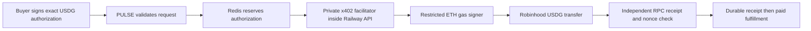

# PULSE's Robinhood USDG facilitator

## Status

Implemented locally using the installed official x402 TypeScript SDK. **A real
0.20 USDG Risk Guard payment, live report, replay and authenticated recovery passed
on mainnet through localhost on September 20.** Other research services and
execution still need qualification. The gate and browser recovery are wired
behind explicit configuration, not enabled by default.
The optional Robinhood appearance and deployed contracts do not change this gate.
Do not set the feature flag to 1 until the acceptance checks below pass.

The owner requested self-hosting rather than depending on a private third-party
facilitator. Primer/Aeron remain explicit research alternatives, never automatic
fallbacks. OKX/CDP keep handling their existing networks unchanged.

## What runs where



This is an embedded `FacilitatorClient`, not an unauthenticated public `/settle`
service. No separate SaaS account, API subscription or additional service is
required by this design. Existing Railway compute/Redis usage and ETH transaction
fees still apply; self-hosted does **not** mean free or maintenance-free.

Protocol: x402 v2 `exact`, EIP-3009, Robinhood **mainnet 4663**, canonical USDG.
The supported token/domain comes from `robinhoodPayment.ts`. No testnet, USDC
fallback, Permit2 spending authority, arbitrary approval or wallet deployment.

## Configuration guide (prepare now; do not enable yet)

1. Create a dedicated EVM wallet for the facilitator. It needs only a small ETH
   balance on Robinhood for gas, not USDG, and no PULSE admin/keeper permissions.
   Keep this separate from the deployment/admin wallet and merchant receiving
   wallet. Store its recovery material securely outside this repository.
2. Put the dedicated private key into `ROBINHOOD_FACILITATOR_PRIVATE_KEY` in local
   `.env` for qualification. Never paste it in chat, commit it, put it into a
   `VITE_` variable, or copy it into the public template.
3. Use `ROBINHOOD_FACILITATOR=self-hosted`. Keep
   `FEATURE_ROBINHOOD_PAYMENTS=1` for intentional local mainnet qualification.
   Leave hosting disabled until qualification passes. Enabling the flag alone
   cannot bypass durable storage, merchant policy or signer separation checks.
4. `ROBINHOOD_RPC_URL` must return chain ID 4663. The public default is suitable
   for initial checks; choose production capacity/fallbacks deliberately.
5. `ROBINHOOD_FACILITATOR_MAX_GAS_ETH=0.00001` is the per-transfer estimated
   execution-gas ceiling. Over-budget or insufficient-gas settlements fail closed;
   do not silently raise this value or ignore the chain's fee model.
6. The merchant destination remains `PAY_TO_ADDRESS`, not the gas wallet.
   Existing Redis is used for authorization claims and signer nonce reservations.
   Configure persistence and a no-eviction policy for these payment keys.
7. After local and paid qualification, add the same server-only configuration to
   the **Railway API** service, not the Vercel browser build. Deployment remains
   owner-controlled. No public facilitator URL is needed for the embedded model.

Run the read-only local signer check after setting the key:

```powershell
npx.cmd tsx scripts/robinhood-facilitator-preflight.ts --run
```

It derives the public address locally and reads the mainnet ETH balance, pending
nonce and account bytecode. It compares the signer with the deployment admin,
test buyer and merchant addresses. It never signs or broadcasts. A funded admin
wallet does not pass signer-separation readiness.

The official [basic facilitator guide](https://github.com/x402-foundation/x402/tree/main/examples/typescript/facilitator/basic)
describes SDK verification/settlement and dedicated gas-key separation. PULSE
adds merchant restrictions, persistence and independent receipts around that SDK.

## Recovery and spending safeguards

- Only catalog-priced USDG transfers to the configured PULSE payee are allowed.
- Off-chain EOA signature validation precedes a durable authorization claim.
- A nonce is bound to the exact original payment header and request digest.
- Redis claims have no expiry. A timeout never changes a pending payment into a
  new authorization or falls back to another facilitator.
- SDK simulation runs again before settlement. The gas signer uses the canonical
  token ABI, checks chain/nonce/balance, estimates gas and enforces its ceiling.
- The prepared transaction hash and signer nonce are saved **before** broadcast.
  The signed raw transaction and customer payment signature are not stored.
- The gas signer uses a distributed lock. A prior unresolved nonce stops new
  submissions even after that lock expires. If the process died before broadcast,
  operator reconciliation is needed; never delete the reservation blindly.
- Delivery requires a successful receipt containing both the exact USDG transfer
  and the [EIP-3009 authorization event](https://eips.ethereum.org/EIPS/eip-3009),
  from the same transaction and canonical block. This proves L2 inclusion, not
  parent-chain finality.
- A missing provider response can be reconciled by payer/authorization nonce.
  RPC history limits remain a possible pending condition; do not infer failure.
- Journal loss/eviction is an incident. Stop payments and reconstruct evidence
  before reopening. Never substitute an in-memory production journal.
- The browser saves the exact authorization before submission in same-origin
  local storage. Web Locks serialize tabs and double clicks. Unknown outcomes
  retain the original payment, including after refresh or authorization expiry.
  A changed request is blocked until the original is recovered. Successful
  delivery persists the report recovery handle before releasing this protection.
  Clearing browser storage loses that local capability: do not clear it while a
  payment is pending. It contains sensitive payment authorizations, never keys.

## Owner-approved shared-signer local qualification

On September 20 the owner explicitly approved using the current admin/test-buyer
key as facilitator **only for local testing**, with replacement before deployment.
The normal API continues to reject that arrangement. The bounded test harness
injects its adapter in-process and listens only on `127.0.0.1:8788`:

```powershell
# Read-only balances/chain check; no signature, payment or database write
node --import tsx scripts/robinhood-paid-qualification.ts
# Explicit real 0.20 USDG Risk Guard report; maximum estimated execution gas 0.00001 ETH
node --import tsx scripts/robinhood-paid-qualification.ts --pay --allow-shared-signer
# Other fixed authorizations: global-quick, global-pro, prediction-quick, prediction-pro
node --import tsx scripts/robinhood-paid-qualification.ts --pay --allow-shared-signer --service=global-quick
# Read-only quotes, transaction validation and native-funding simulation; no signature
node --import tsx scripts/robinhood-trading-readiness.ts --run
```

It uses live sources/Grok, Redis and encrypted Blob reporting with isolated job
namespace `pulse-robinhood-qualification`. It never changes `.env` or hosting.
Automation workers are disabled in this test process only. One fixed encrypted
authorization record in Redis is reused on rerun; do not delete it to force a
new payment. Its encryption key derives from the locally supplied buyer key.
The harness checks the exact payee/amount/token/domain before signing and verifies
receipt and report replay. Public output excludes signatures and recovery tokens.

## Before launch

- Completed: private facilitator and both Redis journals wired into the gate.
- Completed: browser retention/recovery; reload, concurrency, changed-input,
  blocked-storage and lost-response regression tests.
- Completed: all five research services delivered real, bounded USDG payments
  with independently checked receipts and live recoverable reports, including
  replay without a second charge. This qualifies localhost, not production hosting.
- Exercise signer nonce recovery, Redis outage, RPC errors, gas ceiling and
  insufficient ETH cases; confirm errors do not expose credentials/signatures.
- Enable Autopilot pass checkout only after
  Robinhood execution, registration and pass-grant idempotency are qualified.
- Add operational low-gas alerts, failure monitoring and an emergency disable.

Unit/localhost fixtures are evidence of integration behavior, not a claim that a
live customer has paid or a mainnet report was delivered.

Local validation on September 20: all 34 payment-package tests passed, including
the SDK buyer/private-facilitator HTTP workflow, lost-response recovery, concurrent
replays and pre-broadcast nonce persistence. Eleven journal/config tests and the
deployment-template consistency test also passed. Payment build and API/web
TypeScript checks passed. The read-only signer check found the configured key
was still the existing admin/test-buyer wallet; a separate gas signer is required
before production configuration.

### Mainnet qualification result — September 20

- Transaction: `0x2c3513cdb9e5a3096f68c33cfa0bef1b54b0cfeb727067cba00926257315c970`.
- Exactly **0.20 USDG** to the configured merchant; receipt gas **0.00000565075434 ETH**.
- Live Grok Risk Guard report persisted with encrypted Blob and Redis metadata.
- Repeated process restarts/replays used the same authorization and transaction;
  no additional USDG or gas was spent.
- Private report retrieval: 403 without capability, 200 with reissued capability;
  complete Markdown and report returned, job stage `completed`.
- This live test found/fixed missing Robinhood/Arc IDs in the shared Risk Guard
  schema, invalid persisted JSON for absent provider fields, and missing recovery
  capability on payment replay. Historical checksum-verified payloads with bare
  `undefined` can be read without rewriting the source Blob. A temporary report
  read failure no longer marks completed generation as failed.
- Shared signer was expressly approved for this local test. Replace it before
  deployment; the normal runtime still enforces signer separation.
- Final focused regression run: **111 tests passed**, covering payment SDK/gate,
  Redis journals, browser recovery, API workflows, private report storage and
  receipt-bound recovery tokens. Local `.env` was observed with the owner-enabled
  `FEATURE_ROBINHOOD_PAYMENTS=1`; no hosting setting was changed by the agent.

### Remaining research qualification — September 21

| Service | Paid USDG | Receipt gas ETH | Transaction |
| --- | ---: | ---: | --- |
| Global Quick | 0.20 | 0.000004757511528 | `0x88e6e4bdfc421c05d923b5f626da479c57a9df829495ecfa474079e2bd970d6b` |
| Global Pro | 0.30 | 0.000004146680664 | `0xb295cd7420c1975cbeed05dbaa8ccb9aa689a309b5b110a16c09a6041ecf98af` |
| Prediction Quick | 0.20 | 0.00000416444532 | `0x589b6a07f0a34f5e1587ef50b97946cb5b6213a2723c255eea588adf655398b3` |
| Prediction Pro | 0.30 | 0.00000424387383 | `0x56232537c68f56c0d4980da2dd4748f09bd1e4cc8f159ed8317d1964fac2dc45` |

All four returned HTTP 202, reached `completed` with live Grok output, and
returned the full persisted report/Markdown with a recovery capability. Access
without that capability returned 403. The same payment replay returned the same
job and receipt transaction. Global Quick was recovered after a process restart
on September 21 with **zero additional USDG/gas spent**. Along with Risk Guard,
the five unique qualifications cost **1.20 USDG**, not including ETH gas.

The four asynchronous replay handlers now return a recovery capability, matching
Risk Guard; regression tests cover Quick/Pro for both product surfaces, valid
original/reissued tokens and rejected corrupt/missing tokens. The qualification
harness uses the product's read-only prediction eligibility rules (trading
restrictions are not permission to place an order; no prediction order is made).

Read-only trading discovery also returned live ETH→USDG, USDG→WETH and WETH→USDG
routes. Native funding calldata passed the verified deployed router ABI checks
and `eth_call`/gas simulation. The new funding drawer was checked at 390px/1440px
in all five appearances with synthetic browser requests, including exactly one
simulated wallet submission. At this September 21 checkpoint, no live funding
swap, Spot trade or Autopilot activation had been completed. Later September 24
qualification supersedes that status: confirmed funding and Spot/Limit trades,
Autopilot registration, a 1.50 USDG pass purchase/replay, and a scoped live Hold
cycle with pause/withdrawal checks are recorded in the
[mainnet integration plan](ROBINHOOD_MAINNET_PLAN.md). It does not establish a
live AI-approved autonomous trade or production scheduler readiness. Hosting
remains unchanged; the qualification vault and automation registry are paused.

September 21 regression result: **120 tests passed** across payment SDK/gates,
Redis journals, private report persistence/recovery, API validation and browser
payment/funding guards. Funding browser fixtures passed all five themes at
390px and 1440px, including non-overlapping asset-arrow placement. The Robinhood
app shell passed all eight routes at both widths with no horizontal overflow or
render exceptions. Browser fixtures are synthetic, not proof of a mined swap.
